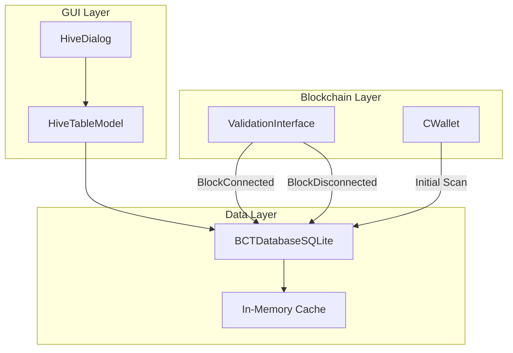

# Design Document: BCT Persistent Database

## Overview

Dieses Design beschreibt die Umstellung des BCT-Caching-Systems von einer JSON-basierten Datei auf eine SQLite-Datenbank mit inkrementellen Updates. Das Ziel ist es, den "Deep-Drill"-Scan beim Start zu eliminieren und stattdessen nur neue/geänderte Daten zu verarbeiten.

### Aktuelle Architektur (Problem)

```
┌─────────────────┐     ┌──────────────────┐     ┌─────────────────┐
│   HiveDialog    │────▶│  HiveTableModel  │────▶│  CWallet::      │
│   (GUI)         │     │  updateBCTs()    │     │  GetBCTs()      │
└─────────────────┘     └──────────────────┘     └─────────────────┘
                                                         │
                                                         ▼
                                                 ┌─────────────────┐
                                                 │ Full Wallet Scan│
                                                 │ O(n) bei jedem  │
                                                 │ Update          │
                                                 └─────────────────┘
```

### Neue Architektur (Lösung)

```
┌─────────────────┐     ┌──────────────────┐     ┌─────────────────┐
│   HiveDialog    │────▶│  HiveTableModel  │────▶│  BCTDatabase    │
│   (GUI)         │     │  (cached data)   │     │  (SQLite)       │
└─────────────────┘     └──────────────────┘     └─────────────────┘
                                                         │
                                                         ▼
                                                 ┌─────────────────┐
                                                 │ Incremental     │
                                                 │ Updates via     │
                                                 │ Block Signals   │
                                                 └─────────────────┘
```

## Architecture

### Komponenten-Übersicht



### Datenfluss

1. **Startup**: BCTDatabaseSQLite lädt Daten aus SQLite → In-Memory Cache
2. **Block Connected**: ValidationInterface signalisiert → BCTDatabaseSQLite scannt nur den neuen Block
3. **GUI Request**: HiveTableModel liest aus In-Memory Cache (sofort verfügbar)
4. **BCT Created**: Wallet signalisiert → BCTDatabaseSQLite fügt neuen Record ein

## Components and Interfaces

### BCTDatabaseSQLite (Neue Klasse)

```cpp
class BCTDatabaseSQLite {
public:
    // Singleton-Zugriff
    static BCTDatabaseSQLite* instance();
    
    // Initialisierung
    bool initialize(const std::string& dataDir);
    void shutdown();
    
    // CRUD-Operationen
    bool insertBCT(const BCTRecord& bct);
    bool updateBCT(const std::string& txid, const BCTRecord& bct);
    bool deleteBCT(const std::string& txid);
    
    // Abfragen
    std::vector<BCTRecord> getAllBCTs(bool includeExpired = false);
    std::vector<BCTRecord> getBCTsByStatus(const std::string& status);
    BCTRecord getBCT(const std::string& txid);
    
    // Inkrementelle Updates
    void processBlock(const CBlock& block, int height);
    void handleReorg(int forkHeight);
    
    // Statistiken
    BCTSummary getSummary();
    
    // Migration
    bool migrateFromJSON(const std::string& jsonPath);
    
private:
    sqlite3* db;
    std::mutex dbMutex;
    std::map<std::string, BCTRecord> cache;  // In-Memory Cache
    int lastProcessedHeight;
    
    bool createSchema();
    bool upgradeSchema(int fromVersion, int toVersion);
};
```

### BCTRecord (Datenstruktur)

```cpp
struct BCTRecord {
    std::string txid;
    std::string honeyAddress;
    std::string status;          // "immature", "mature", "expired"
    int beeCount;
    int creationHeight;
    int maturityHeight;
    int expirationHeight;
    int64_t timestamp;
    int64_t cost;
    int blocksFound;
    int64_t rewardsPaid;
    int64_t profit;
    std::string checksum;        // Für Integritätsprüfung
    
    // Berechnet aus Blockchain-Parametern
    int getBlocksLeft(int currentHeight) const;
    void updateStatus(int currentHeight, const Consensus::Params& params);
};
```

### BCTSummary (Aggregierte Daten)

```cpp
struct BCTSummary {
    int immatureCount;
    int matureCount;
    int expiredCount;
    int totalBeeCount;
    int blocksFound;
    int64_t totalCost;
    int64_t totalRewards;
    int64_t totalProfit;
};
```

## Data Models

### SQLite Schema

```sql
-- Version tracking
CREATE TABLE IF NOT EXISTS schema_version (
    version INTEGER PRIMARY KEY,
    applied_at INTEGER NOT NULL
);

-- BCT records
CREATE TABLE IF NOT EXISTS bcts (
    txid TEXT PRIMARY KEY,
    honey_address TEXT NOT NULL,
    status TEXT NOT NULL DEFAULT 'immature',
    bee_count INTEGER NOT NULL,
    creation_height INTEGER NOT NULL,
    maturity_height INTEGER NOT NULL,
    expiration_height INTEGER NOT NULL,
    timestamp INTEGER NOT NULL,
    cost INTEGER NOT NULL,
    blocks_found INTEGER DEFAULT 0,
    rewards_paid INTEGER DEFAULT 0,
    profit INTEGER DEFAULT 0,
    checksum TEXT,
    updated_at INTEGER NOT NULL
);

-- Indexes für schnelle Abfragen
CREATE INDEX IF NOT EXISTS idx_bcts_status ON bcts(status);
CREATE INDEX IF NOT EXISTS idx_bcts_creation_height ON bcts(creation_height);
CREATE INDEX IF NOT EXISTS idx_bcts_honey_address ON bcts(honey_address);

-- Metadata für Sync-Status
CREATE TABLE IF NOT EXISTS sync_state (
    key TEXT PRIMARY KEY,
    value TEXT NOT NULL
);

-- Rewards tracking (für inkrementelle Updates)
CREATE TABLE IF NOT EXISTS rewards (
    coinbase_txid TEXT PRIMARY KEY,
    bct_txid TEXT NOT NULL,
    amount INTEGER NOT NULL,
    height INTEGER NOT NULL,
    FOREIGN KEY (bct_txid) REFERENCES bcts(txid)
);

CREATE INDEX IF NOT EXISTS idx_rewards_bct ON rewards(bct_txid);
```

### Datenbank-Datei-Speicherort

```
~/.cascoin/
├── wallet.dat
├── blocks/
├── chainstate/
└── bct_database.sqlite    <-- Neue Datei
```

## Correctness Properties

*A property is a characteristic or behavior that should hold true across all valid executions of a system-essentially, a formal statement about what the system should do. Properties serve as the bridge between human-readable specifications and machine-verifiable correctness guarantees.*

### Property 1: Serialization Round-Trip Consistency

*For any* valid BCTRecord object, serializing it to the SQLite database and then deserializing it back SHALL produce an equivalent BCTRecord object with identical field values.

**Validates: Requirements 1.4, 4.2, 7.2**

### Property 2: Update Isolation

*For any* database update operation (status change, reward update, or new BCT insertion), all BCT records not targeted by the update SHALL remain unchanged in the database.

**Validates: Requirements 2.2, 2.3, 2.4**

### Property 3: Incremental Block Processing

*For any* new block added to the chain, the BCT_Database SHALL process only transactions within that block, and the resulting database state SHALL be equivalent to a full rescan up to that block height.

**Validates: Requirements 2.1**

### Property 4: Transaction Atomicity

*For any* write operation to the database, either all changes within that operation SHALL be committed, or none SHALL be committed (no partial writes).

**Validates: Requirements 3.3**

### Property 5: Query Correctness - Sorting

*For any* sort request on BCT data by a given column, the returned results SHALL be correctly ordered according to that column's values and the specified sort direction.

**Validates: Requirements 6.2**

### Property 6: Query Correctness - Filtering

*For any* filter request by status, the returned results SHALL contain only BCT records matching the specified status, and SHALL contain all such matching records.

**Validates: Requirements 6.3**

## Manual Rescan Trigger

### Start-Parameter: `-rescanbct`

Analog zu `-reindex` und `-rescanblockchain` wird ein neuer Start-Parameter hinzugefügt:

```
-rescanbct    Force a full rescan of BCT data from the blockchain.
              This will delete the existing bct_database.sqlite and rebuild it.
```

**Implementierung in init.cpp:**
```cpp
strUsage += HelpMessageOpt("-rescanbct", _("Force a full rescan of BCT (Bee Creation Transaction) data"));

// In AppInitMain:
if (gArgs.GetBoolArg("-rescanbct", false)) {
    BCTDatabaseSQLite::instance()->forceRescan();
}
```

### RPC-Befehl: `rescanbctdatabase`

Analog zu `rescanblockchain` wird ein neuer RPC-Befehl hinzugefügt:

```
rescanbctdatabase ( start_height ) ( stop_height )

Rescan the blockchain for BCT (Bee Creation Transaction) data.
This rebuilds the BCT database from the specified block range.

Arguments:
1. start_height    (numeric, optional, default=0) block height where the rescan should start
2. stop_height     (numeric, optional) the last block height that should be scanned.
                   If none is provided it will rescan up to the tip at return time of this call.

Result:
{
  "start_height"     (numeric) The block height where the rescan started
  "stop_height"      (numeric) The block height where the rescan stopped
  "bcts_found"       (numeric) Number of BCTs found during rescan
}

Examples:
> cascoin-cli rescanbctdatabase 100000 120000
> curl --user myusername --data-binary '{"jsonrpc": "1.0", "id":"curltest", "method": "rescanbctdatabase", "params": [100000, 120000] }' -H 'content-type: text/plain;' http://127.0.0.1:9332/
```

**Implementierung in rpcwallet.cpp:**
```cpp
UniValue rescanbctdatabase(const JSONRPCRequest& request)
{
    // Similar to rescanblockchain but for BCT data only
    // Calls BCTDatabaseSQLite::instance()->rescanFromHeight(startHeight, stopHeight)
}
```

### Integration mit bestehendem Rescan

Der BCT-Rescan wird auch automatisch ausgelöst wenn:
- `-reindex` verwendet wird (kompletter Blockchain-Rebuild)
- `-rescanblockchain` verwendet wird (Wallet-Rescan)
- Die BCT-Datenbank-Version nicht mit der Anwendungsversion übereinstimmt

## Error Handling

### Datenbank-Fehler

| Fehler | Behandlung |
|--------|------------|
| Datenbank kann nicht geöffnet werden | Fallback auf Full-Scan-Modus, Warnung loggen |
| Schema-Migration fehlgeschlagen | Datenbank löschen, Full-Rescan durchführen |
| Schreibfehler | Transaktion rollback, Retry mit Backoff |
| Korrupte Daten (Checksum-Fehler) | Betroffene Records invalidieren, Rescan |

### Sync-Fehler

| Fehler | Behandlung |
|--------|------------|
| Lücke in Block-Historie | Rescan ab letztem bekannten Block |
| Reorg erkannt | Invalidiere Blocks ab Fork-Punkt, Rescan |
| Wallet-Lock nicht verfügbar | Queue Update, Retry später |

## Testing Strategy

### Dual Testing Approach

Dieses Feature erfordert sowohl Unit-Tests als auch Property-Based-Tests:

- **Unit Tests**: Verifizieren spezifische Szenarien wie Migration, Reorg-Handling, Schema-Upgrades
- **Property-Based Tests**: Verifizieren universelle Eigenschaften über alle möglichen Eingaben

### Property-Based Testing Framework

Für C++ wird **RapidCheck** als Property-Based Testing Library verwendet:
- GitHub: https://github.com/emil-e/rapidcheck
- Integration mit Google Test möglich
- Unterstützt Shrinking für minimale Gegenbeispiele

### Test-Konfiguration

- Jeder Property-Based Test MUSS mindestens 100 Iterationen durchführen
- Jeder Test MUSS mit einem Kommentar annotiert sein, der die Correctness Property referenziert

### Unit Test Szenarien

1. **Initial Scan Test**: Datenbank existiert nicht → Full Scan → Daten persistiert
2. **Cached Load Test**: Datenbank existiert → Kein Scan → Daten aus Cache
3. **Migration Test**: JSON-Cache existiert → Import → JSON gelöscht
4. **Reorg Test**: Simuliere Reorg → Betroffene Records invalidiert
5. **Version Mismatch Test**: Alte Schema-Version → Migration ausgeführt

### Property-Based Test Szenarien

1. **Round-Trip Test**: Generiere zufällige BCTRecords → Serialize → Deserialize → Vergleiche
2. **Update Isolation Test**: Generiere DB mit Records → Update einen → Prüfe andere unverändert
3. **Sort Test**: Generiere Records → Sortiere → Prüfe Ordnung
4. **Filter Test**: Generiere Records mit verschiedenen Status → Filter → Prüfe Ergebnis
