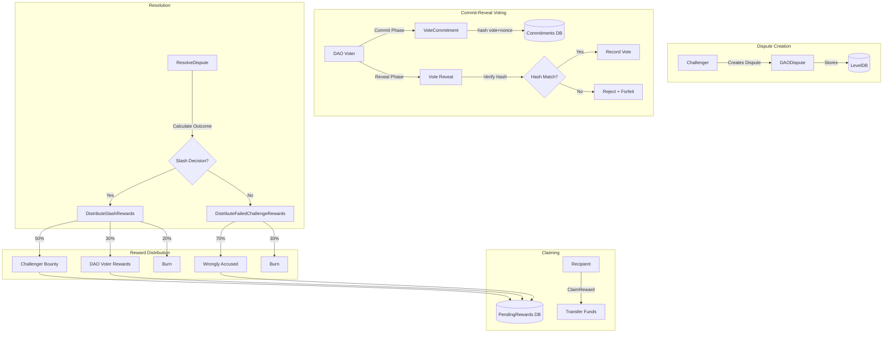

# Design Document: Challenger Reward System

## Overview

The Challenger Reward System extends the existing Cascoin Web-of-Trust DAO dispute mechanism to provide proper cryptoeconomic incentives for challenging malicious votes. The system implements a reward distribution mechanism where successful challengers receive bounties, DAO voters on the winning side receive proportional rewards, and a portion is burned for deflation.

A key innovation is the commit-reveal voting scheme that prevents bandwagoning (voters following the majority without independent evaluation). This ensures DAO members make independent decisions based on the merits of each case.

The system integrates with the existing `TrustGraph` class and `ResolveDispute()` flow, adding reward calculation and distribution logic without modifying core dispute resolution mechanics.

## Architecture



### Component Interaction Flow

1. **Dispute Creation**: Challenger stakes bond and creates dispute via `createdispute` RPC
2. **Commit Phase**: DAO voters submit commitment hashes via `commitdisputevote` RPC
3. **Reveal Phase**: DAO voters reveal votes via `revealdisputevote` RPC
4. **Resolution**: System resolves dispute when quorum reached or timeout expires
5. **Reward Distribution**: `DistributeSlashRewards()` or `DistributeFailedChallengeRewards()` calculates and stores pending rewards
6. **Claiming**: Recipients claim rewards via `claimreward` RPC

## Components and Interfaces

### RewardDistributor Class

New class responsible for calculating and distributing rewards.

```cpp
namespace CVM {

class RewardDistributor {
public:
    explicit RewardDistributor(CVMDatabase& db, const WoTConfig& config);
    
    /**
     * Distribute rewards after a successful slash decision
     * @param dispute The resolved dispute
     * @param slashedBond Amount slashed from malicious voter
     * @return true if distribution successful
     */
    bool DistributeSlashRewards(const DAODispute& dispute, CAmount slashedBond);
    
    /**
     * Distribute rewards after a failed challenge (no slash)
     * @param dispute The resolved dispute
     * @param originalVoter Address of the wrongly accused voter
     * @return true if distribution successful
     */
    bool DistributeFailedChallengeRewards(const DAODispute& dispute, 
                                          const uint160& originalVoter);
    
    /**
     * Get all pending rewards for an address
     * @param recipient Address to query
     * @return Vector of pending rewards
     */
    std::vector<PendingReward> GetPendingRewards(const uint160& recipient) const;
    
    /**
     * Claim a pending reward
     * @param rewardId Unique reward identifier
     * @param recipient Address claiming the reward
     * @return Amount claimed, or 0 if claim failed
     */
    CAmount ClaimReward(const uint256& rewardId, const uint160& recipient);
    
    /**
     * Get reward distribution details for a dispute
     * @param disputeId Dispute to query
     * @return RewardDistribution record
     */
    RewardDistribution GetRewardDistribution(const uint256& disputeId) const;

private:
    CVMDatabase& database;
    const WoTConfig& config;
    
    /**
     * Calculate DAO voter rewards proportionally
     */
    std::map<uint160, CAmount> CalculateVoterRewards(
        const DAODispute& dispute,
        CAmount totalVoterPool,
        bool winningSide
    ) const;
    
    /**
     * Store a pending reward
     */
    bool StorePendingReward(const PendingReward& reward);
    
    /**
     * Emit reward distribution event
     */
    void EmitRewardEvent(const std::string& eventType, 
                         const uint256& disputeId,
                         const uint160& recipient,
                         CAmount amount);
};

} // namespace CVM
```

### CommitRevealManager Class

New class managing the commit-reveal voting scheme.

```cpp
namespace CVM {

class CommitRevealManager {
public:
    explicit CommitRevealManager(CVMDatabase& db, const WoTConfig& config);
    
    /**
     * Submit a vote commitment
     * @param disputeId Dispute being voted on
     * @param voter DAO member address
     * @param commitmentHash Hash of (vote || nonce)
     * @param stake Amount staked
     * @return true if commitment accepted
     */
    bool SubmitCommitment(const uint256& disputeId,
                          const uint160& voter,
                          const uint256& commitmentHash,
                          CAmount stake);
    
    /**
     * Reveal a vote
     * @param disputeId Dispute being voted on
     * @param voter DAO member address
     * @param vote The actual vote (true=slash, false=keep)
     * @param nonce Secret nonce used in commitment
     * @return true if reveal successful and hash matches
     */
    bool RevealVote(const uint256& disputeId,
                    const uint160& voter,
                    bool vote,
                    const uint256& nonce);
    
    /**
     * Check if dispute is in commit phase
     */
    bool IsCommitPhase(const uint256& disputeId) const;
    
    /**
     * Check if dispute is in reveal phase
     */
    bool IsRevealPhase(const uint256& disputeId) const;
    
    /**
     * Get all commitments for a dispute
     */
    std::vector<VoteCommitment> GetCommitments(const uint256& disputeId) const;
    
    /**
     * Forfeit stakes of voters who didn't reveal
     */
    bool ForfeitUnrevealedStakes(const uint256& disputeId);
    
    /**
     * Calculate commitment hash
     */
    static uint256 CalculateCommitmentHash(bool vote, const uint256& nonce);

private:
    CVMDatabase& database;
    const WoTConfig& config;
};

} // namespace CVM
```

### Extended TrustGraph Interface

Modifications to existing `TrustGraph` class:

```cpp
class TrustGraph {
public:
    // ... existing methods ...
    
    /**
     * Resolve dispute with reward distribution
     * Extended to call RewardDistributor after resolution
     */
    bool ResolveDispute(const uint256& disputeId);
    
    /**
     * Get the original vote being disputed
     */
    bool GetDisputedVote(const uint256& disputeId, BondedVote& vote) const;

private:
    std::unique_ptr<RewardDistributor> rewardDistributor;
    std::unique_ptr<CommitRevealManager> commitRevealManager;
};
```

### RPC Interface Extensions

New RPC commands in `src/rpc/cvm.cpp`:

```cpp
// Get pending rewards for an address
UniValue getpendingrewards(const JSONRPCRequest& request);

// Claim a specific reward
UniValue claimreward(const JSONRPCRequest& request);

// Get reward distribution for a resolved dispute
UniValue getrewarddistribution(const JSONRPCRequest& request);

// Submit vote commitment (commit phase)
UniValue commitdisputevote(const JSONRPCRequest& request);

// Reveal vote (reveal phase)
UniValue revealdisputevote(const JSONRPCRequest& request);
```

## Data Models

### PendingReward Structure

```cpp
/**
 * Represents a reward that can be claimed by a recipient
 */
struct PendingReward {
    uint256 rewardId;           // Unique identifier (hash of disputeId + recipient + type)
    uint256 disputeId;          // Source dispute
    uint160 recipient;          // Who can claim this reward
    CAmount amount;             // Amount in satoshis
    RewardType type;            // Type of reward
    uint32_t createdTime;       // When reward was created
    bool claimed;               // Has it been claimed?
    uint256 claimTxHash;        // Transaction that claimed (if any)
    uint32_t claimedTime;       // When claimed
    
    enum RewardType {
        CHALLENGER_BOND_RETURN = 0,  // Original bond returned
        CHALLENGER_BOUNTY = 1,       // Bounty from slashed bond
        DAO_VOTER_REWARD = 2,        // Reward for voting on winning side
        WRONGLY_ACCUSED_COMPENSATION = 3  // Compensation for false accusation
    };
    
    ADD_SERIALIZE_METHODS;
    template <typename Stream, typename Operation>
    inline void SerializationOp(Stream& s, Operation ser_action) {
        READWRITE(rewardId);
        READWRITE(disputeId);
        READWRITE(recipient);
        READWRITE(amount);
        int typeInt = static_cast<int>(type);
        READWRITE(typeInt);
        if (ser_action.ForRead()) type = static_cast<RewardType>(typeInt);
        READWRITE(createdTime);
        READWRITE(claimed);
        READWRITE(claimTxHash);
        READWRITE(claimedTime);
    }
};
```

### RewardDistribution Structure

```cpp
/**
 * Complete record of reward distribution for a dispute
 */
struct RewardDistribution {
    uint256 disputeId;                      // Dispute this distribution is for
    bool slashDecision;                     // Was it a slash or keep decision?
    CAmount totalSlashedBond;               // Total bond that was slashed
    CAmount challengerBondReturn;           // Bond returned to challenger
    CAmount challengerBounty;               // Bounty paid to challenger
    CAmount totalDaoVoterRewards;           // Total paid to DAO voters
    CAmount burnedAmount;                   // Amount burned
    std::map<uint160, CAmount> voterRewards; // Individual voter rewards
    uint32_t distributedTime;               // When distribution occurred
    
    ADD_SERIALIZE_METHODS;
    template <typename Stream, typename Operation>
    inline void SerializationOp(Stream& s, Operation ser_action) {
        READWRITE(disputeId);
        READWRITE(slashDecision);
        READWRITE(totalSlashedBond);
        READWRITE(challengerBondReturn);
        READWRITE(challengerBounty);
        READWRITE(totalDaoVoterRewards);
        READWRITE(burnedAmount);
        READWRITE(voterRewards);
        READWRITE(distributedTime);
    }
};
```

### VoteCommitment Structure

```cpp
/**
 * Represents a committed vote in the commit-reveal scheme
 */
struct VoteCommitment {
    uint256 disputeId;          // Dispute being voted on
    uint160 voter;              // DAO member who committed
    uint256 commitmentHash;     // Hash of (vote || nonce)
    CAmount stake;              // Amount staked
    uint32_t commitTime;        // When commitment was made
    bool revealed;              // Has vote been revealed?
    bool vote;                  // Actual vote (only valid if revealed)
    uint256 nonce;              // Nonce used (only valid if revealed)
    uint32_t revealTime;        // When revealed (0 if not revealed)
    bool forfeited;             // Was stake forfeited for non-reveal?
    
    ADD_SERIALIZE_METHODS;
    template <typename Stream, typename Operation>
    inline void SerializationOp(Stream& s, Operation ser_action) {
        READWRITE(disputeId);
        READWRITE(voter);
        READWRITE(commitmentHash);
        READWRITE(stake);
        READWRITE(commitTime);
        READWRITE(revealed);
        READWRITE(vote);
        READWRITE(nonce);
        READWRITE(revealTime);
        READWRITE(forfeited);
    }
};
```

### Extended DAODispute Structure

```cpp
/**
 * Extended DAODispute with commit-reveal support
 */
struct DAODispute {
    // ... existing fields ...
    
    // Commit-reveal phase tracking
    uint32_t commitPhaseStart;      // Block height when commit phase started
    uint32_t revealPhaseStart;      // Block height when reveal phase started (0 if not started)
    bool useCommitReveal;           // Whether this dispute uses commit-reveal
    
    // Reward tracking
    bool rewardsDistributed;        // Have rewards been distributed?
    uint256 rewardDistributionId;   // ID of reward distribution record
    
    ADD_SERIALIZE_METHODS;
    // ... serialization updated to include new fields ...
};
```

### Extended WoTConfig Structure

```cpp
/**
 * Extended configuration for Web-of-Trust with reward parameters
 */
struct WoTConfig {
    // ... existing fields ...
    
    // Reward distribution percentages (must sum to 100)
    uint8_t challengerRewardPercent;        // Default: 50
    uint8_t daoVoterRewardPercent;          // Default: 30
    uint8_t burnPercent;                    // Default: 20
    
    // Failed challenge distribution
    uint8_t wronglyAccusedRewardPercent;    // Default: 70
    uint8_t failedChallengeBurnPercent;     // Default: 30
    
    // Commit-reveal timing (in blocks)
    uint32_t commitPhaseDuration;           // Default: 720 (~12 hours)
    uint32_t revealPhaseDuration;           // Default: 720 (~12 hours)
    
    // Feature flags
    bool enableCommitReveal;                // Default: true for new disputes
    
    WoTConfig() :
        // ... existing defaults ...
        challengerRewardPercent(50),
        daoVoterRewardPercent(30),
        burnPercent(20),
        wronglyAccusedRewardPercent(70),
        failedChallengeBurnPercent(30),
        commitPhaseDuration(720),
        revealPhaseDuration(720),
        enableCommitReveal(true)
    {}
    
    bool ValidateRewardPercentages() const {
        return (challengerRewardPercent + daoVoterRewardPercent + burnPercent) == 100 &&
               (wronglyAccusedRewardPercent + failedChallengeBurnPercent) == 100;
    }
};
```

### Database Schema

New database keys for the reward system:

```
// Pending rewards
reward_<rewardId>                    → PendingReward
rewards_by_recipient_<addr>_<id>     → PendingReward (index)
rewards_by_dispute_<disputeId>_<id>  → PendingReward (index)

// Reward distributions
distribution_<disputeId>             → RewardDistribution

// Vote commitments
commitment_<disputeId>_<voter>       → VoteCommitment
commitments_by_dispute_<disputeId>   → list of voter addresses

// Events
event_reward_<timestamp>_<id>        → RewardEvent
event_burn_<timestamp>_<id>          → BurnEvent
```


## Correctness Properties

*A property is a characteristic or behavior that should hold true across all valid executions of a system—essentially, a formal statement about what the system should do. Properties serve as the bridge between human-readable specifications and machine-verifiable correctness guarantees.*

Based on the prework analysis, the following properties have been consolidated to eliminate redundancy while ensuring comprehensive coverage:

### Property 1: Conservation of Funds (Slash Decision)

*For any* dispute that resolves with a slash decision, the sum of (challenger bond return + challenger bounty + total DAO voter rewards + burned amount) SHALL equal (original challenger bond + slashed bond from malicious voter).

This ensures no funds are created or destroyed during reward distribution.

**Validates: Requirements 1.1, 1.2, 1.3, 1.4, 5.4, 5.5**

### Property 2: Conservation of Funds (Failed Challenge)

*For any* dispute that resolves without a slash decision (keep vote), the sum of (wrongly accused compensation + burned amount) SHALL equal the original challenger bond.

This ensures the forfeited challenger bond is fully accounted for.

**Validates: Requirements 2.1, 2.2, 2.3**

### Property 3: Proportional Voter Reward Distribution

*For any* set of DAO voters on the winning side with stakes [s1, s2, ..., sn], each voter i's reward SHALL equal (si / sum(s1..sn)) * total_voter_reward_pool, using integer arithmetic with remainder going to burn.

**Validates: Requirements 1.3, 1.5**

### Property 4: Reward Percentage Validation

*For any* WoTConfig, the configuration SHALL be valid if and only if (challengerRewardPercent + daoVoterRewardPercent + burnPercent) equals 100 AND (wronglyAccusedRewardPercent + failedChallengeBurnPercent) equals 100.

**Validates: Requirements 4.6**

### Property 5: Claim Idempotence

*For any* pending reward, claiming it once SHALL succeed and mark it as claimed, and any subsequent claim attempt for the same reward SHALL fail without modifying state.

**Validates: Requirements 3.3, 3.4**

### Property 6: Pending Rewards Query Completeness

*For any* address with N unclaimed rewards in the database, querying pending rewards for that address SHALL return exactly those N rewards, and no claimed rewards.

**Validates: Requirements 3.5**

### Property 7: Commit-Reveal Hash Integrity (Round-Trip)

*For any* vote (true/false) and nonce, computing the commitment hash and then revealing with the same vote and nonce SHALL always verify successfully. Conversely, revealing with a different vote or nonce SHALL always fail verification.

**Validates: Requirements 8.1, 8.4, 8.7**

### Property 8: Phase Transition Correctness

*For any* dispute using commit-reveal, the dispute SHALL be in commit phase from creation until commitPhaseDuration blocks pass, then in reveal phase until revealPhaseDuration blocks pass, then resolvable.

**Validates: Requirements 8.2, 8.3**

### Property 9: Non-Reveal Stake Forfeiture

*For any* voter who submits a commitment but does not reveal within the reveal phase, their stake SHALL be forfeited and not counted in the dispute outcome.

**Validates: Requirements 8.5, 8.6**

### Property 10: Only Revealed Votes Count

*For any* dispute resolution, the outcome SHALL be determined solely by revealed votes, ignoring any commitments that were not revealed.

**Validates: Requirements 8.6**

## Error Handling

### Invalid Inputs

| Error Condition | Handling |
|----------------|----------|
| Invalid dispute ID | Return error "Dispute not found" |
| Dispute not resolved | Return error "Dispute not yet resolved" |
| Invalid reward ID | Return error "Reward not found" |
| Reward already claimed | Return error "Reward already claimed" |
| Wrong recipient claiming | Return error "Not authorized to claim this reward" |
| Invalid commitment hash | Return error "Invalid commitment format" |
| Reveal during commit phase | Return error "Reveal phase not started" |
| Commit during reveal phase | Return error "Commit phase ended" |
| Hash mismatch on reveal | Return error "Commitment hash mismatch" |
| Non-DAO member voting | Return error "Not a DAO member" |

### Edge Cases

| Edge Case | Handling |
|-----------|----------|
| No voters on winning side | Allocate voter reward portion to challenger |
| All voters on losing side | Burn the voter reward portion |
| Zero slashed bond | Return challenger bond, skip bounty distribution |
| Invalid original voter address | Burn entire forfeited challenger bond |
| Rounding remainder | Add remainder satoshis to burn amount |
| Legacy dispute (pre-reward system) | Return empty reward data, no error |
| Dispute timeout before quorum | Auto-resolve based on current votes or return bonds |

### Database Errors

| Error Condition | Handling |
|----------------|----------|
| Failed to write reward | Log error, return false, do not mark dispute as distributed |
| Failed to read reward | Return empty result with error flag |
| Corrupted reward data | Log error, skip corrupted record, continue with valid records |

## Testing Strategy

### Unit Tests

Unit tests will cover specific examples and edge cases:

1. **Configuration Tests**
   - Default WoTConfig values are correct
   - Percentage validation accepts valid configs
   - Percentage validation rejects invalid configs

2. **Reward Calculation Tests**
   - Correct bounty calculation for various slashed bond amounts
   - Correct voter reward distribution for various stake combinations
   - Correct burn amount calculation
   - Rounding remainder handling

3. **Edge Case Tests**
   - No voters on winning side
   - All voters on losing side
   - Zero slashed bond
   - Invalid voter address
   - Legacy dispute handling

4. **Commit-Reveal Tests**
   - Commitment hash calculation
   - Phase transition at correct block heights
   - Reveal verification success and failure cases

### Property-Based Tests

Property-based tests will use the Boost.Test framework with custom generators to verify universal properties across many random inputs. Each test will run minimum 100 iterations.

**Test Configuration:**
- Framework: Boost.Test with custom property generators
- Minimum iterations: 100 per property
- Random seed: Configurable for reproducibility

**Property Test Implementation Pattern:**

```cpp
// Feature: challenger-reward-system, Property 1: Conservation of Funds (Slash Decision)
BOOST_AUTO_TEST_CASE(property_conservation_of_funds_slash)
{
    for (int i = 0; i < 100; i++) {
        // Generate random dispute with random bonds
        CAmount challengerBond = GenerateRandomAmount(COIN, 1000 * COIN);
        CAmount slashedBond = GenerateRandomAmount(COIN, 1000 * COIN);
        
        // Execute distribution
        RewardDistribution dist = distributor.DistributeSlashRewards(dispute, slashedBond);
        
        // Verify conservation
        CAmount totalOut = dist.challengerBondReturn + dist.challengerBounty + 
                          dist.totalDaoVoterRewards + dist.burnedAmount;
        CAmount totalIn = challengerBond + slashedBond;
        
        BOOST_CHECK_EQUAL(totalOut, totalIn);
    }
}
```

**Property Tests to Implement:**

| Property | Test Name | Validates |
|----------|-----------|-----------|
| P1 | `property_conservation_of_funds_slash` | Req 1.1-1.4, 5.4, 5.5 |
| P2 | `property_conservation_of_funds_failed` | Req 2.1-2.3 |
| P3 | `property_proportional_voter_rewards` | Req 1.3, 1.5 |
| P4 | `property_percentage_validation` | Req 4.6 |
| P5 | `property_claim_idempotence` | Req 3.3, 3.4 |
| P6 | `property_pending_rewards_completeness` | Req 3.5 |
| P7 | `property_commit_reveal_roundtrip` | Req 8.1, 8.4, 8.7 |
| P8 | `property_phase_transitions` | Req 8.2, 8.3 |
| P9 | `property_nonreveal_forfeiture` | Req 8.5, 8.6 |
| P10 | `property_only_revealed_votes_count` | Req 8.6 |

### Integration Tests

Integration tests will verify end-to-end flows:

1. **Full Dispute Lifecycle (Slash)**
   - Create dispute → Commit votes → Reveal votes → Resolve → Distribute → Claim

2. **Full Dispute Lifecycle (Keep)**
   - Create dispute → Commit votes → Reveal votes → Resolve → Distribute → Claim

3. **RPC Command Tests**
   - `getpendingrewards` returns correct data
   - `claimreward` transfers funds correctly
   - `getrewarddistribution` returns complete breakdown
   - `commitdisputevote` and `revealdisputevote` work correctly

4. **Backward Compatibility**
   - Legacy disputes without commit-reveal work correctly
   - Pre-reward-system disputes return empty reward data
