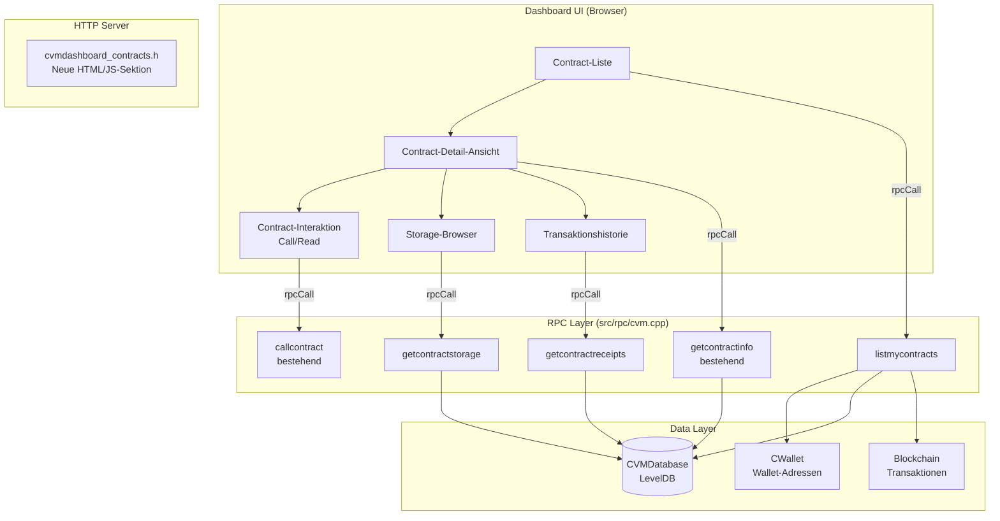

# Design: CVM Dashboard Contract Management

## Übersicht

Dieses Design beschreibt die Erweiterung des bestehenden CVM-Dashboards um eine wallet-bezogene Contract-Management-Funktionalität. Die Architektur folgt dem bestehenden Muster: neue RPC-Endpunkte in `src/rpc/cvm.cpp` liefern Daten, eine neue HTML/JS-Sektion in `src/httpserver/` stellt die UI bereit, und die Kommunikation erfolgt über `window.dashboard.rpcCall()`.

Das Feature besteht aus drei Schichten:
1. **RPC-Backend**: Drei neue Endpunkte (`listmycontracts`, `getcontractstorage`, `getcontractreceipts`)
2. **Dashboard-UI**: Neue HTML-Sektion mit Contract-Liste, Detail-Ansicht, Storage-Browser und Transaktionshistorie
3. **Contract-Interaktion**: Integriertes ABI-basiertes Funktionsaufruf-Interface in der Detail-Ansicht

## Architektur



## Komponenten und Schnittstellen

### 1. RPC-Endpunkt: `listmycontracts`

Neuer RPC-Befehl in `src/rpc/cvm.cpp`, der alle Contracts auflistet, die von Adressen der aktuellen Wallet deployt wurden.

**Algorithmus:**
1. Wallet-Referenz über `GetWalletForJSONRPCRequest()` holen
2. `CVMDatabase::ListContracts()` aufrufen, um alle Contract-Adressen zu erhalten
3. Für jeden Contract: `ReadContract()` aufrufen, um die Metadaten zu laden
4. Die Deployment-Transaktion aus der Blockchain laden (`GetTransaction()`)
5. Den Absender (Deployer) aus den Transaktions-Inputs extrahieren
6. Prüfen, ob der Deployer zur Wallet gehört (`IsMine()`)
7. Matching Contracts als JSON-Array zurückgeben

**Schnittstelle:**
```
listmycontracts

Returns:
[
  {
    "address": "hex",           // Contract-Adresse (uint160 hex)
    "deployer": "base58",       // Deployer Wallet-Adresse
    "deploymentHeight": n,      // Block-Höhe des Deployments
    "deploymentTx": "hex",      // Deployment-Transaktions-Hash
    "codeSize": n,              // Bytecode-Größe in Bytes
    "format": "CVM"|"EVM",     // Bytecode-Format
    "isCleanedUp": bool         // Ob der Contract bereinigt wurde
  },
  ...
]
```

**Performance-Überlegung:** `ListContracts()` iteriert über alle Contracts in der DB. Bei einer großen Anzahl von Contracts kann dies langsam sein. Für die erste Version ist dies akzeptabel, da die Anzahl der Contracts in der Praxis begrenzt ist. Ein Deployer-Index kann in einer späteren Version hinzugefügt werden.

### 2. RPC-Endpunkt: `getcontractstorage`

Neuer RPC-Befehl, der alle Storage-Einträge eines Contracts zurückgibt.

**Algorithmus:**
1. Contract-Adresse als Parameter entgegennehmen
2. Prüfen, ob der Contract existiert (`CVMDatabase::Exists()`)
3. Über `CVMDatabase::ListKeysWithPrefix()` alle Storage-Schlüssel mit dem Prefix `'S' + contractAddr` auflisten
4. Für jeden Schlüssel den Wert laden (`CVMDatabase::Load()`)
5. Als JSON-Objekt mit Schlüssel-Wert-Paaren zurückgeben

**Schnittstelle:**
```
getcontractstorage "contractaddress"

Arguments:
1. "contractaddress"  (string, required) Contract-Adresse als Hex

Returns:
{
  "address": "hex",
  "entries": [
    {
      "key": "hex",     // Storage-Schlüssel (uint256 hex)
      "value": "hex"    // Storage-Wert (uint256 hex)
    },
    ...
  ],
  "count": n            // Anzahl der Einträge
}
```

### 3. RPC-Endpunkt: `getcontractreceipts`

Neuer RPC-Befehl, der alle Transaktions-Receipts für einen Contract zurückgibt.

**Algorithmus:**
1. Contract-Adresse als Parameter entgegennehmen
2. Über die CVMDatabase alle Receipts iterieren, die `to` oder `contractAddress` gleich der angegebenen Adresse haben
3. Receipts nach Blockhöhe absteigend sortieren
4. Optional: Limit-Parameter für Paginierung

**Schnittstelle:**
```
getcontractreceipts "contractaddress" ( count )

Arguments:
1. "contractaddress"  (string, required) Contract-Adresse als Hex
2. count              (numeric, optional, default=50) Max. Anzahl Receipts

Returns:
[
  {
    "txHash": "hex",
    "from": "hex",
    "to": "hex",
    "blockNumber": n,
    "gasUsed": n,
    "status": n,           // 1=Erfolg, 0=Fehler
    "revertReason": "str", // Nur bei Fehler
    "logCount": n          // Anzahl Log-Einträge
  },
  ...
]
```

**Hinweis:** Die CVMDatabase speichert Receipts unter `DB_RECEIPT = 'R'` mit dem TX-Hash als Schlüssel. Es gibt keinen direkten Index nach Contract-Adresse. Der Endpunkt muss daher über `DB_RECEIPT_BLOCK = 'X'` (Block-Receipt-Index) iterieren und Receipts filtern. Alternativ kann ein neuer Index `DB_CONTRACT_RECEIPTS` eingeführt werden, der Contract-Adressen auf TX-Hashes mappt.

### 4. Dashboard-UI: Contract-Management-Sektion

Neue HTML/JS-Datei `src/httpserver/cvmdashboard_contracts.h`, die dem bestehenden Muster von `cvmdashboard_evm.h` folgt.

**UI-Struktur:**

```
┌─────────────────────────────────────────────────┐
│ 📋 Meine Contracts                    [Refresh] │
├─────────────────────────────────────────────────┤
│ ┌─────────────────────────────────────────────┐ │
│ │ Contract: 0xa1b2c3...  │ EVM │ Block 1234  │ │
│ │ Contract: 0xd4e5f6...  │ CVM │ Block 5678  │ │
│ │ Contract: 0x789abc...  │ EVM │ Block 9012  │ │
│ └─────────────────────────────────────────────┘ │
│                                                 │
│ Keine Contracts? Deploy über die EVM-Sektion ↑  │
├─────────────────────────────────────────────────┤
│ 📄 Contract Details: 0xa1b2c3...               │
│ ┌──────────────────┬──────────────────────────┐ │
│ │ Adresse:         │ 0xa1b2c3d4e5f6...       │ │
│ │ Deployer:        │ QAddr123...              │ │
│ │ Block:           │ 1234                     │ │
│ │ TX:              │ 0xabcdef...              │ │
│ │ Größe:           │ 2048 Bytes               │ │
│ │ Format:          │ EVM                      │ │
│ │ Status:          │ ✅ Aktiv                 │ │
│ └──────────────────┴──────────────────────────┘ │
│                                                 │
│ [Interagieren] [Storage] [Transaktionen]        │
├─────────────────────────────────────────────────┤
│ ⚡ Contract Interaktion                         │
│ ABI (JSON): [________________________]          │
│ [Parse ABI]                                     │
│                                                 │
│ 📖 Read Functions:                              │
│ ┌─ getValue() → uint256  [Ausführen]          ┐ │
│ │  getOwner() → address  [Ausführen]          │ │
│ └─────────────────────────────────────────────┘ │
│ ✏️ Write Functions:                             │
│ ┌─ setValue(uint256)     [Senden]             ┐ │
│ │  setOwner(address)     [Senden]             │ │
│ │  Parameter: [___________]                   │ │
│ │  Gas Limit: [100000]                        │ │
│ └─────────────────────────────────────────────┘ │
│ 🔧 Raw Call:                                    │
│ Data (hex): [________________________]          │
│ Gas Limit:  [100000]  Value: [0]                │
│ [Read] [Send TX]                                │
│                                                 │
│ Ergebnis: ✅ 0x0000...0042 (decoded: 66)       │
├─────────────────────────────────────────────────┤
│ 💾 Contract Storage                             │
│ ┌──────────────────┬──────────────────────────┐ │
│ │ Slot 0x00        │ 0x0000...002a            │ │
│ │ Slot 0x01        │ 0x0000...abcd            │ │
│ └──────────────────┴──────────────────────────┘ │
├─────────────────────────────────────────────────┤
│ 📜 Transaktionshistorie                         │
│ ┌──────┬──────────┬─────┬────────┬───────────┐ │
│ │ Block│ TX Hash  │ Von │ Gas    │ Status    │ │
│ │ 1300 │ 0xab...  │ Q...│ 45000  │ ✅ OK    │ │
│ │ 1250 │ 0xcd...  │ Q...│ 21000  │ ❌ Fail  │ │
│ └──────┴──────────┴─────┴────────┴───────────┘ │
└─────────────────────────────────────────────────┘
```

**Integration in bestehendes Dashboard:**
Die neue Sektion wird in `BuildCompleteDashboardHTML()` in `cvmdashboard.cpp` eingebunden, analog zur bestehenden EVM-Sektion. Die HTML und JS werden als statische Strings in `cvmdashboard_contracts.h` definiert.

### 5. Contract-Receipt-Index

Um `getcontractreceipts` effizient zu machen, wird ein neuer DB-Index eingeführt:

**Neuer DB-Key in `cvmdb.h`:**
```cpp
static const char DB_CONTRACT_RECEIPTS = 'T';  // Contract receipts: 'T' + contractAddr -> vector<uint256>
```

Dieser Index mappt Contract-Adressen auf eine Liste von Transaktions-Hashes. Er wird beim Schreiben von Receipts (`WriteReceipt`) aktualisiert und ermöglicht effiziente Abfragen ohne vollständige Iteration.

## Datenmodelle

### Contract-Listen-Eintrag (JSON-Response von `listmycontracts`)

```cpp
// Kein neues C++-Struct nötig — wird direkt als UniValue aufgebaut
UniValue entry(UniValue::VOBJ);
entry.pushKV("address", contract.address.GetHex());
entry.pushKV("deployer", EncodeDestination(deployerDest));
entry.pushKV("deploymentHeight", contract.deploymentHeight);
entry.pushKV("deploymentTx", contract.deploymentTx.GetHex());
entry.pushKV("codeSize", (int)contract.code.size());
entry.pushKV("format", DetectBytecodeFormat(contract.code));  // "CVM" oder "EVM"
entry.pushKV("isCleanedUp", contract.isCleanedUp);
```

### Storage-Eintrag (JSON-Response von `getcontractstorage`)

```cpp
UniValue entry(UniValue::VOBJ);
entry.pushKV("key", storageKey.GetHex());
entry.pushKV("value", storageValue.GetHex());
```

### Receipt-Eintrag (JSON-Response von `getcontractreceipts`)

Nutzt die bestehende `TransactionReceipt::ToJSON()`-Methode, ergänzt um ein `logCount`-Feld:

```cpp
UniValue entry = receipt.ToJSON();
entry.pushKV("logCount", (int)receipt.logs.size());
```

### Contract-Receipt-Index (neuer DB-Eintrag)

```cpp
// Schlüssel: DB_CONTRACT_RECEIPTS + contractAddr (uint160)
// Wert: vector<uint256> (Liste von TX-Hashes)
bool WriteContractReceiptIndex(const uint160& contractAddr, const std::vector<uint256>& txHashes);
bool ReadContractReceiptIndex(const uint160& contractAddr, std::vector<uint256>& txHashes);
bool AppendContractReceiptIndex(const uint160& contractAddr, const uint256& txHash);
```


## Correctness Properties

*A property is a characteristic or behavior that should hold true across all valid executions of a system — essentially, a formal statement about what the system should do. Properties serve as the bridge between human-readable specifications and machine-verifiable correctness guarantees.*

### Property 1: Contract-Ownership-Filterung

*For any* Menge von Contracts in der CVMDatabase und *for any* Menge von Wallet-Adressen, `listmycontracts` SHALL genau diejenigen Contracts zurückgeben, deren Deployer-Adresse in der Wallet-Adressmenge enthalten ist — unabhängig vom Deployment-Zeitpunkt oder anderen Contract-Attributen.

**Validates: Requirements 1.1, 2.1, 2.2**

### Property 2: listmycontracts-Response-Vollständigkeit

*For any* Contract, der von `listmycontracts` zurückgegeben wird, SHALL die Response die Felder `address`, `deploymentHeight` und `format` enthalten, und alle Felder SHALL nicht-leere Werte haben.

**Validates: Requirements 1.5**

### Property 3: ABI-Funktions-Kategorisierung

*For any* gültiges ABI-JSON-Array, SHALL der ABI-Parser alle Funktionen mit `stateMutability` "view" oder "pure" als lesende Funktionen kategorisieren und alle anderen Funktionen als schreibende Funktionen kategorisieren, wobei die Gesamtzahl der kategorisierten Funktionen gleich der Anzahl der Funktions-Einträge im ABI sein SHALL.

**Validates: Requirements 4.1**

### Property 4: ABI-Parameter-Encoding-Round-Trip

*For any* ABI-Funktionsdefinition und *for any* gültige Parameter-Werte, SHALL das Encoding der Parameter zu Hex und anschließendes Decoding des Hex zurück zu Werten die ursprünglichen Parameter-Werte ergeben.

**Validates: Requirements 4.2**

### Property 5: Storage-Read-Write-Round-Trip

*For any* Contract-Adresse und *for any* Menge von Storage-Schlüssel-Wert-Paaren, WHEN diese Paare über `CVMDatabase::Store()` geschrieben werden, THEN SHALL `getcontractstorage` genau diese Paare mit identischen Schlüsseln und Werten zurückgeben.

**Validates: Requirements 5.1**

### Property 6: Receipt-Abruf-Vollständigkeit und Sortierung

*For any* Contract-Adresse mit zugehörigen Receipts, SHALL `getcontractreceipts` alle Receipts zurückgeben, die mit dieser Contract-Adresse verknüpft sind, und die zurückgegebene Liste SHALL nach `blockNumber` absteigend sortiert sein (jeder Eintrag hat eine `blockNumber` >= dem nachfolgenden Eintrag). Jeder Receipt SHALL die Felder `txHash`, `from`, `gasUsed`, `status` und `blockNumber` enthalten.

**Validates: Requirements 6.1, 6.2, 6.3**

## Fehlerbehandlung

### RPC-Fehler

| Fehlerfall | RPC Error Code | Meldung |
|---|---|---|
| Wallet nicht verfügbar | RPC_WALLET_ERROR (-4) | "Wallet not available" |
| Wallet gesperrt | RPC_WALLET_UNLOCK_NEEDED (-13) | "Wallet is locked" |
| Contract nicht gefunden | RPC_INVALID_ADDRESS_OR_KEY (-5) | "Contract not found" |
| Ungültige Contract-Adresse | RPC_INVALID_PARAMETER (-8) | "Invalid contract address" |
| CVMDatabase nicht initialisiert | RPC_DATABASE_ERROR (-20) | "CVM database not initialized" |

### Dashboard-UI-Fehler

- **RPC nicht erreichbar**: Fehlermeldung mit Retry-Button anzeigen. Bestehende `rpcCall()`-Fehlerbehandlung nutzen.
- **Leere Contract-Liste**: Hinweistext "Keine Contracts gefunden. Deployen Sie einen Contract über die EVM-Sektion." anzeigen.
- **Leerer Storage**: Hinweistext "Dieser Contract hat keine Storage-Einträge." anzeigen.
- **ABI-Parse-Fehler**: Fehlermeldung unter dem ABI-Eingabefeld anzeigen, Formular bleibt nutzbar.
- **Contract-Aufruf fehlgeschlagen**: Revert-Grund aus dem Receipt extrahieren und anzeigen.

## Testing-Strategie

### Property-Based Tests (C++)

Property-basierte Tests werden mit dem Boost.Test-Framework und manueller Randomisierung implementiert (Cascoin nutzt Boost.Test als Test-Framework). Jeder Property-Test läuft mit mindestens 100 Iterationen.

**Testdatei:** `src/test/cvm_dashboard_contracts_tests.cpp`

- **Property 1 (Contract-Ownership-Filterung):** Generiere zufällige Contract-Sets mit zufälligen Deployer-Adressen und zufällige Wallet-Adress-Sets. Prüfe, dass die Filterlogik genau die Contracts zurückgibt, deren Deployer in der Wallet ist.
  - Tag: `Feature: cvm-dashboard-contracts, Property 1: Contract-Ownership-Filterung`

- **Property 2 (Response-Vollständigkeit):** Generiere zufällige Contracts mit verschiedenen Attributen. Prüfe, dass die JSON-Serialisierung alle Pflichtfelder enthält.
  - Tag: `Feature: cvm-dashboard-contracts, Property 2: listmycontracts-Response-Vollständigkeit`

- **Property 3 (ABI-Kategorisierung):** Generiere zufällige ABI-Arrays mit verschiedenen Funktionstypen (view, pure, nonpayable, payable). Prüfe, dass die Kategorisierung korrekt ist.
  - Tag: `Feature: cvm-dashboard-contracts, Property 3: ABI-Funktions-Kategorisierung`

- **Property 4 (ABI-Encoding-Round-Trip):** Generiere zufällige ABI-Typen (uint256, address, bool, bytes32) mit zufälligen Werten. Encode, dann decode, prüfe Gleichheit.
  - Tag: `Feature: cvm-dashboard-contracts, Property 4: ABI-Parameter-Encoding-Round-Trip`

- **Property 5 (Storage-Round-Trip):** Generiere zufällige Contract-Adressen und zufällige Storage-Key-Value-Paare. Schreibe sie in die CVMDatabase, lese sie über die Abfrage-Logik, prüfe Gleichheit.
  - Tag: `Feature: cvm-dashboard-contracts, Property 5: Storage-Read-Write-Round-Trip`

- **Property 6 (Receipt-Vollständigkeit und Sortierung):** Generiere zufällige Receipts mit verschiedenen Contract-Adressen und Blockhöhen. Schreibe sie in die DB, frage sie ab, prüfe Vollständigkeit und absteigende Sortierung.
  - Tag: `Feature: cvm-dashboard-contracts, Property 6: Receipt-Abruf-Vollständigkeit-und-Sortierung`

### Unit Tests (C++)

**Testdatei:** `src/test/cvm_dashboard_contracts_tests.cpp`

- `listmycontracts` mit leerer Wallet (Anforderung 1.4)
- `listmycontracts` mit gesperrter Wallet (Anforderung 7.1)
- `getcontractstorage` mit nicht-existierendem Contract (Anforderung 7.3)
- `getcontractstorage` mit leerem Storage (Anforderung 5.3)
- `getcontractreceipts` mit Contract ohne Receipts
- `getcontractreceipts` mit Limit-Parameter
- Contract mit `isCleanedUp = true` (Anforderung 3.2)
- Ungültige Contract-Adresse als Parameter

### JavaScript-Tests (Dashboard-UI)

Die ABI-Parsing- und Encoding-Logik im JavaScript kann mit einem separaten Test-Script validiert werden, das die `parseContractABI()`, `encodeABIParameters()` und `decodeABIResult()`-Funktionen testet. Da das Projekt kein JS-Test-Framework nutzt, werden diese als manuelle Validierung oder als Teil der funktionalen Tests behandelt.
