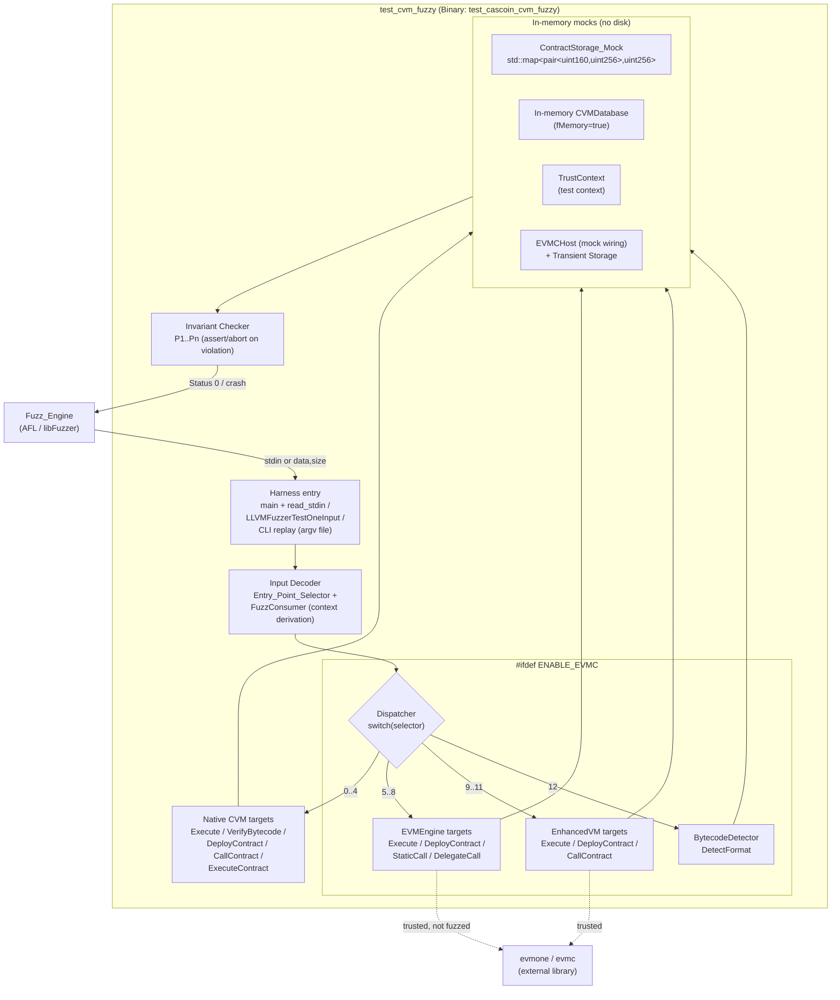

# Design Document: CVM Fuzzing Harness

## Overview

This document describes the design of a CVM-specific fuzzing harness for Cascoin. The goal is an executable test target that forwards arbitrary and structured byte inputs to the public entry points of the three CVM execution layers while checking central security and correctness invariants.

### Purpose

The existing generic harness `src/test/test_bitcoin_fuzzy.cpp` (binary `test_cascoin_fuzzy`) tests only the deserialization of Bitcoin core structures (`CBlock`, `CTransaction`, `CAddrMan`, …). It does not exercise a single CVM code path. The new harness closes this gap by feeding the register-based CVM, the EVM integration layer, and the EnhancedVM router directly.

### Scope (three layers)

1. **Native CVM** — `CVM::CVM` (`src/cvm/cvm.cpp`, `src/cvm/cvm.h`), opcodes in `src/cvm/opcodes.h`. Entry points: `Execute`, `VerifyBytecode`, `DeployContract`, `CallContract` as well as the free function `ExecuteContract`. Covered by Requirements 1–13.
2. **EVM integration layer** — `CVM::EVMEngine` (`src/cvm/evm_engine.cpp/.h`) and the host binding `CVM::EVMCHost` (`src/cvm/evmc_host.cpp/.h`). Only compiled WHEN `ENABLE_EVMC` is defined (in the current build `ENABLE_EVMC = 1`). Covered by Requirements 14–19.
3. **Routing layer** — `CVM::EnhancedVM` (`src/cvm/enhanced_vm.cpp/.h`), created via `EnhancedVMFactory::CreateProductionVM`, with format detection via `CVM::BytecodeDetector` (`src/cvm/bytecode_detector.cpp/.h`). Covered by Requirements 14, 16, 17, 19.

### Non-Goals

- **No fuzzing of the evmone internals.** The external evmone/evmc interpreter is treated as a trusted third-party library (linked externally via `-levmone -levmc-loader -levmc-instructions`). The fuzz target is exclusively the Cascoin integration code (`EVMCHost` callbacks, `EnhancedVM` router) and engine-independent invariants (Req 15).
- **No treatment of evmone error status codes as a bug.** `EVMC_FAILURE`, `EVMC_REVERT`, out-of-gas, etc. are considered a defined execution result (Req 15.1, 15.2).
- **No replacement of the existing `test_cascoin_fuzzy`.** The CVM harness is an additional, standalone binary.

### Relationship to the existing `test_cascoin_fuzzy`

The new harness deliberately mirrors the proven pattern of `test_bitcoin_fuzzy.cpp`: a selector byte at the start of the input (analogous to the `TEST_ID` enum), reading input from stdin (`read_stdin`, capped), AFL persistent mode via `__AFL_LOOP`/`__AFL_INIT`, as well as `LLVMFuzzerTestOneInput`/`LLVMFuzzerInitialize` and a weak `main` for libFuzzer. However, it is maintained as a **separate source and build target** (`src/test/test_cvm_fuzzy.cpp` → binary `test_cascoin_cvm_fuzzy`), not by extending the generic harness (see the "Design Decisions" section for the rationale).

## Architecture

The harness is an in-process fuzz target. The Fuzz_Engine (AFL or libFuzzer) drives a single entry function that decomposes a byte buffer into an Entry_Point_Selector plus derived context, calls exactly one CVM entry point, and then runs the invariant checkers. All side effects run against in-memory mocks.



The three EVM/router-related branches (selectors 5–12) are fully enclosed by `#ifdef ENABLE_EVMC`. If `ENABLE_EVMC` is not defined, these selectors return as a no-op with status code 0 (Req 14.3, 14.4); the harness builds and runs in both configurations.

### Execution flow per input

1. Receive the input buffer (stdin, libFuzzer buffer, or CLI file).
2. If the buffer is empty (`size < 1`), immediately return status 0 (Req 1.2).
3. Read the first byte as the selector; pass the remaining buffer to the `FuzzConsumer`.
4. If the selector is outside the valid range, return status 0 (Req 1.3).
5. Derive context fields from the buffer (gas limit clamped, addresses, values, block context).
6. Create fresh mocks (`ContractStorage_Mock` or in-memory `CVMDatabase` + `TrustContext`).
7. Call exactly one entry point within a `try` block.
8. Run the invariant checkers for that entry point.
9. Catch expected exceptions → status 0 (Req 1.7); unexpected invariant violations → `abort()` (the sanitizer/AFL registers the crash).

## Input Format / Entry_Point_Selector

### Byte layout

```
+--------+-----------------------------+--------------------------------+
| Byte 0 | Front bytes (code/inputData)| Tail bytes (context fields)    |
| Selec- | ---- read from the start -->| <-- read from the end -----    |
| tor    |                             |                                |
+--------+-----------------------------+--------------------------------+
```

Analogous to the FuzzedDataProvider pattern, **context fields are consumed from the end** of the buffer, while **code/input data remain from the start** (after the selector byte). This keeps the code portion contiguous and easily mutable for the Fuzz_Engine, while context bytes are extracted deterministically. If the buffer is not large enough for a context field, the consumer returns 0-bytes (defined default value).

### Derivation of context fields

The consumer derives the following in fixed order from the end of the buffer:

| Field | Bytes | Derivation |
|------|-------|-----------|
| `gasLimit` | 4 | `uint32` little-endian, clamped to `value % (MAX_GAS_PER_TX + 1)` → range 0..1,000,000 (Req 1.5, 5.4, 14.6) |
| `callValue` | 8 | `uint64` little-endian |
| `blockHeight` | 4 | `uint32` → `int` (high bit masked → non-negative) |
| `timestamp` | 8 | `int64` little-endian |
| `callerAddr` | 20 | `uint160` from 20 bytes (missing bytes = 0) |
| `contractAddr` | 20 | `uint160` from 20 bytes (missing bytes = 0) |
| `blockHash` | 32 | `uint256` from 32 bytes (missing bytes = 0) |
| `code` / `inputData` | rest | remaining front bytes after the selector |

For `CallContract`-style targets the remaining front bytes are interpreted as `inputData` and the separately derived `contractAddr` is used as the target address. For `Execute`/`DeployContract`/`VerifyBytecode`/`DetectFormat` the front bytes are the `code`.

### Selector table

The first byte is interpreted directly as an index into the following enum. Values `>= CVM_FUZZ_TARGET_END` are invalid and lead to status 0 (Req 1.3) — this mirrors the `test_id >= TEST_ID_END` pattern from `test_bitcoin_fuzzy.cpp`.

| Selector | Enum value | Target | Layer | Gating |
|----------|-----------|------|---------|--------|
| 0 | `CVM_EXECUTE` | `CVM::Execute(code, VMState&, ContractStorage*)` | Native | always |
| 1 | `CVM_VERIFY_BYTECODE` | `CVM::VerifyBytecode(code)` (static) | Native | always |
| 2 | `CVM_DEPLOY_CONTRACT` | `CVM::DeployContract(code, contractAddr, storage)` | Native | always |
| 3 | `CVM_CALL_CONTRACT` | `CVM::CallContract(contractAddr, inputData, VMState&, storage)` | Native | always |
| 4 | `EXECUTE_CONTRACT` | `ExecuteContract(code, gasLimit, …, storage)` | Native | always |
| 5 | `EVM_EXECUTE` | `EVMEngine::Execute(...)` | EVM | `ENABLE_EVMC` |
| 6 | `EVM_DEPLOY_CONTRACT` | `EVMEngine::DeployContract(...)` | EVM | `ENABLE_EVMC` |
| 7 | `EVM_STATIC_CALL` | `EVMEngine::StaticCall(...)` | EVM | `ENABLE_EVMC` |
| 8 | `EVM_DELEGATE_CALL` | `EVMEngine::DelegateCall(...)` | EVM | `ENABLE_EVMC` |
| 9 | `ENHANCED_EXECUTE` | `EnhancedVM::Execute(...)` | Router | `ENABLE_EVMC` |
| 10 | `ENHANCED_DEPLOY_CONTRACT` | `EnhancedVM::DeployContract(...)` | Router | `ENABLE_EVMC` |
| 11 | `ENHANCED_CALL_CONTRACT` | `EnhancedVM::CallContract(...)` | Router | `ENABLE_EVMC` |
| 12 | `BYTECODE_DETECT` | `BytecodeDetector::DetectFormat(code)` | Router | `ENABLE_EVMC` |
| — | `CVM_FUZZ_TARGET_END` | range marker | — | — |

When `ENABLE_EVMC` is not defined, `CVM_FUZZ_TARGET_END = 13` is preserved, but cases 5–12 in the dispatcher are no-ops with status 0 (Req 14.3). As a result, the selector values do not shift between build variants, and the same seed corpus remains valid.

### Structured consumer

Recommendation: **a small, hand-written `FuzzConsumer`** instead of an external dependency. Rationale: LLVM's `FuzzedDataProvider.h` is bound to the Clang/libFuzzer toolchain and is not necessarily available in the AFL/GCC build; the need is small (integer, byte, `uint160`/`uint256` consumption). The consumer is deterministic and free of side effects.

```cpp
class FuzzConsumer {
public:
    FuzzConsumer(const uint8_t* data, size_t size); // without selector byte

    template <typename T> T ConsumeIntegralFromTail();   // reads sizeof(T) bytes from the end
    uint160 ConsumeUint160FromTail();                     // 20 bytes from the end
    uint256 ConsumeUint256FromTail();                     // 32 bytes from the end
    uint64_t ConsumeGasLimit();      // uint32 % (MAX_GAS_PER_TX + 1)
    std::vector<uint8_t> ConsumeRemainingFront();         // remaining front bytes

private:
    const uint8_t* m_begin;
    size_t m_front;   // next front index
    size_t m_back;    // next tail index (exclusive)
};
```

If bytes are missing for a field, the consumer returns 0-filled values — there is no error path; every input is well-defined and processable.

## Components and Interfaces

### `src/test/test_cvm_fuzzy.cpp` (harness)

Contains the selector enum, `read_stdin` (taken from the existing harness, cap `1<<20` bytes), `FuzzConsumer`, the mocks, the dispatcher `test_one_input`, the invariant checkers, `LLVMFuzzerTestOneInput`/`LLVMFuzzerInitialize`, as well as a weak `main` with AFL persistent mode and CLI replay.

```cpp
int test_one_input(std::vector<uint8_t> buffer) {
    if (buffer.empty()) return 0;                       // Req 1.2
    uint8_t selector = buffer[0];
    FuzzConsumer c(buffer.data() + 1, buffer.size() - 1);
    if (selector >= CVM_FUZZ_TARGET_END) return 0;      // Req 1.3

    // derive context from tail
    uint64_t gasLimit   = c.ConsumeGasLimit();          // Req 1.5 / 14.6
    uint256  blockHash  = c.ConsumeUint256FromTail();
    uint160  contractA  = c.ConsumeUint160FromTail();
    uint160  callerA    = c.ConsumeUint160FromTail();
    int64_t  timestamp  = c.ConsumeIntegralFromTail<int64_t>();
    int      blockH     = (int)(c.ConsumeIntegralFromTail<uint32_t>() & 0x7fffffff);
    uint64_t callValue  = c.ConsumeIntegralFromTail<uint64_t>();
    std::vector<uint8_t> code = c.ConsumeRemainingFront();

    try {
        switch (selector) {
        case CVM_EXECUTE:          return RunCvmExecute(code, gasLimit, contractA, callerA,
                                                        callValue, blockH, blockHash, timestamp);
        case CVM_VERIFY_BYTECODE:  return RunCvmVerify(code);
        case CVM_DEPLOY_CONTRACT:  return RunCvmDeploy(code, contractA);
        case CVM_CALL_CONTRACT:    return RunCvmCall(contractA, code /*inputData*/, gasLimit,
                                                     callerA, callValue, blockH, blockHash, timestamp);
        case EXECUTE_CONTRACT:     return RunExecuteContract(code, gasLimit, contractA, callerA,
                                                             callValue, blockH, blockHash, timestamp);
#ifdef ENABLE_EVMC
        case EVM_EXECUTE:          return RunEvmExecute(code, gasLimit, contractA, callerA,
                                                        callValue, blockH, blockHash, timestamp);
        case EVM_DEPLOY_CONTRACT:  return RunEvmDeploy(code, gasLimit, callerA, callValue,
                                                       blockH, blockHash, timestamp);
        case EVM_STATIC_CALL:      return RunEvmStaticCall(contractA, code, gasLimit, callerA,
                                                           blockH, blockHash, timestamp);
        case EVM_DELEGATE_CALL:    return RunEvmDelegateCall(contractA, code, gasLimit, callerA,
                                                             callValue, blockH, blockHash, timestamp);
        case ENHANCED_EXECUTE:     return RunEnhancedExecute(code, gasLimit, contractA, callerA,
                                                             callValue, blockH, blockHash, timestamp);
        case ENHANCED_DEPLOY_CONTRACT:
                                   return RunEnhancedDeploy(code, gasLimit, callerA, callValue,
                                                            blockH, blockHash, timestamp);
        case ENHANCED_CALL_CONTRACT:
                                   return RunEnhancedCall(contractA, code, gasLimit, callerA,
                                                          callValue, blockH, blockHash, timestamp);
        case BYTECODE_DETECT:      return RunBytecodeDetect(code);
#else
        case EVM_EXECUTE: case EVM_DEPLOY_CONTRACT: case EVM_STATIC_CALL:
        case EVM_DELEGATE_CALL: case ENHANCED_EXECUTE: case ENHANCED_DEPLOY_CONTRACT:
        case ENHANCED_CALL_CONTRACT: case BYTECODE_DETECT:
            return 0;                                   // Req 14.3
#endif
        default:                   return 0;
        }
    } catch (const std::exception&) {
        return 0;                                       // Req 1.7 (expected exceptions)
    }
}
```

### Input Decoder

Realized through `FuzzConsumer` (see above). Encapsulates the entire derivation of selector and context, so that all handlers see the same, deterministic values for the same input (prerequisite for the determinism properties, Req 8/19).

### `ContractStorage_Mock`

In-memory implementation of the abstract interface `CVM::ContractStorage` (`src/cvm/vmstate.h`). Backing store: `std::map<std::pair<uint160, uint256>, uint256>`.

```cpp
class ContractStorage_Mock : public CVM::ContractStorage {
public:
    bool Load(const uint160& addr, const uint256& key, uint256& value) override {
        auto it = m_store.find({addr, key});
        if (it == m_store.end()) return false;          // Req 2.3
        value = it->second; return true;                // Req 2.2
    }
    bool Store(const uint160& addr, const uint256& key, const uint256& value) override {
        m_store[{addr, key}] = value;                   // Req 2.4 (overwrites), 2.6 (isolated)
        m_addrs.insert(addr);
        return true;
    }
    // Note: the real interface declares Exists(addr) WITHOUT key.
    bool Exists(const uint160& addr) override {         // Req 2.5 (adapted to the real signature)
        return m_addrs.count(addr) > 0;
    }
    const std::map<std::pair<uint160,uint256>, uint256>& Snapshot() const { return m_store; }
private:
    std::map<std::pair<uint160, uint256>, uint256> m_store;
    std::set<uint160> m_addrs;
};
```

Note on the deviation: Requirement 2.5 formulates `Exists(contractAddr, key)`, but the real interface in `vmstate.h` is `Exists(const uint160& contractAddr)`. The mock implements the actual signature; "exists" therefore means "at least one `Store` for this address has occurred". The `Snapshot()` method serves the determinism checker (bit-identical final state, Req 8.3).

### EVM/router wiring (only `ENABLE_EVMC`)

The `EVMEngine`, `EnhancedVM`, and `EVMCHost` require a `CVMDatabase*` and a `TrustContext`. The harness uses the **in-memory option** provided by the `CVMDatabase` constructor (`fMemory = true`), so that no disk access occurs (Req 18.1). This realizes the required "EVMCHost_Mock": the real `EVMCHost` is bound against an in-memory `CVMDatabase` plus a test `TrustContext`; transient storage is already fully in-memory in `EVMCHost` (`std::map<std::pair<evmc_address, evmc_bytes32>, evmc_bytes32> transient_storage`).

```cpp
#ifdef ENABLE_EVMC
struct EvmFixture {
    std::unique_ptr<CVM::CVMDatabase> db;                 // fMemory=true, fWipe=true
    std::shared_ptr<CVM::TrustContext> trust;             // test context
    EvmFixture() {
        db = std::make_unique<CVM::CVMDatabase>(fs::temp_directory_path() / "cvm_fuzz",
                                                1 << 20, /*fMemory=*/true, /*fWipe=*/true);
        trust = std::make_shared<CVM::TrustContext>(db.get());
    }
};

int RunEnhancedExecute(const std::vector<uint8_t>& code, uint64_t gasLimit,
                       const uint160& contractA, const uint160& callerA, uint64_t callValue,
                       int blockH, const uint256& blockHash, int64_t ts) {
    EvmFixture fx;
    auto vm = CVM::EnhancedVMFactory::CreateProductionVM(fx.db.get(), fx.trust);
    CVM::EnhancedExecutionResult r =
        vm->Execute(code, gasLimit, contractA, callerA, callValue,
                    /*input_data=*/{}, blockH, blockHash, ts);

    CheckGasBounds(r.gas_used, gasLimit);                 // Req 16.3
    CheckRoutingConsistency(*vm, code, r);                // Req 17.3/17.4/17.6
    // EVMC error codes are NOT a violation (Req 15.1/15.2) -> do not check
    return 0;                                             // Req 14.7
}
#endif
```

The `BytecodeDetector` is instantiated directly (`CVM::BytecodeDetector det; auto res = det.DetectFormat(code);`) and returns exactly one `BytecodeFormat` (Req 17.1).

### Invariant checker functions

Small, side-effect-free functions that are called after each entry point. A violated invariant triggers `abort()`/`assert` so that AFL/libFuzzer/sanitizer stores the case as a crash with the triggering buffer (Req 3.2, 12.1). Expected, defined error results (`success == false`, EVMC error codes) are NOT a violation.

```cpp
static void CheckGasBounds(uint64_t gasUsed, uint64_t gasLimit) {
    assert(gasUsed <= gasLimit);                          // Req 5.1, 16.3
}
static void CheckStackBound(const CVM::VMState& s) {
    assert(s.StackSize() <= CVM::MAX_STACK_SIZE);         // Req 6.1
}
static void CheckTerminated(const CVM::VMState& s) {
    assert(s.GetStatus() != CVM::VMState::Status::RUNNING); // Req 4.1
}
```

## Invariant Checkers (Mapping Property → Requirement → Check)

| Property | Requirement(s) | Concrete check in the harness |
|----------|----------------|------------------------------|
| Crash/UB freedom | 3.1, 3.2, 3.3, 16.1, 16.5, 16.6 | Call within the `try` block; expected exceptions → status 0; unexpected exceptions/sanitizer reports → crash with stored buffer. Build under ASan/UBSan. |
| Termination | 4.1, 4.3, 4.4, 16.2 | After `Execute`/`ExecuteContract`: `state.GetStatus() != RUNNING`. Gas limit ≤ `MAX_GAS_PER_TX` guarantees a finite opcode count. |
| Gas bounds | 5.1, 5.2, 5.3, 16.3 | `assert(result.gasUsed <= gasLimit)`; for `ExecuteContract`: `result.gasUsed == state.GetGasUsed()`. Monotonicity implicit via `UseGas`. |
| Stack bound | 6.1, 6.2, 6.3 | `assert(state.StackSize() <= MAX_STACK_SIZE)`; overflow/underflow → status `STACK_OVERFLOW`/`STACK_UNDERFLOW`, no continuation. |
| Invalid size/opcode/jump | 7.1, 7.3, 7.4, 7.5, 7.6 | `VerifyBytecode`: empty → `false`, `> MAX_CODE_SIZE` → `false`. Execution: oversized → `VM_ERROR`; invalid opcode byte → `INVALID_OPCODE`; invalid jump target → `INVALID_JUMP`; in each case no storage commit. |
| Determinism (native) | 8.1, 8.2, 8.3, 8.4, 8.5, 19.… | Double (and 100-fold) execution with a fresh mock; comparison of `success`, `gasUsed`, `returnData`, status and `ContractStorage_Mock::Snapshot()`. |
| Storage round-trip | 2.2, 2.3, 2.4, 2.5, 2.6, 18.2, 18.3 | Direct mock test: `Store` then `Load` returns the last value; unset keys → `false`/null; isolation of other pairs. |
| Transient storage | 18.5, 18.6, 18.7 | `EVMCHost::GetInterface()` registers non-null pointers for `get_transient_storage`/`set_transient_storage`; set→get round-trip within one execution; `ClearTransientStorage` on a new execution → null. |
| Detector + routing | 17.1, 17.2, 17.3, 17.4, 17.5, 17.6 | `DetectFormat` returns exactly one format and is stable for bit-identical input; `EnhancedExecutionResult.executed_format` corresponds to the routed format; `UNKNOWN` → `success == false`. |
| EVMC error codes ≠ violation | 15.1, 15.2, 15.4 | `status_code`/`success == false`/non-loadable interpreter are NOT counted as a violation; only crash/UB/assertion/engine-independent invariants (16–19). |
| EVM/router determinism | 19.1, 19.2, 19.3, 19.4 | Double (and 100-fold) execution with a fresh `EvmFixture`; comparison of `success`, `gas_used`, `return_data`, `executed_format` (Enhanced) or `status_code`, `output_data` (Engine) as well as the host final state. |

## Data Models

### Selector enum

```cpp
enum CvmFuzzTarget : uint8_t {
    CVM_EXECUTE = 0, CVM_VERIFY_BYTECODE, CVM_DEPLOY_CONTRACT, CVM_CALL_CONTRACT,
    EXECUTE_CONTRACT, EVM_EXECUTE, EVM_DEPLOY_CONTRACT, EVM_STATIC_CALL,
    EVM_DELEGATE_CALL, ENHANCED_EXECUTE, ENHANCED_DEPLOY_CONTRACT,
    ENHANCED_CALL_CONTRACT, BYTECODE_DETECT, CVM_FUZZ_TARGET_END
};
```

### Derived context (internal structure)

```cpp
struct FuzzContext {
    uint64_t gasLimit;      // 0..MAX_GAS_PER_TX
    uint64_t callValue;
    int      blockHeight;   // >= 0
    int64_t  timestamp;
    uint160  contractAddr;
    uint160  callerAddr;
    uint256  blockHash;
    std::vector<uint8_t> code;   // or inputData
};
```

### Result types used (existing, not new)

- `CVM::ExecutionResult { bool success; uint64_t gasUsed; std::vector<uint8_t> returnData; std::vector<VMState::LogEntry> logs; std::string error; }`
- `CVM::EVMExecutionResult { bool success; evmc_status_code status_code; uint64_t gas_used; uint64_t gas_left; std::vector<uint8_t> output_data; …}`
- `CVM::EnhancedExecutionResult { bool success; uint64_t gas_used; std::vector<uint8_t> return_data; …; BytecodeFormat executed_format; uint160 contract_address; }`
- `CVM::VMState::Status { RUNNING, STOPPED, RETURNED, REVERTED, OUT_OF_GAS, STACK_OVERFLOW, STACK_UNDERFLOW, INVALID_OPCODE, INVALID_JUMP, VM_ERROR }`
- `CVM::BytecodeFormat { UNKNOWN, CVM_NATIVE, EVM_BYTECODE, HYBRID }`

### Relevant constants (existing)

`MAX_STACK_SIZE = 1024`, `MAX_CODE_SIZE = 24576`, `MAX_CONTRACT_SIZE = 24576`, `MAX_GAS_PER_TX = 1,000,000`, `MAX_GAS_PER_BLOCK = 10,000,000`, `MAX_CALL_DEPTH = 256` (native) or `EnhancedVM::MAX_BYTECODE_SIZE = 24576`, `EnhancedVM::MAX_CALL_DEPTH = 1024`.

## Correctness Properties

*A property is a characteristic or behavior that should hold true across all valid executions of a system — essentially a formal statement about what the system should do. Properties form the bridge between human-readable specifications and machine-verifiable correctness guarantees.*

The harness is well suited to property-based testing (PBT): the checked entry points have clearly defined input/output behavior, universal invariants exist (bounds, determinism, round-trips), and the input space (arbitrary byte buffers) is practically infinite. The following properties were derived from the prework and consolidated (redundant criteria combined). Each property is implemented with **one** property-based test (at least 100 iterations).

### Property 1: Crash freedom and termination of the native CVM

*For every* byte buffer with a length of 0 to 24,576 that is processed via a native CVM entry point (`Execute`/`ExecuteContract`/`CallContract`) with a gas limit in the range 0..`MAX_GAS_PER_TX`, the execution terminates without a memory access error, triggered assertion, or undefined behavior, and leaves a `VMState::Status` other than `RUNNING`.

**Validates: Requirements 3.1, 3.4, 4.1, 1.6, 1.7**

### Property 2: Gas bounds and result consistency

*For every* byte buffer and every gas limit `gasLimit` in the range 0..`MAX_GAS_PER_TX`, the following holds after `ExecuteContract` completes: `0 <= gasUsed <= gasLimit`, and the field `ExecutionResult.gasUsed` is exactly equal to `VMState::GetGasUsed()`.

**Validates: Requirements 5.1, 5.2, 5.3**

### Property 3: Stack bound

*For every* byte buffer that is executed via a native CVM entry point, `VMState::StackSize() <= MAX_STACK_SIZE` (1024) holds at every observable point in time and at the end of execution.

**Validates: Requirements 6.1, 6.4**

### Property 4: Status classification of invalid bytecode

*For every* byte buffer whose execution hits one of the violation classes, the native CVM returns the appropriate defined status without a state commit: length > `MAX_CODE_SIZE` → `VM_ERROR`; reached invalid opcode byte → `INVALID_OPCODE`; invalid jump target (JUMP/JUMPI) → `INVALID_JUMP`.

**Validates: Requirements 7.4, 7.5, 7.6**

### Property 5: VerifyBytecode classification by size and opcodes

*For every* `code` the following holds: if the length is 0 or greater than `MAX_CODE_SIZE`, `CVM::VerifyBytecode` returns `false`; if the `code` (length 1..`MAX_CODE_SIZE`) consists exclusively of bytes that satisfy `IsValidOpCode`, `VerifyBytecode` returns `true`.

**Validates: Requirements 7.1, 7.2, 7.3**

### Property 6: Determinism of native execution

*For every* byte buffer, every context, and every bit-identical initial state of the `ContractStorage_Mock`, any number (at least 100) of consecutive `ExecuteContract` calls return identical `success`, exactly equal `gasUsed`, byte-for-byte identical `returnData`, identical `VMState::Status`, and a bit-identical final state of the `ContractStorage_Mock`.

**Validates: Requirements 8.1, 8.2, 8.3, 8.4, 8.5**

### Property 7: ContractStorage_Mock semantics

*For every* address, every key, and every value the following holds: after `Store(addr, key, value)`, `Load(addr, key, out)` returns exactly the last stored `value` and `true`; for a pair that was never stored, `Load` returns `false` and leaves `out` unchanged; a `Store` on one pair does not change any other pair; `Exists(addr)` is `true` exactly when at least one `Store` has occurred for `addr`.

**Validates: Requirements 2.2, 2.3, 2.4, 2.5, 2.6**

### Property 8: Gas limit derivation within the valid range

*For every* input byte buffer, the gas limit derived by the `FuzzConsumer` always lies in the range 0..`MAX_GAS_PER_TX` (inclusive), regardless of the chosen entry point.

**Validates: Requirements 1.5, 14.6**

### Property 9: Deterministic, valid selector routing

*For every* input byte buffer, the Entry_Point_Selector maps the first byte deterministically to at most one entry point: a valid selector value selects exactly one target; a value `>= CVM_FUZZ_TARGET_END` as well as (when `ENABLE_EVMC` is not defined) any EVM/router selector leads to no entry point call and status code 0.

**Validates: Requirements 1.1, 1.3, 14.1, 14.2, 14.3**

### Property 10: Crash freedom and gas bounds of the EVM/router path

*For every* byte buffer with a length of 0 to 24,576 that (when `ENABLE_EVMC` is defined) is processed via an `EVMEngine` or `EnhancedVM` entry point with a gas limit 0..`MAX_GAS_PER_TX`, the execution terminates without crash/UB with a defined result, and `0 <= gas_used <= gasLimit` holds.

**Validates: Requirements 16.1, 16.2, 16.3, 14.7**

### Property 11: Totality and determinism of the BytecodeDetector

*For every* byte buffer with a length of 0 to 24,576, `BytecodeDetector::DetectFormat` returns without a crash exactly one of the values `CVM_NATIVE`, `EVM_BYTECODE`, `HYBRID`, or `UNKNOWN`, and two calls with bit-identical input return the same value.

**Validates: Requirements 17.1, 17.2**

### Property 12: Consistency of format detection and routing

*For every* byte buffer that the `BytecodeDetector` does not classify as `UNKNOWN`, the field `EnhancedExecutionResult.executed_format` corresponds exactly to the classified format to which the execution was actually forwarded; if the detector classifies `UNKNOWN`, the `EnhancedVM` returns `success == false` with the `error` field set and without a crash.

**Validates: Requirements 17.3, 17.4, 17.5, 17.6**

### Property 13: EVMCHost storage and account semantics

*For every* contract address, every storage key, and every value, the EVMCHost_Mock returns via `get_storage` with the same values the last value set via `set_storage` byte-identically; for a pair that was never set, `get_storage` returns a null value; for a non-existing account, `account_exists`, `get_balance`, `get_code_size`, `get_code_hash`, and `copy_code` return defined default values without a crash.

**Validates: Requirements 18.2, 18.3, 18.4**

### Property 14: Transient storage round-trip and reset

*For every* contract address, every key, and every value, the EVMCHost_Mock returns within one execution via `get_transient_storage` with the same values the last value set via `set_transient_storage` byte-identically; after the start of a new execution (`ClearTransientStorage`), `get_transient_storage` returns a null value for every pair.

**Validates: Requirements 18.6, 18.7**

### Property 15: Determinism of the EVM/router path

*For every* byte buffer, every context, and every bit-identical initial state of the EVMCHost_Mock, any number (at least 100) of consecutive `EnhancedVM` calls return identical `success`, exactly equal `gas_used`, byte-for-byte identical `return_data`, identical `executed_format`, and a bit-identical host final state; correspondingly, `EVMEngine` calls return identical `success`, `status_code`, `gas_used`, and `output_data`.

**Validates: Requirements 19.1, 19.2, 19.3, 19.4**

### Property 16: Reproducibility of stored crash inputs

*For every* stored Crash_Input, the harness triggers on every repetition (100% of executions) the same invariant violation or the same crash with an identical observable result.

**Validates: Requirements 12.3**

## Error Handling

The harness strictly distinguishes between **defined results** and **invariant violations**:

- **Defined results** (not an error of the harness): every `VMState::Status` (incl. `OUT_OF_GAS`, `INVALID_OPCODE`, `INVALID_JUMP`, `STACK_OVERFLOW`, `STACK_UNDERFLOW`, `VM_ERROR`), `success == false`, set `error` fields, as well as all EVMC status codes (`EVMC_FAILURE`, `EVMC_REVERT`, out-of-gas, etc.). These are not reported (Req 15.1, 15.2).
- **Expected exceptions**: are caught within the `try` block; the harness returns with status 0 (Req 1.7). Since the production entry points, per contract, should not throw exceptions, an optional distinction is made between "expected" (silent return) and "unexpected" (violation); for maximum bug-finding, the harness reports unexpected exception types as a violation (Req 3.2, 16.5).
- **Invariant violations**: violation of one of the properties P1–P16, sanitizer report (ASan/UBSan), triggered assertion, or crash. These lead to `abort()`; AFL/libFuzzer store the triggering buffer as a Crash_Input (Req 3.2, 3.3, 12.1, 16.6).
- **evmone not loadable**: is treated as a defined error state; the harness returns with status 0 and does not report a violation (Req 15.4).
- **CLI replay of an unreadable file**: error message to stderr, no own crash, defined exit (Req 12.5).
- **Input cap**: `read_stdin` discards inputs > `1<<20` bytes (taken from the existing harness); the libFuzzer entry accepts 0..≥1 MiB (Req 9.5).

## Testing Strategy

### Two-stage approach

- **Property-based tests** cover the universal invariants P1–P16. Each property is implemented with **exactly one** property test that runs at least **100 iterations**. Since Cascoin uses C++ with the Boost test framework (`src/test/test_cascoin`), the property tests are implemented as `rapidcheck` properties (or a hand-written generator-based loop with ≥100 iterations, if `rapidcheck` is not available) in a new suite `cvm_fuzz_property_tests.cpp` under `src/test/`. **No** PBT library is implemented from scratch.
- **Unit/example/edge-case tests** cover the concrete edge cases from the prework: empty buffer (1.2), `gasLimit == 0` → `OUT_OF_GAS` (4.4), gas nearly exhausted → `OUT_OF_GAS`/rollback (4.3, 5.5), `gasLimit` out of range passed to `ExecuteContract` (5.4), stack overflow/underflow bytecodes (6.2, 6.3), empty/oversized `VerifyBytecode` (7.3), transient callback pointers not null (18.5), non-existent replay file (12.5), EVMC error code does not trigger an `abort` (15.1, 15.2).
- **Smoke/integration tests**: the build target builds with and without `ENABLE_EVMC` (9.1–9.4, 14.4); a smoke run over the seed corpus processes every seed input without a violation (10.4). Where practical in CI/`make check`, the harness is run in CLI replay mode over all seeds.

### Property test configuration

- At least 100 iterations per property test.
- Each property test references its design property via a comment tag in the format:
  `// Feature: cvm-fuzzing-harness, Property {number}: {property_text}`
- Generators produce: arbitrary byte buffers (0..24,576 and beyond for size edge cases), buffers consisting exclusively of valid opcode bytes (for P5), buffers with targeted EVM prefixes (`0x60` PUSH pattern) or CVM headers (for P11/P12), as well as random `(uint160, uint256, uint256)` triples (for P7/P13/P14).
- Sanitizers: property and smoke runs are additionally built under ASan/UBSan so that P1/P10 uncover memory and UB errors.

## Build Integration

### New target in `src/Makefile.test.include`

Analogous to the existing `test_cascoin_fuzzy` block, a separate target `test/test_cascoin_cvm_fuzzy` is added (source `test/test_cvm_fuzzy.cpp`). The linked libraries mirror exactly the existing fuzzy block (incl. `$(EVMC_LIBS)`, so that the EVM layer is available):

```makefile
noinst_PROGRAMS += test/test_cascoin_cvm_fuzzy

# test_cvm_fuzzy binary #
test_test_cascoin_cvm_fuzzy_SOURCES = test/test_cvm_fuzzy.cpp
test_test_cascoin_cvm_fuzzy_CPPFLAGS = $(AM_CPPFLAGS) $(BITCOIN_INCLUDES)
test_test_cascoin_cvm_fuzzy_CXXFLAGS = $(AM_CXXFLAGS) $(PIE_FLAGS)
test_test_cascoin_cvm_fuzzy_LDFLAGS = $(RELDFLAGS) $(AM_LDFLAGS) $(LIBTOOL_APP_LDFLAGS)

test_test_cascoin_cvm_fuzzy_LDADD = \
  $(LIBUNIVALUE) \
  $(LIBBITCOIN_SERVER) \
  $(LIBBITCOIN_COMMON) \
  $(LIBBITCOIN_UTIL) \
  $(LIBBITCOIN_CONSENSUS) \
  $(LIBBITCOIN_CRYPTO) \
  $(LIBBITCOIN_QUANTUM) \
  $(LIBSECP256K1)

test_test_cascoin_cvm_fuzzy_LDADD += $(BOOST_LIBS) $(CRYPTO_LIBS) $(EVMC_LIBS) $(LIBOQS_LIBS)
```

The name follows the `test_cascoin*` convention (Req 9.1). The binary is maintained as `noinst_PROGRAMS` (no `make install`), exactly like `test_cascoin_fuzzy`.

### AFL/libFuzzer mode selection

The source code uses the same preprocessor pattern as `test_bitcoin_fuzzy.cpp`:

- `extern "C" int LLVMFuzzerTestOneInput(const uint8_t*, size_t)` and `LLVMFuzzerInitialize` for libFuzzer (Req 9.5).
- Weak `main` (`__attribute__((weak))`, except WIN32), which libFuzzer overrides when needed.
- `#ifdef __AFL_INIT` → `__AFL_INIT()` (deferred forkserver) and `#ifdef __AFL_LOOP` → `while (__AFL_LOOP(1000))` with `read_stdin` (persistent mode, Req 9.4).
- Without AFL macros: a single `read_stdin` + `test_one_input`.
- **CLI replay** (Req 12.4): if the harness detects an `argv[1]`, it reads exactly that file instead of stdin; an unreadable file → error message, no crash (Req 12.5).

### `ENABLE_EVMC` gating

All EVM/router-specific includes, handlers, and checkers (selectors 5–12) reside within `#ifdef ENABLE_EVMC`. When `ENABLE_EVMC` is not defined, these selectors are no-ops with status 0 (Req 14.3). This way the harness builds and runs in both configurations (Req 14.4), without selector values or corpus compatibility changing.

## Seed Corpus

### Location

`src/test/fuzz_seeds/cvm/` (path relative to the repository root, documented in `doc/developer/fuzzing.md`, Req 13.3). Each seed file is a raw byte buffer in the harness input format (first byte = selector, front = code/InputData, tail = context).

### Generation and storage

The seeds are generated by a small, versioned helper script or by hand and checked in as binary files. Context bytes are chosen so that a sensible gas limit results (e.g., tail filled such that `ConsumeGasLimit` returns a high value near `MAX_GAS_PER_TX`). Each seed file does not exceed the maximum CVM bytecode size (24 KB) (Req 10.1).

### Covering seeds (Req 10)

| Seed | Selector | Purpose | Requirement |
|------|----------|-------|-------------|
| `valid_execute.bin` | 0 | valid bytecode (PUSH/… /STOP), passes `VerifyBytecode` | 10.1 |
| `verify_valid.bin` | 1 | only valid opcode bytes → `VerifyBytecode == true` | 10.1, 10.2 |
| `deploy_valid.bin` | 2 | valid deploy bytecode | 10.2 |
| `call_basic.bin` | 3 | `CallContract` with InputData | 10.2 |
| `execute_contract.bin` | 4 | `ExecuteContract` with full context | 10.2 |
| `sstore_sload.bin` | 0/4 | SSTORE to a key, then SLOAD of the same key → read value == written value | 10.3 |
| `invalid_bytecode.bin` | 1 | contains invalid opcode bytes → `VerifyBytecode == false` | 10.5, 10.6 |
| `evm_execute.bin` | 5 | EVM bytecode (only effective with `ENABLE_EVMC`) | 10.2 |
| `enhanced_execute.bin` | 9 | router input (only effective with `ENABLE_EVMC`) | 10.2 |
| `detect_formats.bin` | 12 | input for `BytecodeDetector` | 10.2 |

For each entry point supported per Req 1 and Req 14, at least one seed exists that deterministically selects that entry point on every execution (the first byte is fixed). Invalid seeds are processed or discarded by the harness without a violation (Req 10.6).

## Crash Reproduction and Regtest Path

### CLI replay (Req 12)

```bash
# Replay exactly one stored input without a running fuzz engine:
src/test/test_cascoin_cvm_fuzzy path/to/crash-input
# Expected success signal: for an error-free input, exit 0 without output;
# for a crash input, identical abort (sanitizer/assertion message) on every run.
```

The replay mode reads exactly the file specified as `argv[1]`. If the file does not exist or is not readable, the harness prints an error message and aborts without its own crash (Req 12.5). Since native and (with `ENABLE_EVMC`) EVM/router execution are deterministic (P6, P15), the same buffer reproduces the same violation on 100% of runs (P16, Req 12.3).

### Regtest reproduction (Req 11.3)

For end-to-end validation of a finding, the bytecode contained in the Crash_Input is extracted (front bytes after the selector) and executed in a local regtest network via the RPC commands:

```bash
# 1) Start the regtest daemon
src/cascoind -regtest -daemon
# Success signal: "Cascoin server starting"; getblockchaininfo returns "chain": "regtest".

# 2) Generate mature coins
src/cascoin-cli -regtest generate 101
# Success signal: 101 returned block hashes; getbalance > 0.

# 3) Prepare and deploy the contract with the reproduced bytecode
src/cascoin-cli -regtest deploycontract <bytecode_hex>
src/cascoin-cli -regtest sendcvmcontract <deploy_hex>
src/cascoin-cli -regtest generate 1
# Success signal: getcontractinfo <addr> returns the contract metadata
# (or, for invalid bytecode, a defined error instead of a daemon crash).

# 4) Call the contract with the reproduced InputData
src/cascoin-cli -regtest callcontract <addr> <inputdata_hex>
# Success signal: defined RPC response with success/error and gasUsed;
# the daemon stays alive (getblockchaininfo still responds).
```

A successful reproduction case of the Crash_Input exists when an invariant violation occurs in the in-process harness, but the regtest observes the expected defined behavior (defined error status, no daemon crash) — the difference localizes the integration error. The documentation records that the primary fuzzing happens in-process and that regtest serves reproduction/validation (Req 11.4).

## Design Decisions and Trade-offs

### Separate binary instead of extending `test_cascoin_fuzzy`

**Decision:** new target `test_cascoin_cvm_fuzzy` (source `test/test_cvm_fuzzy.cpp`).
**Rationale:** The existing harness has its own `TEST_ID` space and a CDataStream-based deserialization focus. Mixing them would overload the selector space, break the corpus compatibility of both targets, and dilute the CVM coverage signal with Bitcoin deserialization paths. A separate binary allows targeted corpora, clean coverage measurement, and independent sanitizer builds. Cost: minimal duplication of `read_stdin`/`main` boilerplate — acceptable and deliberately chosen.

### Hand-written input decoder instead of a dependency

**Decision:** own `FuzzConsumer` instead of LLVM `FuzzedDataProvider.h`.
**Rationale:** The harness must build both with AFL (gcc/afl-clang-fast) and with libFuzzer; `FuzzedDataProvider.h` is part of the LLVM tooling and is not available in all configurations. The need is small and clear (integer/byte/`uint160`/`uint256` consumption, gas clamping). A hand-written, deterministic consumer avoids a toolchain coupling and keeps the determinism (P6, P15) under control. Cost: ~50 lines of own code, well testable (P8).

### evmone as a trusted third-party library

**Decision:** evmone/evmc are not fuzzed; only the Cascoin integration code and engine-independent invariants.
**Rationale:** evmone is a separately maintained, extensively tested upstream project; internal EVMC error status codes are defined results, not bugs (Req 15). The harness calls only public Cascoin entry points (Req 15.3). Trade-off: errors within evmone itself are not directly sought — deliberate, since they are not within Cascoin's responsibility.

### Gating strategy for `ENABLE_EVMC`

**Decision:** full `#ifdef ENABLE_EVMC` gating of selectors 5–12 with the selector space remaining stable (`CVM_FUZZ_TARGET_END = 13` in both builds).
**Rationale:** This keeps the same seed corpus valid in both configurations, and inputs do not change their target between builds. Without `ENABLE_EVMC`, the EVM/router cases are deterministic no-ops with status 0 (Req 14.3), so that the harness builds and runs in both variants (Req 14.4). The alternative (compressing the selector when EVMC is missing) was rejected because it would destroy corpus portability.
