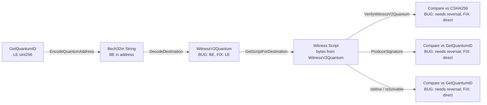

# Design Document: Quantum Endianness Fix

## Overview

This design addresses an endianness inconsistency in how the quantum witness program (SHA256 hash of a FALCON-512 public key) flows through the Cascoin Core codebase. The root cause is a mismatch between the encoding path (which reverses bytes from LE to BE for Bech32m) and the decoding path (which does not reverse them back). This causes the `WitnessV2Quantum` destination and the resulting witness script to store bytes in BE order, while all hash computations (`GetQuantumID()`, `CSHA256`) produce LE order. Every downstream consumer — verification, signing, ownership detection — must then perform ad-hoc byte reversals to compensate.

A secondary issue is that `VerifyQuantumTransaction()` uses `Hash()` (double SHA256) instead of `CSHA256` (single SHA256), creating a hash function mismatch with `GetQuantumID()`.

The fix establishes LE as the canonical byte order by adding a single reversal in `DecodeDestination()`, then removes all compensating reversals from downstream code paths.

## Architecture

The fix touches six code paths that form a data flow pipeline:



The fix is a single-point correction at the decode boundary (arrow from B→C), which eliminates the need for all downstream compensations (E, F, G).

## Components and Interfaces

### Component 1: DecodeDestination (base58.cpp) — THE FIX

The quantum branch in `DecodeDestination()` currently copies Bech32m-decoded bytes directly into `WitnessV2Quantum`:

```cpp
// CURRENT (buggy): stores BE bytes
WitnessV2Quantum quantum;
std::copy(data.begin(), data.end(), quantum.begin());
```

The fix reverses the bytes to restore LE order:

```cpp
// FIXED: reverse BE→LE to match GetQuantumID() output
WitnessV2Quantum quantum;
for (size_t i = 0; i < 32; i++) {
    quantum.begin()[i] = data[31 - i];
}
```

This is the only place where new byte manipulation is added.

### Component 2: WitnessV2Quantum Encoder (base58.cpp) — ADD REVERSAL

The `EncodeDestination` visitor for `WitnessV2Quantum` passes `id.begin()` to `id.end()` directly to `ConvertBits`. Since `WitnessV2Quantum` will now store LE bytes (matching `GetQuantumID()`), the encoder must reverse LE→BE before Bech32m encoding, matching what `EncodeQuantumAddress()` in `address_quantum.cpp` already does:

```cpp
// FIXED: reverse LE→BE for Bech32m encoding
std::vector<unsigned char> programBE(32);
for (size_t i = 0; i < 32; i++) {
    programBE[i] = id.begin()[31 - i];
}
std::vector<unsigned char> data = {address::QUANTUM_WITNESS_VERSION};
ConvertBits<8, 5, true>(data, programBE.begin(), programBE.end());
```

### Component 3: VerifyWitnessV2Quantum (interpreter.cpp) — REMOVE REVERSAL

Two locations in this function contain the `programLE` reversal loop. Both are removed:

```cpp
// CURRENT (compensating for BE in script):
std::vector<unsigned char> programLE(32);
for (size_t i = 0; i < 32; i++) {
    programLE[i] = program[31 - i];
}
if (memcmp(pubkeyHash.begin(), programLE.data(), 32) != 0) { ... }

// FIXED (script now stores LE, direct comparison):
if (memcmp(pubkeyHash.begin(), program.data(), 32) != 0) { ... }
```

This applies to both the registry format path and the standard format path.

### Component 4: ProduceSignature (sign.cpp) — REMOVE REVERSAL

The quantum signing branch currently reverses bytes to reconstruct the `pubkeyHash`:

```cpp
// CURRENT (compensating for BE in script):
uint256 pubkeyHash;
if (result[0].size() == 32) {
    for (size_t i = 0; i < 32; i++) {
        pubkeyHash.begin()[31 - i] = result[0][i];
    }
}

// FIXED (script now stores LE, direct copy):
uint256 pubkeyHash;
if (result[0].size() == 32) {
    memcpy(pubkeyHash.begin(), result[0].data(), 32);
}
```

### Component 5: IsSolvable (sign.cpp) — REMOVE REVERSAL

Same pattern as ProduceSignature:

```cpp
// CURRENT:
uint256 pubkeyHash;
for (size_t i = 0; i < 32; i++) {
    pubkeyHash.begin()[31 - i] = vSolutions[0][i];
}

// FIXED:
uint256 pubkeyHash;
memcpy(pubkeyHash.begin(), vSolutions[0].data(), 32);
```

### Component 6: IsMine (ismine.cpp) — REMOVE REVERSALS

Two locations: the `TX_WITNESS_UNKNOWN` fallback path and the `TX_WITNESS_V2_QUANTUM` path. Both have the same reversal loop to remove:

```cpp
// CURRENT (both locations):
uint256 witnessProgram;
for (size_t i = 0; i < 32; i++) {
    witnessProgram.begin()[31 - i] = vSolutions[X][i];
}

// FIXED (both locations):
uint256 witnessProgram;
memcpy(witnessProgram.begin(), vSolutions[X].data(), 32);
```

### Component 7: VerifyQuantumTransaction (quantum_registry.cpp) — FIX HASH FUNCTION

Replace `Hash()` (double SHA256) with `CSHA256` (single SHA256):

```cpp
// CURRENT (wrong hash function):
uint256 computedProgram = Hash(pubkey.begin(), pubkey.end());

// FIXED (single SHA256, consistent with GetQuantumID):
uint256 computedProgram;
CSHA256().Write(pubkey.data(), pubkey.size()).Finalize(computedProgram.begin());
```

### Component 8: ExtractDestination (standard.cpp) — NO CHANGE NEEDED

`ExtractDestination` copies `vSolutions[0]` bytes directly into `WitnessV2Quantum`. After the fix, the script stores LE bytes, so `ExtractDestination` correctly produces an LE `WitnessV2Quantum`. No change needed.

## Data Models

No new data structures are introduced. The existing `WitnessV2Quantum` (a `uint256` subclass) continues to be used. The only change is the byte order convention: after the fix, `WitnessV2Quantum` always stores bytes in LE order (matching `uint256` and `GetQuantumID()` conventions).

### Byte Order Convention (Post-Fix)

| Location | Byte Order | Notes |
|---|---|---|
| `GetQuantumID()` output | LE | Single SHA256, stored in uint256 |
| `WitnessV2Quantum` | LE | Matches GetQuantumID() |
| Witness script program bytes | LE | Copied from WitnessV2Quantum |
| Bech32m address encoding | BE | Reversed during encode, reversed back during decode |
| `CSHA256().Finalize()` output | LE | Stored in uint256 |
| `VerifyWitnessV2Quantum` comparison | LE vs LE | Direct memcmp, no reversal |
| `ProduceSignature` key lookup | LE | Direct memcpy from script |
| `IsMine` / `IsSolvable` comparison | LE vs LE | Direct memcpy from script |


## Correctness Properties

*A property is a characteristic or behavior that should hold true across all valid executions of a system — essentially, a formal statement about what the system should do. Properties serve as the bridge between human-readable specifications and machine-verifiable correctness guarantees.*

The following properties were derived from the acceptance criteria in the requirements document. After prework analysis, 6 consolidated properties were identified from the original 30+ acceptance criteria, eliminating redundancy while maintaining full coverage.

### Property 1: Address encoding round-trip (pubkey → address → destination)

*For any* valid FALCON-512 public key, encoding a quantum address via `EncodeQuantumAddress()` then decoding via `DecodeDestination()` shall produce a `WitnessV2Quantum` whose raw bytes are identical to the `GetQuantumID()` output for that public key.

**Validates: Requirements 1.1, 1.3, 2.1, 2.3, 9.1**

### Property 2: Address decoding round-trip (address → destination → address)

*For any* valid quantum address string (well-formed Bech32m with quantum HRP, witness version 2, and 32-byte program), decoding via `DecodeDestination()` then re-encoding via `EncodeDestination()` shall produce the original address string.

**Validates: Requirements 2.2**

### Property 3: Script stores canonical bytes

*For any* valid FALCON-512 public key, constructing a `WitnessV2Quantum` from `GetQuantumID()`, then calling `GetScriptForDestination()`, then extracting the 32-byte program from the resulting script, shall yield bytes identical to `GetQuantumID()` output (i.e., identical to `CSHA256(pubkey)` finalized into a `uint256`).

**Validates: Requirements 1.2, 3.1, 9.2**

### Property 4: Hash consistency across all quantum functions

*For any* valid FALCON-512 public key, the following four computations shall all produce the same 32-byte value:
1. `GetQuantumID()` on the `CPubKey`
2. `GetQuantumWitnessProgram()` on the `CPubKey` or raw pubkey data
3. `ParseQuantumWitness()` `.pubkeyHash` field for a registration witness containing that public key
4. The hash computed inside `VerifyQuantumTransaction()` for the same public key data

**Validates: Requirements 3.3, 5.1, 5.2, 5.3, 5.4, 5.5, 9.4**

### Property 5: Signing path works with canonical bytes

*For any* valid FALCON-512 keypair present in the keystore, and a quantum output script derived from that keypair's `GetQuantumID()`:
- `ProduceSignature()` shall successfully produce a valid quantum witness
- `IsSolvable()` shall return `true`
- `IsMine()` shall return `ISMINE_SPENDABLE`

All without any byte reversal in the signing/solvability/ownership code paths.

**Validates: Requirements 4.1, 4.2, 4.3, 9.3**

### Property 6: ECDSA non-interference

*For any* valid ECDSA keypair and standard transaction type (P2PKH, P2SH, P2WPKH, P2WSH), the quantum endianness fix shall not alter the behavior of `GetScriptForDestination()`, `ProduceSignature()`, `VerifyScript()`, `IsSolvable()`, or `IsMine()` for that transaction.

**Validates: Requirements 8.1, 8.2, 9.5**

## Error Handling

The fix does not introduce new error conditions. It removes compensating byte reversals and fixes a hash function mismatch. The existing error handling in each component remains unchanged:

- `VerifyWitnessV2Quantum`: continues to return `SCRIPT_ERR_WITNESS_PROGRAM_MISMATCH` when the program doesn't match `SHA256(pubkey)`. The fix makes this comparison work correctly without reversal.
- `ProduceSignature`: continues to return `false` (signing failure) when no matching quantum key is found. The fix ensures the key lookup uses the correct byte order.
- `IsMine` / `IsSolvable`: continue to return `ISMINE_NO` / `false` when no matching key exists. The fix ensures the comparison uses the correct byte order.
- `VerifyQuantumTransaction`: continues to return `false` on hash mismatch. The fix changes the hash function from `Hash()` (double SHA256) to `CSHA256` (single SHA256) so the comparison actually succeeds for valid transactions.
- `DecodeDestination`: continues to return `CNoDestination` for invalid quantum addresses. The fix only changes the byte order of successfully decoded addresses.

### Backward Compatibility (Requirement 7)

Since the testnet can be reset from genesis (Requirement 7.3), no dual-recognition mechanism is needed. The fix assumes a clean deployment where all quantum UTXOs use the corrected LE byte order. If a testnet reset is not performed, existing quantum UTXOs with BE byte order in scripts would become unspendable — this is acceptable given the testnet context and the small number of quantum transactions created during development.

## Testing Strategy

### Unit Tests (src/test/quantum_tests.cpp)

Tests run via: `src/test/test_cascoin --run_test=quantum_tests`

Unit tests cover specific examples and edge cases:

1. Round-trip test with a known FALCON-512 keypair (Property 1 example)
2. Decode-encode round-trip with a known address string (Property 2 example)
3. Script extraction test verifying program bytes match `GetQuantumID()` (Property 3 example)
4. Hash consistency test calling all four hash functions on the same pubkey (Property 4 example)
5. Signing test with `ProduceSignature()` on a quantum output (Property 5 example)
6. ECDSA non-interference test verifying P2WPKH signing still works (Property 6 example)
7. Edge case: empty/invalid quantum address strings return `CNoDestination`
8. Edge case: quantum address with wrong HRP returns `CNoDestination`

### Property-Based Tests (src/test/quantum_endianness_property_tests.cpp)

Property-based testing library: Boost.Test with `BOOST_DATA_TEST_CASE` using randomly generated FALCON-512 keypairs. Each test runs a minimum of 100 iterations.

Each property test must reference its design document property with a comment tag:
- Tag format: `Feature: quantum-endianness-fix, Property {number}: {property_text}`

Property tests:

1. **Property 1**: Generate random FALCON-512 keypairs, encode → decode → compare with `GetQuantumID()`
2. **Property 2**: Generate random keypairs, encode to address, decode → re-encode, compare strings
3. **Property 3**: Generate random keypairs, create script from `GetQuantumID()`, extract program, compare
4. **Property 4**: Generate random keypairs, compute hash via all four functions, assert equality
5. **Property 5**: Generate random keypairs, add to keystore, verify `ProduceSignature`/`IsSolvable`/`IsMine` all succeed
6. **Property 6**: Generate random ECDSA keypairs, verify signing/verification/IsMine all work identically

### Dual Testing Rationale

- Unit tests catch concrete bugs with known values and verify edge cases
- Property tests verify universal correctness across randomly generated inputs, catching endianness issues that might only manifest with certain byte patterns (e.g., leading zeros, all-0xFF bytes)
- Together they provide comprehensive coverage: unit tests for specific scenarios, property tests for general correctness
