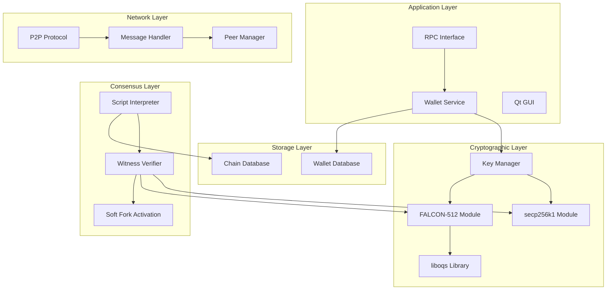
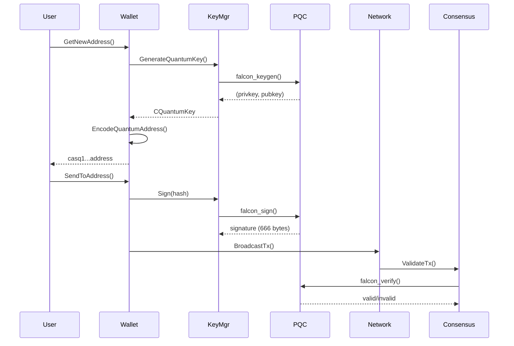

# Design Document: Quantum Hybrid Migration

## Overview

This design document describes the implementation of Post-Quantum Cryptography (PQC) using FALCON-512 in the Cascoin blockchain. The system implements a hybrid cryptographic approach where both classical ECDSA (secp256k1) and quantum-resistant FALCON-512 signatures coexist, enabling a gradual migration path while maintaining full backward compatibility.

The design follows Cascoin's established soft-fork pattern (similar to CVM activation) where new features activate at a predetermined block height without requiring a hard fork. Old nodes continue to operate normally, seeing quantum transactions as valid but unspendable outputs until they upgrade.

### Key Design Decisions

1. **Witness Version 2**: Quantum signatures use SegWit witness version 2, following Bitcoin's upgrade path pattern
2. **liboqs Integration**: Use the Open Quantum Safe library for FALCON-512 implementation rather than custom cryptography
3. **Polymorphic Key Classes**: Extend existing CKey/CPubKey with variant-based storage rather than creating parallel hierarchies
4. **Address Differentiation**: Use distinct HRP ("casq") to make quantum addresses visually distinguishable
5. **Gas Premium for CVM**: Higher gas cost for quantum signature verification reflects computational overhead

## Architecture



### Component Interaction Flow



## Components and Interfaces

### 1. Key Management Component

#### CKeyType Enumeration
```cpp
enum class CKeyType : uint8_t {
    KEY_TYPE_INVALID = 0x00,
    KEY_TYPE_ECDSA = 0x01,
    KEY_TYPE_QUANTUM = 0x02
};
```

#### CKey Class Extension
```cpp
class CKey {
public:
    // Constants for both key types
    static const unsigned int ECDSA_PRIVATE_KEY_SIZE = 32;
    static const unsigned int QUANTUM_PRIVATE_KEY_SIZE = 1281;  // FALCON-512
    
private:
    CKeyType keyType;
    bool fValid;
    bool fCompressed;  // Only applicable for ECDSA
    std::vector<unsigned char, secure_allocator<unsigned char>> keydata;
    
public:
    // Constructors
    CKey();
    explicit CKey(CKeyType type);
    
    // Key type management
    CKeyType GetKeyType() const { return keyType; }
    bool IsQuantum() const { return keyType == CKeyType::KEY_TYPE_QUANTUM; }
    bool IsECDSA() const { return keyType == CKeyType::KEY_TYPE_ECDSA; }
    
    // Key generation
    void MakeNewKey(bool fCompressedIn);  // ECDSA
    void MakeNewQuantumKey();              // FALCON-512
    
    // Signing
    bool Sign(const uint256& hash, std::vector<unsigned char>& vchSig) const;
    bool SignQuantum(const uint256& hash, std::vector<unsigned char>& vchSig) const;
    
    // Public key derivation
    CPubKey GetPubKey() const;
    
    // Serialization
    template<typename Stream>
    void Serialize(Stream& s) const;
    template<typename Stream>
    void Unserialize(Stream& s);
};
```

#### CPubKey Class Extension
```cpp
class CPubKey {
public:
    static const unsigned int ECDSA_PUBLIC_KEY_SIZE = 65;
    static const unsigned int ECDSA_COMPRESSED_PUBLIC_KEY_SIZE = 33;
    static const unsigned int QUANTUM_PUBLIC_KEY_SIZE = 897;  // FALCON-512
    static const unsigned int QUANTUM_SIGNATURE_SIZE = 666;   // Typical FALCON-512 sig
    static const unsigned int MAX_QUANTUM_SIGNATURE_SIZE = 700;
    
private:
    CKeyType keyType;
    std::vector<unsigned char> vchPubKey;
    
public:
    // Constructors
    CPubKey();
    CPubKey(const std::vector<unsigned char>& vch, CKeyType type);
    
    // Key type
    CKeyType GetKeyType() const { return keyType; }
    bool IsQuantum() const { return keyType == CKeyType::KEY_TYPE_QUANTUM; }
    
    // Verification
    bool Verify(const uint256& hash, const std::vector<unsigned char>& vchSig) const;
    bool VerifyQuantum(const uint256& hash, const std::vector<unsigned char>& vchSig) const;
    
    // Address derivation
    CKeyID GetID() const;  // Hash160 for ECDSA, SHA256 truncated for quantum
    uint256 GetQuantumID() const;  // Full SHA256 for quantum witness programs
};
```

### 2. FALCON-512 Cryptographic Module

```cpp
namespace quantum {

// Initialize the quantum cryptography subsystem
void PQC_Start();
void PQC_Stop();
bool PQC_InitSanityCheck();

// Key generation
bool GenerateKeyPair(
    std::vector<unsigned char>& privkey,
    std::vector<unsigned char>& pubkey
);

// Signing
bool Sign(
    const std::vector<unsigned char>& privkey,
    const unsigned char* message,
    size_t messageLen,
    std::vector<unsigned char>& signature
);

// Verification
bool Verify(
    const std::vector<unsigned char>& pubkey,
    const unsigned char* message,
    size_t messageLen,
    const std::vector<unsigned char>& signature
);

// Signature canonicalization check
bool IsCanonicalSignature(const std::vector<unsigned char>& signature);

} // namespace quantum
```

### 3. Witness Version 2 Verifier

```cpp
// New SigVersion for quantum
enum SigVersion {
    SIGVERSION_BASE = 0,
    SIGVERSION_WITNESS_V0 = 1,
    SIGVERSION_WITNESS_V2_QUANTUM = 2,  // New
};

// Extended VerifyWitnessProgram
static bool VerifyWitnessProgram(
    const CScriptWitness& witness,
    int witversion,
    const std::vector<unsigned char>& program,
    unsigned int flags,
    const BaseSignatureChecker& checker,
    ScriptError* serror
) {
    if (witversion == 0) {
        // Existing ECDSA logic
        return VerifyWitnessV0(witness, program, flags, checker, serror);
    }
    else if (witversion == 2) {
        // New quantum logic
        return VerifyWitnessV2Quantum(witness, program, flags, checker, serror);
    }
    else if (flags & SCRIPT_VERIFY_DISCOURAGE_UPGRADABLE_WITNESS_PROGRAM) {
        return set_error(serror, SCRIPT_ERR_DISCOURAGE_UPGRADABLE_WITNESS_PROGRAM);
    }
    // Future versions return true for soft fork compatibility
    return set_success(serror);
}

// Quantum-specific witness verification
static bool VerifyWitnessV2Quantum(
    const CScriptWitness& witness,
    const std::vector<unsigned char>& program,
    unsigned int flags,
    const BaseSignatureChecker& checker,
    ScriptError* serror
);
```

### 4. Address Encoding Component

```cpp
namespace address {

// HRP constants
const std::string QUANTUM_HRP_MAINNET = "casq";
const std::string QUANTUM_HRP_TESTNET = "tcasq";
const std::string QUANTUM_HRP_REGTEST = "rcasq";

// Encode quantum address
std::string EncodeQuantumAddress(
    const CPubKey& pubkey,
    const CChainParams& params
);

// Decode address and determine type
struct DecodedAddress {
    bool isValid;
    bool isQuantum;
    int witnessVersion;
    std::vector<unsigned char> program;
};

DecodedAddress DecodeAddress(
    const std::string& address,
    const CChainParams& params
);

// Get destination from quantum public key
CTxDestination GetQuantumDestination(const CPubKey& pubkey);

} // namespace address
```

### 5. Consensus Parameters Extension

```cpp
struct Params {
    // ... existing params ...
    
    // Quantum-related consensus fields
    int quantumActivationHeight;           // Block height for quantum activation (mainnet: 350000)
    int quantumActivationHeightTestnet;    // Testnet activation height (50000)
    int quantumActivationHeightRegtest;    // Regtest activation height (1)
    
    // Quantum signature limits
    size_t maxQuantumSignatureSize;        // Maximum signature size (700 bytes)
    size_t maxQuantumPubKeySize;           // Maximum pubkey size (897 bytes)
    
    // CVM gas costs for quantum operations
    uint64_t cvmQuantumVerifyGas;          // Gas for VERIFY_SIG_QUANTUM (3000)
};
```

### 6. Network Protocol Extensions

```cpp
// Service flags
enum ServiceFlags : uint64_t {
    // ... existing flags ...
    NODE_QUANTUM = (1 << 8),  // Node supports quantum transactions
};

// Extended version message
struct CVersionMessage {
    // ... existing fields ...
    uint64_t nServices;  // Include NODE_QUANTUM flag
    uint32_t nQuantumVersion;  // Quantum protocol version (1 initially)
};

// Inventory types
enum GetDataMsg {
    // ... existing types ...
    MSG_QUANTUM_TX = 5,  // Quantum transaction
};
```

### 7. CVM Opcode Extensions

```cpp
namespace CVM {

// Extended opcodes
enum OpCode : uint8_t {
    // ... existing opcodes ...
    
    // Quantum signature operations
    OP_VERIFY_SIG_QUANTUM = 0x60,  // Explicit FALCON-512 verification
    OP_VERIFY_SIG_ECDSA = 0x61,    // Explicit ECDSA verification
};

// Gas costs
static constexpr uint64_t GAS_VERIFY_SIG_ECDSA = 60;
static constexpr uint64_t GAS_VERIFY_SIG_QUANTUM = 3000;

} // namespace CVM
```

## Data Models

### Key Storage Schema

```cpp
// Wallet database key record
struct WalletKeyRecord {
    uint8_t version;           // Record version (2 for quantum support)
    CKeyType keyType;          // KEY_TYPE_ECDSA or KEY_TYPE_QUANTUM
    std::vector<unsigned char> encryptedKey;  // Encrypted private key
    CPubKey pubkey;            // Public key
    int64_t nCreateTime;       // Creation timestamp
    std::string hdKeypath;     // HD derivation path (if applicable)
    CKeyID masterKeyID;        // Master key ID for HD wallets
    
    ADD_SERIALIZE_METHODS;
    template <typename Stream, typename Operation>
    inline void SerializationOp(Stream& s, Operation ser_action) {
        READWRITE(version);
        READWRITE(keyType);
        READWRITE(encryptedKey);
        READWRITE(pubkey);
        READWRITE(nCreateTime);
        READWRITE(hdKeypath);
        READWRITE(masterKeyID);
    }
};
```

### Transaction Witness Structure

```cpp
// Witness version 2 structure for quantum transactions
// witness = [signature, pubkey]
// - signature: FALCON-512 signature (up to 700 bytes)
// - pubkey: FALCON-512 public key (897 bytes)

struct QuantumWitness {
    std::vector<unsigned char> signature;  // ~666 bytes typical
    std::vector<unsigned char> pubkey;     // 897 bytes
    
    bool IsValid() const {
        return signature.size() <= 700 && 
               pubkey.size() == CPubKey::QUANTUM_PUBLIC_KEY_SIZE;
    }
};
```

### Address Encoding Format

```
Quantum Address Format (Bech32m):
┌─────────────────────────────────────────────────────────────┐
│ HRP (casq) │ Separator (1) │ Version (q) │ Data │ Checksum  │
└─────────────────────────────────────────────────────────────┘

Data = ConvertBits(SHA256(pubkey)[0:32], 8, 5)
Version byte = 0x02 (witness version 2)

Example: casq1qw508d6qejxtdg4y5r3zarvary0c5xw7k...
```

### Migration Transaction Structure

```cpp
// Migration transaction from legacy to quantum
struct MigrationTx {
    // Inputs: Legacy UTXOs (ECDSA signed)
    std::vector<CTxIn> legacyInputs;
    
    // Output: Single quantum address
    CTxOut quantumOutput;
    
    // Change output (optional, to quantum address)
    CTxOut changeOutput;
    
    // Fee calculation
    CAmount CalculateFee() const {
        // Account for larger quantum output script
        size_t txSize = GetSerializeSize(*this, SER_NETWORK, PROTOCOL_VERSION);
        return txSize * feeRate;
    }
};
```


## Correctness Properties

*A property is a characteristic or behavior that should hold true across all valid executions of a system—essentially, a formal statement about what the system should do. Properties serve as the bridge between human-readable specifications and machine-verifiable correctness guarantees.*

### Property 1: Key Storage Round-Trip

*For any* generated key (ECDSA or FALCON-512), storing the key and retrieving it SHALL produce an identical key with the same type flag, key data, and validity state.

**Validates: Requirements 1.1, 1.2, 1.3, 1.4**

### Property 2: Key Serialization Round-Trip

*For any* valid quantum key, serializing and then deserializing the key SHALL produce an equivalent key with identical type, key data, and cryptographic properties.

**Validates: Requirements 1.8, 1.9**

### Property 3: Signature Size by Key Type

*For any* valid key and message hash:
- If the key is ECDSA, Sign() SHALL produce a signature between 64-72 bytes
- If the key is FALCON-512, Sign() SHALL produce a signature between 600-700 bytes

**Validates: Requirements 1.5, 1.6**

### Property 4: Witness Version Determines Verification Algorithm

*For any* valid transaction with witness data:
- If witness version is 0 or 1, verification SHALL use secp256k1 ECDSA
- If witness version is 2 (post-activation), verification SHALL use FALCON-512

**Validates: Requirements 2.1, 2.2**

### Property 5: Quantum Signature Acceptance

*For any* valid FALCON-512 signature up to 700 bytes in a witness version 2 program, the Witness_Verifier SHALL not reject based on signature size alone.

**Validates: Requirements 2.3**

### Property 6: Quantum Pubkey Size Validation

*For any* witness version 2 program after activation, if the public key size is not exactly 897 bytes, verification SHALL fail with SCRIPT_ERR_WITNESS_PROGRAM_MISMATCH.

**Validates: Requirements 2.6, 2.7**

### Property 7: Sighash Consistency

*For any* transaction, the signature hash computed for witness version 2 SHALL use the same BIP143-style algorithm as witness version 0, producing identical hashes for identical transaction data.

**Validates: Requirements 2.8**

### Property 8: Quantum Address HRP by Network

*For any* quantum public key:
- On mainnet, the encoded address SHALL have HRP "casq"
- On testnet, the encoded address SHALL have HRP "tcasq"  
- On regtest, the encoded address SHALL have HRP "rcasq"

**Validates: Requirements 3.1, 3.2, 3.3**

### Property 9: Quantum Address Encoding Round-Trip

*For any* quantum public key, encoding to a quantum address and then decoding SHALL:
- Return witness version 2
- Return the SHA256 hash of the original public key as the program
- Be recognized as a quantum address (IsQuantum() returns true)

**Validates: Requirements 3.4, 3.5, 3.6**

### Property 10: Address Type Recognition

*For any* decoded address:
- If HRP is "casq", "tcasq", or "rcasq" with witness version 2, IsQuantum() SHALL return true
- If address is Base58 or Bech32 v0/v1, IsQuantum() SHALL return false

**Validates: Requirements 3.5, 3.7, 3.8**

### Property 11: Quantum Address HRP Validation

*For any* address with witness version 2 but HRP not in {"casq", "tcasq", "rcasq"}, decoding SHALL fail.

**Validates: Requirements 3.9**

### Property 12: Hive Dual Signature Support

*For any* valid Hive agent creation transaction with either ECDSA or FALCON-512 signature, the Hive_Agent_Manager SHALL accept the transaction.

**Validates: Requirements 4.1**

### Property 13: Hive Signature Algorithm Matching

*For any* Hive agent and any operation requiring signature verification, the algorithm used SHALL match the agent's registered key type.

**Validates: Requirements 4.5, 4.6**

### Property 14: Wallet Default Address Type

*For any* call to GetNewAddress() when current height >= activation height, the returned address SHALL be a quantum address.

**Validates: Requirements 5.1**

### Property 15: Migration Transaction Structure

*For any* successful migrate_to_quantum call with a set of legacy UTXOs, the resulting transaction SHALL:
- Spend all specified legacy UTXOs as inputs
- Have exactly one or two outputs (destination + optional change)
- All outputs SHALL be to quantum addresses

**Validates: Requirements 5.4, 5.7**

### Property 16: Activation Height Enforcement

*For any* block at height H and witness version 2 transaction:
- If H < activation_height, the transaction SHALL be treated as anyone-can-spend
- If H >= activation_height, the transaction SHALL require valid FALCON-512 signature

**Validates: Requirements 6.4, 6.5**

### Property 17: Backward Compatibility

*For any* transaction that was valid before the activation height, it SHALL remain valid after the activation height.

**Validates: Requirements 6.8**

### Property 18: CVM Signature Type Detection

*For any* VERIFY_SIG opcode execution:
- If signature length > 100 bytes, FALCON-512 verification SHALL be attempted
- If signature length <= 72 bytes, ECDSA verification SHALL be used

**Validates: Requirements 7.2, 7.3**

### Property 19: CVM Quantum Gas Cost

*For any* FALCON-512 signature verification in CVM, the gas cost SHALL be exactly 3000 gas.

**Validates: Requirements 7.4**

### Property 20: CVM Contract Address Derivation Invariance

*For any* contract deployment, the derived contract address SHALL be identical regardless of whether the deployer uses an ECDSA or quantum key.

**Validates: Requirements 7.7**

### Property 21: CVM Explicit Opcode Type Checking

*For any* VERIFY_SIG_QUANTUM opcode execution with an ECDSA signature (<=72 bytes), verification SHALL fail.

**Validates: Requirements 7.8**

### Property 22: Network Large Signature Support

*For any* transaction with FALCON-512 signatures up to 700 bytes, network serialization and deserialization SHALL preserve the complete signature data.

**Validates: Requirements 8.1**

### Property 23: Network Quantum Relay Filtering

*For any* quantum transaction and non-quantum peer (lacking NODE_QUANTUM flag), the transaction SHALL NOT be relayed to that peer.

**Validates: Requirements 8.5**

### Property 24: Network Block Relay Universality

*For any* block containing quantum transactions, the block SHALL be relayed to all connected peers regardless of their quantum capability.

**Validates: Requirements 8.8**

### Property 25: Transaction Virtual Size Calculation

*For any* transaction with quantum signatures, the virtual size SHALL include the full signature size in the calculation.

**Validates: Requirements 9.6**

### Property 26: Signature Size Limit

*For any* signature exceeding 1024 bytes, the transaction SHALL be rejected as invalid.

**Validates: Requirements 9.7**

### Property 27: Signature Canonicality

*For any* FALCON-512 signature that is not in canonical form, verification SHALL fail.

**Validates: Requirements 9.8, 9.9**

### Property 28: Serialization Version Prefixes

*For any* serialized quantum key:
- Private keys SHALL have version byte prefix 0x02
- Public keys SHALL have version byte prefix 0x05

**Validates: Requirements 10.1, 10.2**

### Property 29: Separate Key Pools

*For any* wallet with both ECDSA and quantum keys, the key pools SHALL be maintained separately such that requesting an ECDSA key never returns a quantum key and vice versa.

**Validates: Requirements 10.6**

### Property 30: Wallet Backup Completeness

*For any* wallet backup operation, the backup SHALL contain all ECDSA keys AND all quantum keys present in the wallet.

**Validates: Requirements 10.7**

## Error Handling

### Cryptographic Errors

| Error Code | Description | Recovery Action |
|------------|-------------|-----------------|
| `ERR_PQC_KEYGEN_FAILED` | FALCON-512 key generation failed | Retry with fresh entropy |
| `ERR_PQC_SIGN_FAILED` | FALCON-512 signing operation failed | Check key validity, retry |
| `ERR_PQC_VERIFY_FAILED` | FALCON-512 verification failed | Transaction invalid |
| `ERR_PQC_INVALID_PUBKEY_SIZE` | Public key not 897 bytes | Reject transaction |
| `ERR_PQC_INVALID_SIG_SIZE` | Signature exceeds 700 bytes | Reject transaction |
| `ERR_PQC_NON_CANONICAL_SIG` | Signature not in canonical form | Reject transaction |

### Consensus Errors

| Error Code | Description | Recovery Action |
|------------|-------------|-----------------|
| `SCRIPT_ERR_SIG_QUANTUM_VERIFY` | Quantum signature verification failed | Transaction invalid |
| `SCRIPT_ERR_WITNESS_PROGRAM_MISMATCH` | Witness program validation failed | Transaction invalid |
| `SCRIPT_ERR_QUANTUM_NOT_ACTIVE` | Quantum features not yet activated | Wait for activation height |

### Wallet Errors

| Error Code | Description | Recovery Action |
|------------|-------------|-----------------|
| `ERR_WALLET_INSUFFICIENT_FUNDS` | Not enough funds for migration | Add more funds |
| `ERR_WALLET_NO_LEGACY_UTXOS` | No legacy UTXOs to migrate | Nothing to migrate |
| `ERR_WALLET_QUANTUM_KEY_IMPORT_FAILED` | Failed to import quantum key | Check key format |

### Network Errors

| Error Code | Description | Recovery Action |
|------------|-------------|-----------------|
| `ERR_NET_QUANTUM_TX_TOO_LARGE` | Transaction exceeds size limits | Reduce transaction size |
| `ERR_NET_NO_QUANTUM_PEERS` | No quantum-capable peers available | Wait for peer connections |

## Testing Strategy

### Dual Testing Approach

This implementation requires both unit tests and property-based tests for comprehensive coverage:

- **Unit tests**: Verify specific examples, edge cases, integration points, and error conditions
- **Property tests**: Verify universal properties across randomly generated inputs

### Property-Based Testing Configuration

**Library**: Use `rapidcheck` for C++ property-based testing (compatible with existing test framework)

**Configuration**:
- Minimum 100 iterations per property test
- Each property test must reference its design document property
- Tag format: `Feature: quantum-hybrid-migration, Property {number}: {property_text}`

### Test Categories

#### 1. Cryptographic Tests

**Unit Tests**:
- Key generation produces valid keys of correct size
- Known test vectors for FALCON-512 (from liboqs test suite)
- Edge cases: empty message, maximum message size
- Error handling for invalid keys

**Property Tests**:
- Property 1: Key storage round-trip
- Property 2: Key serialization round-trip
- Property 3: Signature size by key type
- Property 27: Signature canonicality
- Property 28: Serialization version prefixes

#### 2. Consensus Tests

**Unit Tests**:
- Witness version 2 parsing
- Activation height boundary conditions
- Script error codes
- Integration with existing witness versions

**Property Tests**:
- Property 4: Witness version determines verification algorithm
- Property 5: Quantum signature acceptance
- Property 6: Quantum pubkey size validation
- Property 7: Sighash consistency
- Property 16: Activation height enforcement
- Property 17: Backward compatibility

#### 3. Address Encoding Tests

**Unit Tests**:
- Bech32m encoding/decoding
- HRP validation
- Known address test vectors
- Invalid address rejection

**Property Tests**:
- Property 8: Quantum address HRP by network
- Property 9: Quantum address encoding round-trip
- Property 10: Address type recognition
- Property 11: Quantum address HRP validation

#### 4. Hive Mining Tests

**Unit Tests**:
- Agent creation with both key types
- Hive block validation
- Agent migration transaction format

**Property Tests**:
- Property 12: Hive dual signature support
- Property 13: Hive signature algorithm matching

#### 5. Wallet Tests

**Unit Tests**:
- GetNewAddress() behavior pre/post activation
- migrate_to_quantum RPC command
- Key pool management
- Wallet backup/restore

**Property Tests**:
- Property 14: Wallet default address type
- Property 15: Migration transaction structure
- Property 29: Separate key pools
- Property 30: Wallet backup completeness

#### 6. CVM Tests

**Unit Tests**:
- VERIFY_SIG opcode with both signature types
- New opcodes VERIFY_SIG_QUANTUM and VERIFY_SIG_ECDSA
- Gas metering for quantum operations
- Contract deployment with quantum keys

**Property Tests**:
- Property 18: CVM signature type detection
- Property 19: CVM quantum gas cost
- Property 20: CVM contract address derivation invariance
- Property 21: CVM explicit opcode type checking

#### 7. Network Tests

**Unit Tests**:
- Version message with quantum flags
- Transaction serialization with large signatures
- Peer capability detection
- Inventory message handling

**Property Tests**:
- Property 22: Network large signature support
- Property 23: Network quantum relay filtering
- Property 24: Network block relay universality
- Property 25: Transaction virtual size calculation
- Property 26: Signature size limit

### Test Data Generators

```cpp
// Random quantum key generator for property tests
Arbitrary<CKey> arbitraryQuantumKey() {
    return gen::build<CKey>(
        gen::set(&CKey::keyType, CKeyType::KEY_TYPE_QUANTUM),
        gen::invoke([]() {
            CKey key;
            key.MakeNewQuantumKey();
            return key;
        })
    );
}

// Random ECDSA key generator
Arbitrary<CKey> arbitraryECDSAKey() {
    return gen::build<CKey>(
        gen::invoke([]() {
            CKey key;
            key.MakeNewKey(true);
            return key;
        })
    );
}

// Random message hash generator
Arbitrary<uint256> arbitraryHash() {
    return gen::arbitrary<std::array<uint8_t, 32>>()
        .map([](const auto& arr) {
            uint256 hash;
            memcpy(hash.begin(), arr.data(), 32);
            return hash;
        });
}
```

### Integration Test Scenarios

1. **Full Migration Flow**: Create legacy wallet → Fund with testnet coins → Activate quantum → Migrate to quantum → Verify funds accessible
2. **Mixed Transaction Block**: Create block with both ECDSA and quantum transactions → Validate block → Verify all transactions
3. **Hive Mining with Quantum**: Create quantum agent → Mine Hive block → Verify rewards
4. **CVM Contract with Quantum**: Deploy contract with quantum key → Call contract → Verify execution
5. **Network Upgrade Simulation**: Start mixed network (quantum and non-quantum nodes) → Broadcast quantum transaction → Verify propagation
