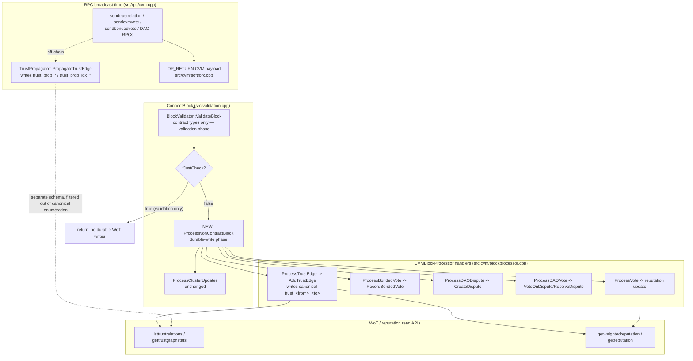

# Trust System Activation — Bugfix Design

## Overview

The on-chain Web-of-Trust (WoT) write path is dead code. A user broadcasts a trust
relationship (`sendtrustrelation`), reputation vote (`sendcvmvote`), bonded vote
(`sendbondedvote`), or DAO dispute/vote; the transaction carries a CVM `OP_RETURN`
payload; the block is mined and connected — but the node never persists the canonical
record the WoT read APIs enumerate. `sendtrustrelation` reports success
(`edges_propagated >= 1`, a mined `txid`), yet `listtrustrelations`,
`gettrustgraphstats`, and `getweightedreputation` show nothing, because only `addtrust`
(direct write) currently populates the canonical trust graph.

The root cause is a **too-broad disable** in `ConnectBlock()`
(`src/validation.cpp`). `CVMBlockProcessor::ProcessBlock()` was disabled because it
re-executed contract deploy/call work — work now performed by
`CVM::BlockValidator::ValidateBlock()` — and ran expensive per-transaction
`TrustContext`/`SecureHAT` calculations that hung the node. Disabling `ProcessBlock()`
removed the duplicate contract work, but it also removed the **only** code path that
persists on-chain trust edges, bonded votes, DAO records, and reputation votes:
`ProcessTrustEdge`, `ProcessBondedVote`, `ProcessDAODispute`, `ProcessDAOVote`, and
`ProcessVote`. The active path, `BlockValidator::ValidateBlock()`, handles only the four
contract types (`CONTRACT_DEPLOY`, `CONTRACT_CALL`, `EVM_DEPLOY`, `EVM_CALL`) and
explicitly `continue`s past every non-contract CVM type.

The fix is targeted and minimal: re-enable **only** the non-contract CVM record
persistence during block connect, without re-executing the contract deploy/call work
already handled by `BlockValidator` (thereby avoiding the duplicate-work/hang that
caused the original disable). The persistence must be confirmation-driven, idempotent
(reorg/reconnect safe), reconciled with the off-chain propagation side effect the
broadcasting RPC already produces, gated by the CVM soft fork, and skipped under
`fJustCheck`.

## Glossary

- **Bug_Condition (C)**: The condition that triggers the bug — a connected block that
  contains a non-contract CVM `OP_RETURN` transaction (`TRUST_EDGE`, `BONDED_VOTE`,
  `DAO_DISPUTE`, `DAO_VOTE`, `REPUTATION_VOTE`) on a CVM-active chain.
- **Property (P)**: The desired behavior — the canonical record for each such
  transaction is persisted (once, idempotently) and becomes readable by the
  corresponding WoT/reputation read API, without re-executing contract work or hanging.
- **Preservation**: Existing behavior that must remain unchanged — the contract path,
  `ProcessClusterUpdates`, `addtrust` direct write, invalid-input rejection, soft-fork
  gating, `fJustCheck`, and all completed `web-of-trust-fixes` behavior.
- **`F` / `F'`**: The original (unfixed) node vs. the fixed node.
- **Contract CVM type**: `CONTRACT_DEPLOY`, `CONTRACT_CALL`, `EVM_DEPLOY`, `EVM_CALL` —
  gas-bearing, executed by `BlockValidator::ValidateBlock()`.
- **Non-contract CVM type**: `TRUST_EDGE`, `BONDED_VOTE`, `DAO_DISPUTE`, `DAO_VOTE`,
  `REPUTATION_VOTE` — record-only, persisted by the `CVMBlockProcessor` handlers.
- **`BlockValidator::ValidateBlock()`** (`src/cvm/block_validator.cpp`): the active CVM
  path in `ConnectBlock()`; runs in the validation phase (before the `fJustCheck`
  return), executes contract transactions, enforces gas, and manages an atomic
  contract-state snapshot/rollback journal. It skips non-contract types.
- **`CVMBlockProcessor::ProcessBlock()`** (`src/cvm/blockprocessor.cpp`): the disabled
  processor that iterated every CVM tx and dispatched by op type, including
  re-executing contract deploy/call via the Enhanced VM.
- **`ProcessClusterUpdates()`**: the wallet-trust-propagation step that still runs in
  `ConnectBlock()`, in the durable-write phase (after the `fJustCheck` return).
- **`TrustPropagator::PropagateTrustEdge`** (`src/cvm/trustpropagator.cpp`): the
  off-chain RPC side effect that writes `trust_prop_*` / `trust_prop_idx_*` index
  records (a different schema from the canonical `trust_<from>_<to>` edge). It never
  calls `TrustGraph::AddTrustEdge`.
- **Canonical edge**: `trust_<from>_<to>` (and reverse index `trust_in_<to>_<from>`),
  the single record set the WoT read APIs enumerate. Written by
  `TrustGraph::AddTrustEdge`.
- **`fJustCheck`**: validation-only mode (e.g. `TestBlockValidity`) in which durable
  state MUST NOT be written.

## Bug Details

### Bug Condition

The bug manifests when a block being connected on a CVM-active chain contains a
non-contract CVM `OP_RETURN` transaction. The node validates the block (running only
`BlockValidator::ValidateBlock()`, which skips non-contract types, and
`ProcessClusterUpdates()`), so the handler that would persist the canonical WoT/
reputation record is never invoked. The observable defect is that a successfully mined
non-contract CVM transaction produces no readable canonical record.

**Formal Specification:**
```
FUNCTION isBugCondition(block)
  INPUT: block being connected (fJustCheck == false), on a CVM-active chain
  OUTPUT: boolean

  RETURN IsCVMSoftForkActive(block.height)
         AND EXISTS tx IN block.vtx WHERE
               NOT tx.IsCoinBase()
               AND FindCVMOpReturn(tx) >= 0
               AND opType(tx) IN { TRUST_EDGE, BONDED_VOTE,
                                   DAO_DISPUTE, DAO_VOTE, REPUTATION_VOTE }
END FUNCTION
```

Under the current code, for every such `tx` the canonical record
(`canonicalRecordFor(tx)`) is absent after `connectBlock(block)`, because:
- `BlockValidator::ValidateBlock()` reaches the non-contract tx, logs
  `"Non-contract CVM tx ... skipping gas validation"`, and `continue`s
  (`src/cvm/block_validator.cpp` ~lines 217–245).
- `CVMBlockProcessor::ProcessBlock()` — the only caller of `ProcessTrustEdge`,
  `ProcessBondedVote`, `ProcessDAODispute`, `ProcessDAOVote`, `ProcessVote` — is
  commented out in `ConnectBlock()` (`src/validation.cpp` ~lines 2211–2224); only
  `ProcessClusterUpdates()` runs.

### Examples

- `sendtrustrelation "<B>" 80` mined and connected → `listtrustrelations` returns
  `count: 0`; no `trust_<A>_<B>` edge exists (expected: one canonical edge from signer
  `A` to target `B`, weight 80).
- Trust chain `A → B → C → D` built exclusively with `sendtrustrelation` and mined →
  `getweightedreputation "<D>" "<A>" 3` returns `paths_found: 0`, `reputation: 0`
  (expected: `paths_found >= 1`, non-zero reputation, matching the `addtrust`-built
  graph).
- `sendcvmvote "<target>" 100 "reason"` mined and connected → `getreputation "<target>"`
  is unchanged (expected: reflects the on-chain vote).
- `sendbondedvote`, DAO dispute, and DAO vote transactions mined and connected → no
  `vote_<txid>`, `dispute_<txid>`, or DAO vote record persisted (expected: each record
  persisted and queryable).
- Edge case — the same block is disconnected then reconnected during a reorg → the fixed
  node MUST NOT create duplicate or double-counted records (idempotency).

## Expected Behavior

### Preservation Requirements

**Unchanged Behaviors:**
- Contract CVM/EVM transactions (`CONTRACT_DEPLOY`, `CONTRACT_CALL`, `EVM_DEPLOY`,
  `EVM_CALL`) MUST continue to be validated and executed exactly once by
  `BlockValidator::ValidateBlock()`, with identical gas accounting, subsidy/rebate
  handling, contract-state persistence, and success/failure semantics (3.1). The
  re-enabled non-contract processing MUST NOT touch this path.
- `ProcessClusterUpdates()` MUST continue to run with unchanged results (3.2).
- Block connection MUST continue to complete without hanging and with comparable
  performance; the fix MUST NOT reintroduce the duplicate-work/expensive-calculation
  hang that caused `ProcessBlock()` to be disabled (3.3).
- `addtrust` (direct write) MUST continue to store, list, and traverse edges identically
  (3.4).
- On-chain trust edges with an invalid weight (outside −100..+100), insufficient bond, or
  an invalid/unparseable payload MUST continue to be rejected/ignored without persisting a
  record and without failing validation for the rest of the block (3.5).
- When the CVM soft fork is not active, or a block contains no CVM `OP_RETURN`
  transactions, block connection MUST behave exactly as today (3.6).
- Under `fJustCheck` (validation-only), no durable WoT/reputation record MUST be written
  (3.7).
- The completed `web-of-trust-fixes` behavior — WoT read APIs, quantum/wide-address
  support, identity resolution, viewer echo — MUST be unchanged for inputs unaffected by
  this fix (3.8).
- Other persisted CVM records sharing serialization/storage infrastructure (contracts,
  contract state, nonces, propagated-edge index records) MUST continue to round-trip
  correctly (3.9).

**Scope:**
All blocks where `isBugCondition` is false MUST be completely unaffected by this fix.
This includes:
- Blocks with only contract CVM/EVM transactions.
- Blocks with no CVM `OP_RETURN` transactions at all.
- Any block validated under `fJustCheck`.
- Blocks connected before the CVM soft fork activation height.

_The concrete expected correct behavior for buggy inputs is defined in the Correctness
Properties section below._

## Hypothesized Root Cause

Confirmed against the source during investigation.

1. **The non-contract dispatch is disabled in `ConnectBlock()` (primary cause).**
   `src/validation.cpp` (~lines 2211–2224): `CVMBlockProcessor::ProcessBlock()` is
   commented out with the note that contract work is now done by
   `BlockValidator::ValidateBlock()` and that `ProcessBlock` created
   "expensive TrustContext+SecureHAT calculations that caused the node to hang." Only
   `ProcessClusterUpdates()` runs. `ProcessBlock()` was the sole caller that dispatched
   `TRUST_EDGE`/`BONDED_VOTE`/`DAO_DISPUTE`/`DAO_VOTE`/`REPUTATION_VOTE` to their
   handlers, so disabling it silently killed all on-chain WoT/reputation persistence.

2. **`BlockValidator::ValidateBlock()` intentionally skips non-contract types.**
   `src/cvm/block_validator.cpp` (~lines 217–245): after confirming a CVM tx, it extracts
   the gas limit; for non-contract types (`ExtractGasLimit == 0` and op type not one of
   the four contract types) it logs and `continue`s. It never routes these types to a
   persistence handler — by design, since its responsibility is contract execution, gas,
   and the atomic contract-state snapshot/rollback journal.

3. **The RPC side effect writes a different record type, not the canonical edge.**
   `sendtrustrelation` (`src/rpc/cvm.cpp` ~lines 2036–2072) builds/signs/broadcasts the
   on-chain tx and then calls `TrustPropagator::PropagateTrustEdge`, which writes only
   `trust_prop_*` / `trust_prop_idx_*` index records (a `PropagatedTrustEdge` schema),
   keyed under a separate prefix. It never calls `TrustGraph::AddTrustEdge`. The canonical
   `trust_<from>_<to>` edge was expected to be written on block connect by
   `ProcessTrustEdge` — which is dead code. Hence success is reported but the canonical
   graph stays empty. `addtrust` is the only RPC that writes the canonical edge directly.

4. **The disable was correct about the hang, but too broad.** The expensive work lived in
   `ProcessDeploy`/`ProcessCall` (Enhanced VM re-execution + `TrustContext`/`SecureHAT`),
   not in the five non-contract handlers. `ProcessTrustEdge`, `ProcessBondedVote`,
   `ProcessDAODispute`, `ProcessDAOVote`, and `ProcessVote` do only bond validation and a
   handful of LevelDB writes/reads — cheap, bounded work. Re-enabling **only** those five
   avoids the hang.

## Correctness Properties

Property 1: Bug Condition — On-chain trust edges persisted and traversable on block connect

_For any_ block where the bug condition holds and that contains a `TRUST_EDGE`
transaction, the fixed `ConnectBlock` SHALL parse the payload and persist a canonical
`trust_<from>_<to>` edge via `TrustGraph::AddTrustEdge` — using the on-chain signer as
`from` and the payload target as `to`, with the payload weight, bond, bond-tx hash, and
timestamp — such that `listtrustrelations`, `gettrustgraphstats`, and
`getweightedreputation` enumerate and traverse it exactly as they do for an `addtrust`
edge, so a chain `A → B → C → D` built only with `sendtrustrelation` yields
`paths_found >= 1` and a non-zero weighted reputation equal to the `addtrust`-built
result.

**Validates: Requirements 2.1, 2.2, 2.3**

Property 2: Bug Condition — On-chain reputation, bonded votes, and DAO records persisted on block connect

_For any_ block where the bug condition holds, the fixed `ConnectBlock` SHALL, for each
non-contract CVM transaction, invoke its persistence handler so that: a `REPUTATION_VOTE`
updates the target's reputation consistently with the vote payload (reflected by
`getreputation`); a valid `BONDED_VOTE` persists a bonded-vote record; a valid
`DAO_DISPUTE` persists a listable/queryable dispute record; and a valid `DAO_VOTE`
records the DAO vote against its dispute and resolves the dispute when the existing
resolution threshold is met.

**Validates: Requirements 2.4, 2.5, 2.6, 2.7**

Property 3: Bug Condition — Idempotent, reorg-safe persistence reconciled with off-chain propagation

_For any_ non-contract CVM transaction processed during block connection — including when
the same block is disconnected and reconnected during a reorg — the fixed code SHALL
persist its canonical record exactly once (idempotently), producing no duplicate or
conflicting records and no double-counting, and the on-chain canonical record SHALL agree
with (not double-count against) the off-chain `trust_prop_*` propagation side effect
already produced by the broadcasting RPC.

**Validates: Requirements 2.8**

Property 4: Bug Condition — Bounded-time persistence without contract re-execution

_For any_ block where the bug condition holds, the fixed `ConnectBlock` SHALL persist the
non-contract records without re-executing any contract deployment/call and without the
expensive per-transaction `TrustContext`/`SecureHAT` calculations that previously caused
the node to hang, so block connection completes in bounded time.

**Validates: Requirements 2.9**

Property 5: Preservation — Contract path, cluster updates, direct write, rejection, gating, fJustCheck, and completed WoT behavior unchanged

_For any_ input where the bug condition does NOT hold, the fixed code SHALL produce the
same result as the original code: contract CVM/EVM transactions are validated/executed
exactly once by `BlockValidator` with identical gas/subsidy/state semantics;
`ProcessClusterUpdates()` runs unchanged; `addtrust` direct-write still stores/lists/
traverses identically; invalid weight/bond/unparseable payloads are still rejected without
persisting a record or failing the rest of the block; pre-activation blocks and
CVM-free blocks connect exactly as today; `fJustCheck` writes no durable WoT/reputation
state; and the completed `web-of-trust-fixes` read-path, quantum/wide-address, identity,
and viewer-echo behavior — plus shared serialization round-trips for contracts, nonces,
and propagated-edge records — are unchanged.

**Validates: Requirements 3.1, 3.2, 3.3, 3.4, 3.5, 3.6, 3.7, 3.8, 3.9**

## Fix Implementation

### Approach and alternatives considered

Two candidate approaches were evaluated for routing the five non-contract CVM types to
their persistence handlers.

**Alternative A — Extend `BlockValidator::ValidateBlock()` to route non-contract types.**
Rejected. `BlockValidator` runs in the **validation phase** (before the `fJustCheck`
return in `ConnectBlock`) and owns the atomic contract-state snapshot/rollback journal
(`m_contractSnapshot`, `m_contractSnapshotValues`, `RollbackContractState`). Injecting
durable WoT/reputation writes there would (1) mix record persistence into a component
whose single responsibility is contract execution and gas, (2) require adding a second
`fJustCheck`-gating and rollback discipline for WoT records that the journal does not
currently cover, and (3) risk WoT writes being caught in a contract-triggered rollback or,
worse, leaking on a `fJustCheck` path. Higher blast radius, more failure modes.

**Alternative B — Re-add a slimmed, non-contract-only dispatch (chosen).** Add a
dedicated entry point on `CVMBlockProcessor` that iterates the block and dispatches
**only** the five non-contract types to their existing handlers, explicitly skipping the
four contract types (which `BlockValidator` already handled). Call it from `ConnectBlock`
in the **durable-write phase**, immediately alongside `ProcessClusterUpdates()` — i.e.
after the `if (fJustCheck) return true;` guard. This is minimal, keeps the WoT/reputation
persistence logic where it already lives (`blockprocessor.cpp`), reuses the already-fixed
handlers (which now use `TrustNodeId` per `web-of-trust-fixes`), naturally satisfies the
`fJustCheck` contract (the code is unreachable when `fJustCheck` is true), and cannot
touch the contract execution/gas/rollback path.

### Data-flow overview



### Changes Required

Assuming the root-cause analysis is correct:

**Change 1 — Add a non-contract-only dispatch to `CVMBlockProcessor`.**

- **File**: `src/cvm/blockprocessor.h` / `src/cvm/blockprocessor.cpp`
- Add a new static method (a slimmed `ProcessBlock` variant), e.g.:
  ```
  // Persist ONLY non-contract CVM records (TRUST_EDGE, BONDED_VOTE, DAO_DISPUTE,
  // DAO_VOTE, REPUTATION_VOTE) found in the block. Contract deploy/call work is
  // handled by BlockValidator::ValidateBlock() and is explicitly NOT re-executed
  // here, so the expensive TrustContext/SecureHAT/Enhanced-VM work that caused the
  // original ProcessBlock() hang is never reached.
  static void ProcessNonContractBlock(const CBlock& block, int height, CVMDatabase& db);
  ```
- Implementation: iterate `block.vtx`, skip coinbase, `FindCVMOpReturn` + `ParseCVMOpReturn`,
  and dispatch **only** the five non-contract op types to the existing handlers
  (`ProcessTrustEdge`, `ProcessBondedVote`, `ProcessDAODispute`, `ProcessDAOVote`,
  `ProcessVote`). For `CONTRACT_DEPLOY`/`CONTRACT_CALL`/`EVM_DEPLOY`/`EVM_CALL` and unknown
  types: do nothing (they are `BlockValidator`'s responsibility). This is a strict subset of
  the old `ProcessTransaction` switch, minus the contract cases — reuse
  `ProcessTransaction` refactored to skip contract types, or add a thin
  `ProcessNonContractTransaction` helper, to avoid duplicating the parse/switch.
- Each handler already validates its own preconditions (bond via `ValidateBond`, weight
  range in `AddTrustEdge`/`RecordBondedVote`) and returns without persisting on failure, and
  it logs a warning without throwing — so an invalid record neither persists nor aborts the
  rest of the block (preserves 3.5). The dispatch MUST NOT propagate exceptions out of
  `ConnectBlock`; wrap per-tx processing defensively.

**Change 2 — Call the new dispatch from `ConnectBlock()` in the durable-write phase.**

- **File**: `src/validation.cpp`, in the existing soft-fork block that currently runs only
  `ProcessClusterUpdates()` (~lines 2217–2224, which is already after
  `if (fJustCheck) return true;`).
- Add the non-contract dispatch **before** `ProcessClusterUpdates()` so records exist before
  cluster propagation runs:
  ```
  if (CVM::IsCVMSoftForkActive(pindex->nHeight, chainparams.GetConsensus())) {
      if (CVM::g_cvmdb) {
          // Persist on-chain non-contract CVM records (trust edges, bonded votes,
          // DAO disputes/votes, reputation votes). Contract work already done by
          // BlockValidator::ValidateBlock() above; NOT re-executed here.
          CVM::CVMBlockProcessor::ProcessNonContractBlock(block, pindex->nHeight, *CVM::g_cvmdb);
          // Existing wallet trust propagation (unchanged).
          CVM::CVMBlockProcessor::ProcessClusterUpdates(block, pindex->nHeight, *CVM::g_cvmdb);
      } else { /* unchanged error log */ }
  }
  ```
- Because this block is reached only when `fJustCheck == false` (the `fJustCheck` return
  precedes it), no durable WoT/reputation write can occur during validation-only — this is
  exactly how `ProcessClusterUpdates()` already behaves and satisfies 3.7 without additional
  `fJustCheck` plumbing.
- The soft-fork gate `IsCVMSoftForkActive(...)` is retained, satisfying 3.6.
- The contract path (`BlockValidator::ValidateBlock()`, earlier in `ConnectBlock`) and the
  coinbase/subsidy/validator-payment logic between the two sections are untouched (3.1).

**Change 3 — Make `REPUTATION_VOTE` application idempotent / reorg-safe.**

- **Finding**: The four other handlers are already idempotent upserts keyed by a unique
  identifier — `AddTrustEdge` writes `trust_<from>_<to>` (overwrite), `RecordBondedVote`
  writes `vote_<bondTxHash>` (overwrite), `CreateDispute` writes `dispute_<txid>`
  (overwrite), and `VoteOnDispute` sets `dispute.daoVotes[member]` in a member-keyed map with
  a `resolved` guard on `ResolveDispute`. Reprocessing the same transaction overwrites the
  same record rather than duplicating it.
- **Problem**: `ProcessVote` (`src/cvm/blockprocessor.cpp`) does `score.score += voteValue;
  score.voteCount++;` — a non-idempotent increment. If the same block is reconnected during a
  reorg, the reputation is applied twice (double-counting), violating 2.8.
- **File**: `src/cvm/blockprocessor.cpp`, `ProcessVote`. Add a processed-transaction marker
  so a given `REPUTATION_VOTE` tx is applied at most once:
  ```
  // Idempotency guard: skip if this reputation vote tx was already applied
  // (reorg/reconnect safe). Keyed by the vote transaction hash.
  std::string appliedKey = "repvote_applied_" + tx.GetHash().ToString();
  if (db.ExistsGeneric(appliedKey)) return;
  // ... apply score delta ...
  db.WriteGeneric(appliedKey, {1});
  ```
  (Use the existing generic read/exists/write helpers already used for other records.) An
  alternative — recomputing reputation from the full set of persisted vote records rather than
  incrementing — is larger in scope and out of scope for this targeted fix; the marker is the
  minimal reorg-safe change.

**Change 4 — Reconciliation with the off-chain propagation side effect.**

- No code change is required beyond documenting the invariant, because the two record sets
  live in disjoint key namespaces and the `web-of-trust-fixes` work already made the canonical
  enumerators exclude `trust_prop_*` / `trust_prop_idx_*`:
  - The RPC writes only `trust_prop_*` (propagated-edge index) records at broadcast time.
  - `ProcessTrustEdge` writes only the canonical `trust_<from>_<to>` edge at connect time,
    keyed by the same signer `from` embedded on-chain (the RPC passes `resolvedFromAddress`
    from `BuildTrustTransaction` into propagation, so the two agree on `from`).
  - `listtrustrelations` and `GetGraphStats` count only canonical forward edges
    (`IsCanonicalForwardEdgeKey`), so the propagated records are not double-counted.
  The design MUST verify (via preservation checks) that enumeration counts remain correct
  when both record sets coexist.

### fJustCheck handling

`fJustCheck` (validation-only, e.g. `TestBlockValidity`) MUST NOT write durable WoT/
reputation state (3.7). This is achieved structurally: the new dispatch is placed in the
durable-write section of `ConnectBlock`, which is reached only after
`if (fJustCheck) return true;`. When `fJustCheck` is true, `ConnectBlock` returns before
reaching the non-contract dispatch, exactly as it already does for `ProcessClusterUpdates`
and the undo/index writes. No handler is invoked and no LevelDB write occurs. The contract
path (`BlockValidator`) continues to honor `fJustCheck` internally as today (it skips
`SaveContractState`/subsidy distribution when `fJustCheck`).

### Idempotency / reorg handling

| Op type | Handler | Persisted key | Idempotent? | Action |
|---|---|---|---|---|
| `TRUST_EDGE` | `ProcessTrustEdge` → `AddTrustEdge` | `trust_<from>_<to>` (+ `trust_in_...`) | Yes (upsert) | none (note: timestamp is refreshed on re-add; value-idempotent for identity/weight/bond) |
| `BONDED_VOTE` | `ProcessBondedVote` → `RecordBondedVote` | `vote_<bondTxHash>`, `votes_<target>_<bondTxHash>` | Yes (upsert by unique txid) | none |
| `DAO_DISPUTE` | `ProcessDAODispute` → `CreateDispute` | `dispute_<txid>` | Yes (upsert by unique txid) | none |
| `DAO_VOTE` | `ProcessDAOVote` → `VoteOnDispute` | `dispute_<id>` (member-keyed map) | Yes (overwrites member entry; `resolved` guard) | none |
| `REPUTATION_VOTE` | `ProcessVote` | reputation score (increment) | **No** (`score += voteValue`) | **Change 3**: add `repvote_applied_<txid>` marker |

Reorg semantics: on disconnect, the block's canonical records are not explicitly removed by
this fix (matching the current disconnect behavior, which does not undo CVM state); on
reconnect, the idempotent upserts overwrite the same keys and the `REPUTATION_VOTE` marker
prevents a second increment. This yields "persist exactly once" behavior for the observable
records (2.8). If future work requires full disconnect-time removal of WoT records, it is
out of scope here and would be a separate change.

## Testing Strategy

### Validation Approach

Two phases: first surface counterexamples that demonstrate the bug on the unfixed node,
then verify the fix persists records correctly and preserves all other behavior. Because
the write path is a consensus-adjacent block-connection step, prefer functional/regtest
end-to-end tests (mine + connect + read via RPC) for the fix checks, plus unit tests for
the dispatch/idempotency logic, plus property-based tests for preservation.

### Exploratory Bug Condition Checking

**Goal**: Surface counterexamples that demonstrate the bug BEFORE implementing the fix, and
confirm the root cause (non-contract dispatch disabled; `BlockValidator` skips non-contract
types). If a test unexpectedly passes on the unfixed node, the root-cause hypothesis is
refuted and must be revisited.

**Test Plan**: On the UNFIXED node, build each non-contract CVM transaction via its RPC,
mine and connect the block, then assert (via the read APIs and/or direct DB inspection) that
no canonical record exists.

**Test Cases**:
1. **Trust edge not persisted**: `sendtrustrelation "<B>" 80`, mine → `listtrustrelations`
   `count == 0`; no `trust_<A>_<B>` (will fail on unfixed code).
2. **Trust chain has no paths**: build `A → B → C → D` with `sendtrustrelation`, mine →
   `getweightedreputation "<D>" "<A>" 3` returns `paths_found: 0`, `reputation: 0` (will fail
   on unfixed code).
3. **Reputation vote not applied**: `sendcvmvote "<T>" 100`, mine → `getreputation "<T>"`
   unchanged (will fail on unfixed code).
4. **Bonded vote / DAO dispute / DAO vote not persisted**: mine each and assert
   `vote_<txid>` / `dispute_<txid>` / DAO vote record absent (will fail on unfixed code).
5. **Edge case — out-of-range / insufficient bond**: assert these are already rejected on the
   unfixed node (baseline for preservation 3.5; may already "pass" as no-op).

**Expected Counterexamples**:
- No canonical `trust_<from>_<to>` edge after connect; `paths_found: 0`.
- Reputation score unchanged after a mined `REPUTATION_VOTE`.
- Root cause: `ProcessBlock()` disabled in `ConnectBlock`; `BlockValidator` `continue`s past
  non-contract types.

### Fix Checking

**Goal**: For all blocks where the bug condition holds, the fixed node persists the correct
canonical record and it is readable, without hanging or re-executing contract work.

**Pseudocode:**
```
FOR ALL block WHERE isBugCondition(block) DO
  connectBlock'(block)                      // fJustCheck == false
  FOR EACH non-contract CVM tx IN block DO
    ASSERT canonicalRecordFor(tx) is persisted
           AND readable by the corresponding read API
  END FOR
  ASSERT no contract deploy/call was re-executed by the non-contract dispatch
  ASSERT connectBlock'(block) completes in bounded time (no hang)
END FOR
```

### Preservation Checking

**Goal**: For all inputs where the bug condition does NOT hold, the fixed node behaves
identically to the original.

**Pseudocode:**
```
FOR ALL input WHERE NOT isBugCondition(input) DO
  ASSERT connectBlock(input) == connectBlock'(input)
END FOR
```

**Testing Approach**: Property-based testing is recommended for preservation because it
generates many block/tx shapes across the input domain (contract-only blocks, CVM-free
blocks, `fJustCheck` blocks, pre-activation blocks, invalid-payload blocks) and catches edge
cases manual tests miss. Observe behavior on the UNFIXED node first, then assert the fixed
node matches.

**Test Cases**:
1. **Contract path unchanged**: a block with `CONTRACT_DEPLOY`/`CONTRACT_CALL`/`EVM_*` —
   assert contracts execute exactly once, same gas/subsidy/state, and the non-contract
   dispatch does not touch them (3.1).
2. **Cluster updates unchanged**: assert `ProcessClusterUpdates` results are identical (3.2).
3. **No hang / bounded time**: assert connection time for WoT-heavy blocks is comparable to
   the unfixed node running the contract path only (3.3).
4. **`addtrust` unchanged**: create/list/traverse a direct-write edge — identical (3.4).
5. **Invalid input rejected**: on-chain edge with weight `> 100`, insufficient bond, or an
   unparseable payload — no record persisted, block not failed for the rest (3.5).
6. **Soft-fork gating / CVM-free block**: pre-activation and no-CVM blocks connect exactly as
   today (3.6).
7. **`fJustCheck`**: validate a block with non-contract CVM txs under `fJustCheck` and assert
   no durable WoT/reputation record is written (3.7).
8. **Reorg idempotency**: connect → disconnect → reconnect a block with each non-contract
   type; assert exactly one canonical record and no double-counted reputation (2.8).
9. **Coexistence with propagation**: after `sendtrustrelation`, assert canonical edge count
   is not inflated by `trust_prop_*` records (2.8, 3.8, 3.9).
10. **`web-of-trust-fixes` behavior**: rerun the completed WoT read-path/quantum/identity/
    viewer-echo checks — unchanged (3.8).

### Unit Tests

- `ProcessNonContractBlock` dispatch: given a block with one tx of each op type, assert only
  the five non-contract handlers are invoked and contract types are ignored.
- `ProcessVote` idempotency: applying the same `REPUTATION_VOTE` tx twice changes the score
  once (`repvote_applied_<txid>` marker).
- Invalid-input handling: bad weight / insufficient bond / unparseable payload → handler
  returns without persisting and without throwing.
- `fJustCheck` reachability: confirm the non-contract dispatch is unreachable when
  `fJustCheck` is true (structural test around the `ConnectBlock` early return).

### Property-Based Tests

- Generate random blocks mixing contract, non-contract, and non-CVM txs; assert canonical
  records for exactly the valid non-contract txs and no change to the contract path.
- Generate random trust graphs built via `sendtrustrelation` vs `addtrust`; assert the two
  produce equivalent canonical graphs (`listtrustrelations`/`getweightedreputation` agree).
- Generate connect/disconnect/reconnect sequences; assert idempotency (persist exactly once).
- Generate random invalid payloads; assert none persist and none abort the rest of the block.

### Integration Tests

- End-to-end regtest: build `A → B → C → D` exclusively with `sendtrustrelation`, mine and
  connect, then `getweightedreputation "<D>" "<A>" 3` returns `paths_found >= 1` and a
  non-zero reputation matching the `addtrust`-built graph (2.3).
- End-to-end regtest for `sendcvmvote`, `sendbondedvote`, DAO dispute + DAO vote: mine, then
  query via the corresponding read/DAO RPCs and assert each record is present and, for DAO
  votes, that the dispute resolves at threshold (2.4–2.7).
- Reorg integration: force a reorg over blocks containing non-contract CVM txs and assert no
  duplicate/double-counted records (2.8).
- Full block flow with mixed contract + non-contract CVM txs: assert both paths work and the
  node does not hang (2.9, 3.1, 3.3).
