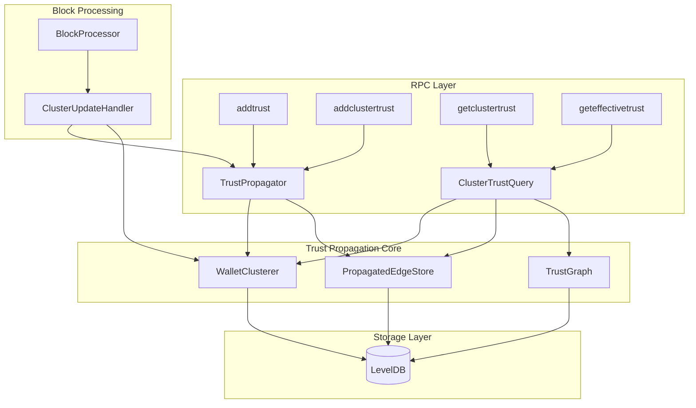
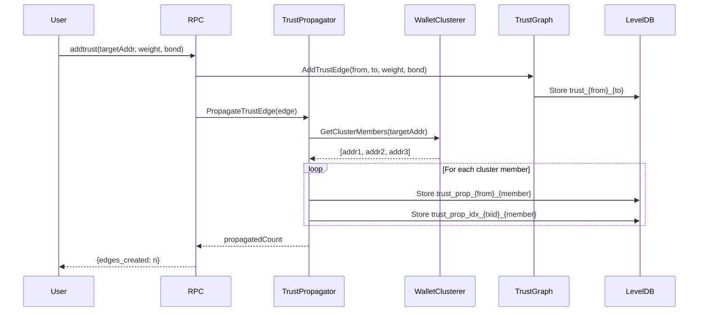

# Design Document: Wallet Trust Propagation

## Overview

The Wallet Trust Propagation system extends Cascoin's Web-of-Trust to operate at the wallet level rather than individual addresses. This prevents reputation gaming where malicious actors create new addresses to escape negative trust scores.

The system integrates with the existing `WalletClusterer` component to identify addresses belonging to the same wallet, then automatically propagates trust relations to all cluster members. This ensures that a scammer's bad reputation follows them regardless of which address they use.

### Key Design Decisions

1. **Propagation on Write**: Trust edges are propagated when created, not on read. This ensures consistent query performance.
2. **Reference-Based Storage**: Propagated edges store a reference to the original edge, enabling cascade updates and deletions.
3. **Cluster-Canonical Addressing**: Each cluster has a canonical address (oldest/most active) used for cluster-level operations.
4. **Event-Driven Inheritance**: New addresses inherit trust via block processing hooks, ensuring timely propagation.

## Architecture



### Component Interactions

1. **Trust Addition Flow**: `addtrust` → `TrustPropagator` → `WalletClusterer.GetClusterMembers()` → Create propagated edges for each member
2. **Trust Query Flow**: `geteffectivetrust` → `ClusterTrustQuery` → Aggregate direct + propagated edges → Return minimum score
3. **New Address Flow**: `BlockProcessor` → `ClusterUpdateHandler` → Detect new cluster member → `TrustPropagator.InheritTrust()`

## Components and Interfaces

### TrustPropagator Class

The core component responsible for propagating trust edges across wallet clusters.

```cpp
namespace CVM {

/**
 * Propagated Trust Edge - Links to original edge
 */
struct PropagatedTrustEdge {
    uint160 fromAddress;          // Original truster
    uint160 toAddress;            // Propagated target (cluster member)
    uint160 originalTarget;       // Original target address
    uint256 sourceEdgeTx;         // Reference to original trust edge tx
    int16_t trustWeight;          // Inherited weight
    uint32_t propagatedAt;        // When propagation occurred
    CAmount bondAmount;           // Inherited bond amount
    
    ADD_SERIALIZE_METHODS;
    template <typename Stream, typename Operation>
    inline void SerializationOp(Stream& s, Operation ser_action) {
        READWRITE(fromAddress);
        READWRITE(toAddress);
        READWRITE(originalTarget);
        READWRITE(sourceEdgeTx);
        READWRITE(trustWeight);
        READWRITE(propagatedAt);
        READWRITE(bondAmount);
    }
};

/**
 * Cluster Trust Summary - Aggregated trust for a wallet cluster
 */
struct ClusterTrustSummary {
    uint160 clusterId;                    // Canonical cluster address
    std::set<uint160> memberAddresses;    // All addresses in cluster
    int64_t totalIncomingTrust;           // Sum of positive incoming trust
    int64_t totalNegativeTrust;           // Sum of negative incoming trust
    double effectiveScore;                // Minimum score across cluster
    uint32_t edgeCount;                   // Total trust edges (direct + propagated)
    uint32_t lastUpdated;                 // Last modification timestamp
};

/**
 * TrustPropagator - Manages trust propagation across wallet clusters
 */
class TrustPropagator {
public:
    explicit TrustPropagator(CVMDatabase& db, WalletClusterer& clusterer, TrustGraph& trustGraph);
    
    /**
     * Propagate a trust edge to all addresses in target's wallet cluster
     * 
     * @param edge The original trust edge to propagate
     * @return Number of propagated edges created
     */
    uint32_t PropagateTrustEdge(const TrustEdge& edge);
    
    /**
     * Inherit existing trust relations for a new cluster member
     * 
     * @param newAddress The newly detected address
     * @param clusterId The cluster it belongs to
     * @return Number of trust edges inherited
     */
    uint32_t InheritTrustForNewMember(const uint160& newAddress, const uint160& clusterId);
    
    /**
     * Handle cluster merge - combine trust relations
     * 
     * @param cluster1 First cluster ID
     * @param cluster2 Second cluster ID
     * @param mergedClusterId New merged cluster ID
     * @return true if merge successful
     */
    bool HandleClusterMerge(const uint160& cluster1, const uint160& cluster2, 
                           const uint160& mergedClusterId);
    
    /**
     * Delete propagated edges when original edge is removed
     * 
     * @param sourceEdgeTx Transaction hash of original edge
     * @return Number of propagated edges deleted
     */
    uint32_t DeletePropagatedEdges(const uint256& sourceEdgeTx);
    
    /**
     * Update propagated edges when original edge is modified
     * 
     * @param sourceEdgeTx Transaction hash of original edge
     * @param newWeight New trust weight
     * @return Number of propagated edges updated
     */
    uint32_t UpdatePropagatedEdges(const uint256& sourceEdgeTx, int16_t newWeight);
    
    /**
     * Get all propagated edges for a target address
     * 
     * @param target Address to query
     * @return Vector of propagated trust edges
     */
    std::vector<PropagatedTrustEdge> GetPropagatedEdgesForAddress(const uint160& target) const;
    
    /**
     * Get cluster trust summary
     * 
     * @param address Any address in the cluster
     * @return Aggregated trust summary for the cluster
     */
    ClusterTrustSummary GetClusterTrustSummary(const uint160& address) const;

private:
    CVMDatabase& database;
    WalletClusterer& clusterer;
    TrustGraph& trustGraph;
    
    // Cache for cluster trust summaries
    mutable std::map<uint160, ClusterTrustSummary> summaryCache;
    mutable std::mutex cacheMutex;
    
    /**
     * Store a propagated edge in database
     */
    bool StorePropagatedEdge(const PropagatedTrustEdge& edge);
    
    /**
     * Build index entry for source edge -> propagated edges
     */
    bool IndexPropagatedEdge(const uint256& sourceEdgeTx, const uint160& propagatedTo);
    
    /**
     * Invalidate cache for a cluster
     */
    void InvalidateClusterCache(const uint160& clusterId);
};

} // namespace CVM
```

### ClusterTrustQuery Class

Handles trust queries with cluster awareness.

```cpp
namespace CVM {

/**
 * ClusterTrustQuery - Query trust considering wallet clusters
 */
class ClusterTrustQuery {
public:
    ClusterTrustQuery(CVMDatabase& db, WalletClusterer& clusterer, 
                      TrustGraph& trustGraph, TrustPropagator& propagator);
    
    /**
     * Get effective trust score for an address (cluster-aware)
     * Returns minimum score across all cluster members
     * 
     * @param target Address to evaluate
     * @param viewer Optional viewer for personalized trust
     * @return Effective trust score
     */
    double GetEffectiveTrust(const uint160& target, const uint160& viewer = uint160()) const;
    
    /**
     * Get all trust relations affecting a cluster
     * 
     * @param address Any address in the cluster
     * @return Vector of all trust edges (direct + propagated)
     */
    std::vector<TrustEdge> GetAllClusterTrustEdges(const uint160& address) const;
    
    /**
     * Get incoming trust for entire cluster
     * 
     * @param address Any address in the cluster
     * @return Vector of incoming trust edges
     */
    std::vector<TrustEdge> GetClusterIncomingTrust(const uint160& address) const;
    
    /**
     * Check if an address has negative trust in its cluster
     * 
     * @param address Address to check
     * @return true if any cluster member has negative trust
     */
    bool HasNegativeClusterTrust(const uint160& address) const;

private:
    CVMDatabase& database;
    WalletClusterer& clusterer;
    TrustGraph& trustGraph;
    TrustPropagator& propagator;
};

} // namespace CVM
```

### ClusterUpdateHandler Class

Handles cluster membership changes during block processing.

```cpp
namespace CVM {

/**
 * ClusterUpdateEvent - Event emitted when cluster membership changes
 */
struct ClusterUpdateEvent {
    enum Type {
        NEW_MEMBER,      // New address joined cluster
        CLUSTER_MERGE,   // Two clusters merged
        TRUST_INHERITED  // Trust was inherited by new member
    };
    
    Type eventType;
    uint160 clusterId;
    uint160 affectedAddress;
    uint160 mergedFromCluster;  // For CLUSTER_MERGE
    uint32_t blockHeight;
    uint32_t timestamp;
};

/**
 * ClusterUpdateHandler - Processes cluster changes during block processing
 */
class ClusterUpdateHandler {
public:
    ClusterUpdateHandler(CVMDatabase& db, WalletClusterer& clusterer, 
                        TrustPropagator& propagator);
    
    /**
     * Process a new block for cluster updates
     * 
     * @param blockHeight Height of the block
     * @param transactions Transactions in the block
     * @return Number of cluster updates processed
     */
    uint32_t ProcessBlock(int blockHeight, const std::vector<CTransaction>& transactions);
    
    /**
     * Check if an address is new to its cluster
     * 
     * @param address Address to check
     * @param clusterId Cluster it belongs to
     * @return true if address is newly detected in cluster
     */
    bool IsNewClusterMember(const uint160& address, const uint160& clusterId) const;
    
    /**
     * Get recent cluster update events
     * 
     * @param maxCount Maximum events to return
     * @return Vector of recent events
     */
    std::vector<ClusterUpdateEvent> GetRecentEvents(uint32_t maxCount = 100) const;

private:
    CVMDatabase& database;
    WalletClusterer& clusterer;
    TrustPropagator& propagator;
    
    // Track known cluster memberships
    std::map<uint160, uint160> knownMemberships;  // address -> clusterId
    
    /**
     * Detect new cluster members from transaction inputs
     */
    std::vector<std::pair<uint160, uint160>> DetectNewMembers(
        const std::vector<CTransaction>& transactions);
    
    /**
     * Emit cluster update event
     */
    void EmitEvent(const ClusterUpdateEvent& event);
};

} // namespace CVM
```

### RPC Interface Extensions

New and modified RPC commands for cluster-aware trust operations.

```cpp
// New RPC Commands

/**
 * addclustertrust - Add trust to entire wallet cluster
 * 
 * Arguments:
 * 1. "address"  (string, required) Any address in target cluster
 * 2. weight     (numeric, required) Trust weight (-100 to +100)
 * 3. bond       (numeric, optional) Bond amount in CAS
 * 4. "reason"   (string, optional) Reason for trust
 * 
 * Result:
 * {
 *   "cluster_id": "address",
 *   "members_affected": n,
 *   "edges_created": n,
 *   "source_txid": "hash"
 * }
 */
UniValue addclustertrust(const JSONRPCRequest& request);

/**
 * getclustertrust - Get trust summary for wallet cluster
 * 
 * Arguments:
 * 1. "address"  (string, required) Any address in cluster
 * 2. "viewer"   (string, optional) Viewer for personalized trust
 * 
 * Result:
 * {
 *   "cluster_id": "address",
 *   "member_count": n,
 *   "members": ["addr1", "addr2", ...],
 *   "effective_score": n.n,
 *   "worst_member": "address",
 *   "worst_score": n.n,
 *   "total_incoming_edges": n,
 *   "total_propagated_edges": n
 * }
 */
UniValue getclustertrust(const JSONRPCRequest& request);

/**
 * listclustertrustrelations - List all trust relations for cluster
 * 
 * Arguments:
 * 1. "address"  (string, required) Any address in cluster
 * 2. max_count  (numeric, optional) Maximum relations to return
 * 
 * Result:
 * {
 *   "cluster_id": "address",
 *   "direct_edges": [...],
 *   "propagated_edges": [...],
 *   "total_count": n
 * }
 */
UniValue listclustertrustrelations(const JSONRPCRequest& request);
```

## Data Models

### Database Schema

```
# Propagated Trust Edges
Key: "trust_prop_{from}_{to}"
Value: PropagatedTrustEdge (serialized)

# Source Edge Index (for cascade updates/deletes)
Key: "trust_prop_idx_{sourceEdgeTx}_{to}"
Value: uint160 (propagated target address)

# Cluster Trust Summary Cache
Key: "cluster_trust_{clusterId}"
Value: ClusterTrustSummary (serialized)

# Known Cluster Memberships (for new member detection)
Key: "cluster_member_{address}"
Value: uint160 (clusterId) + uint32 (firstSeenBlock)

# Cluster Update Events
Key: "cluster_event_{timestamp}_{eventId}"
Value: ClusterUpdateEvent (serialized)
```

### Data Flow Diagram




## Correctness Properties

*A property is a characteristic or behavior that should hold true across all valid executions of a system—essentially, a formal statement about what the system should do. Properties serve as the bridge between human-readable specifications and machine-verifiable correctness guarantees.*

### Property 1: Trust Propagation Completeness

*For any* wallet cluster with N member addresses, when a trust edge is added to any member address, the system shall create exactly N propagated trust edges (one for each cluster member including the original target).

**Validates: Requirements 1.2, 3.1, 4.1**

### Property 2: Propagated Edge Source Traceability

*For any* propagated trust edge, the edge shall contain a valid reference to the original trust edge's transaction hash, and querying by that transaction hash shall return the propagated edge.

**Validates: Requirements 1.3, 5.5**

### Property 3: Query Completeness

*For any* address in a wallet cluster that has trust relations, querying trust for that address shall return the union of all direct trust edges and all propagated trust edges targeting that address.

**Validates: Requirements 1.4**

### Property 4: New Member Trust Inheritance

*For any* wallet cluster with existing trust edges, when a new address is detected as a member of that cluster, the new address shall receive propagated copies of all existing trust edges targeting other cluster members.

**Validates: Requirements 2.1**

### Property 5: Propagated Edge Data Integrity

*For any* propagated trust edge, the trust weight, bond amount, and original timestamp shall be identical to the source trust edge from which it was propagated.

**Validates: Requirements 2.2**

### Property 6: Cluster Update Event Emission

*For any* cluster membership change (new member or cluster merge), the system shall emit exactly one ClusterUpdateEvent with the correct event type, cluster ID, and affected address.

**Validates: Requirements 2.3, 6.3**

### Property 7: RPC Response Format Consistency

*For any* cluster-level RPC command (`getclustertrust`, `addclustertrust`, `listclustertrustrelations`), the response shall include the `cluster_id` field and `member_count` field with values matching the actual cluster state.

**Validates: Requirements 3.2, 3.4**

### Property 8: Trust Relation Listing Completeness

*For any* wallet cluster, calling `listclustertrustrelations` shall return all trust edges where any cluster member is the target, with no duplicates and no missing edges.

**Validates: Requirements 3.3**

### Property 9: Cluster-Aware Minimum Scoring

*For any* address in a wallet cluster, the effective trust score returned by `geteffectivetrust` shall equal the minimum trust score among all addresses in that cluster.

**Validates: Requirements 4.2, 4.4**

### Property 10: Storage Key Prefix Convention

*For any* propagated trust edge stored in the database, the storage key shall begin with the prefix `trust_prop_` followed by the from-address and to-address.

**Validates: Requirements 5.1**

### Property 11: Index Round-Trip Consistency

*For any* original trust edge with propagated edges, querying the index by the source transaction hash shall return exactly the set of addresses that received propagated edges, and each of those addresses shall have a corresponding propagated edge in storage.

**Validates: Requirements 5.2, 5.4**

### Property 12: Cascade Update Propagation

*For any* modification (weight change or deletion) to an original trust edge, all propagated edges referencing that source edge shall be updated or deleted accordingly, maintaining consistency.

**Validates: Requirements 5.3**

### Property 13: Cluster Merge Trust Combination

*For any* two wallet clusters that merge, the resulting merged cluster shall contain propagated trust edges such that every address in the merged cluster has trust edges from both original clusters' trust relations.

**Validates: Requirements 6.1, 6.2**

### Property 14: Conflict Resolution by Timestamp

*For any* cluster merge where the same truster has trust edges to addresses in both original clusters with different weights, the propagated edges shall use the weight from the most recent (highest timestamp) original edge.

**Validates: Requirements 6.4**

### Property 15: Cluster Size Limit Enforcement

*For any* trust propagation operation targeting a cluster with more than 10,000 addresses, the system shall process at most 10,000 addresses per operation and indicate that the operation was limited.

**Validates: Requirements 7.2**

## Error Handling

### Database Errors

| Error Condition | Handling Strategy |
|----------------|-------------------|
| Failed to read cluster membership | Return error, do not propagate trust |
| Failed to write propagated edge | Retry up to 3 times, then rollback and return error |
| Failed to update index | Log warning, continue (index can be rebuilt) |
| Cluster query timeout | Return partial results with warning flag |

### Invalid Input Handling

| Input Condition | Response |
|----------------|----------|
| Invalid address format | Return RPC error with descriptive message |
| Trust weight out of range | Reject with validation error |
| Negative bond amount | Reject with validation error |
| Empty cluster (no members found) | Treat address as single-member cluster |

### Cluster Edge Cases

| Scenario | Behavior |
|----------|----------|
| Address not in any cluster | Create single-address cluster, proceed normally |
| Cluster with 1 member | Propagation creates 1 edge (to self), functionally same as direct edge |
| Circular trust (A trusts B, B trusts A, same cluster) | Both edges propagate independently |
| Self-trust (address trusts itself) | Allowed, propagates to cluster members |

### Recovery Procedures

1. **Index Corruption**: Run `rebuildtrustindex` RPC to reconstruct from propagated edges
2. **Missing Propagated Edges**: Run `repairclusterrust` RPC to re-propagate from original edges
3. **Orphaned Propagated Edges**: Detected during index rebuild, automatically cleaned up

## Testing Strategy

### Unit Tests

Unit tests focus on specific examples and edge cases:

1. **TrustPropagator Tests**
   - Propagate to 2-member cluster
   - Propagate to 10-member cluster
   - Handle empty cluster gracefully
   - Delete propagated edges when source deleted

2. **ClusterTrustQuery Tests**
   - Query address with only direct trust
   - Query address with only propagated trust
   - Query address with both direct and propagated trust
   - Calculate minimum score across cluster

3. **ClusterUpdateHandler Tests**
   - Detect new cluster member from transaction
   - Handle cluster merge event
   - Emit correct event types

4. **RPC Command Tests**
   - `addclustertrust` creates correct number of edges
   - `getclustertrust` returns correct summary
   - `listclustertrustrelations` returns complete list
   - Error responses for invalid inputs

### Property-Based Tests

Property-based tests verify universal properties across randomized inputs. Each test runs minimum 100 iterations.

**Testing Framework**: Use Boost.Test with custom generators for:
- Random wallet clusters (1-100 addresses)
- Random trust edges (weight -100 to +100, various bond amounts)
- Random cluster merge scenarios

**Test Configuration**:
```cpp
// Property test configuration
#define PBT_MIN_ITERATIONS 100
#define PBT_MAX_CLUSTER_SIZE 100
#define PBT_MAX_TRUST_EDGES 50
```

**Property Test Implementation Pattern**:
```cpp
// Feature: wallet-trust-propagation, Property 1: Trust Propagation Completeness
BOOST_AUTO_TEST_CASE(property_trust_propagation_completeness)
{
    for (int i = 0; i < PBT_MIN_ITERATIONS; i++) {
        // Generate random cluster
        auto cluster = GenerateRandomCluster(1, PBT_MAX_CLUSTER_SIZE);
        
        // Add trust to random member
        auto targetMember = PickRandomMember(cluster);
        auto trustEdge = GenerateRandomTrustEdge(targetMember);
        
        // Propagate
        uint32_t propagatedCount = propagator.PropagateTrustEdge(trustEdge);
        
        // Verify: propagated count equals cluster size
        BOOST_CHECK_EQUAL(propagatedCount, cluster.size());
        
        // Verify: each member has propagated edge
        for (const auto& member : cluster) {
            auto edges = propagator.GetPropagatedEdgesForAddress(member);
            BOOST_CHECK_GE(edges.size(), 1);
        }
    }
}
```

### Integration Tests

1. **End-to-End Trust Flow**
   - Add trust via RPC → Verify propagation → Query effective trust
   
2. **Block Processing Integration**
   - Submit transaction creating new address → Process block → Verify trust inheritance

3. **Cluster Merge Scenario**
   - Create two clusters with trust → Submit linking transaction → Verify merged trust

### Test Data Generators

```cpp
namespace TestGenerators {
    // Generate random wallet cluster
    WalletClusterInfo GenerateRandomCluster(size_t minSize, size_t maxSize);
    
    // Generate random trust edge
    TrustEdge GenerateRandomTrustEdge(const uint160& target);
    
    // Generate random propagated edge
    PropagatedTrustEdge GenerateRandomPropagatedEdge(const TrustEdge& source);
    
    // Generate cluster merge scenario
    std::pair<WalletClusterInfo, WalletClusterInfo> GenerateMergeScenario();
}
```
