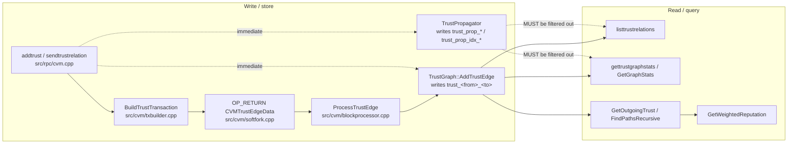
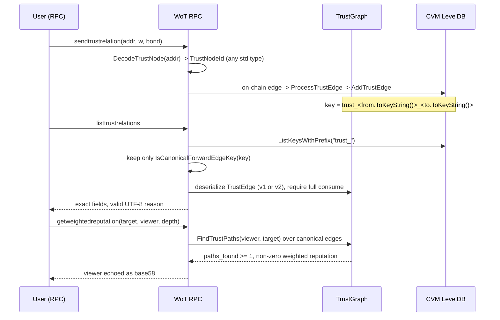

# Web-of-Trust Fixes — Bugfix Design

## Overview

The on-chain Web-of-Trust (WoT) subsystem produces incorrect results when trust edges
are created, persisted, and queried. This document formalizes the bug conditions for the
four in-scope defects, identifies the precise root cause of each in the actual source, and
specifies targeted, minimal fixes plus the checks (fix checks and preservation checks) that
validate them.

The four defects, and the outcome of the code investigation:

1. **Trust-edge "serialization" round-trip corruption (Bug 1, clauses 1.1–1.4 / 2.1–2.4).**
   The corruption is *not* caused by an asymmetry inside `TrustEdge::SerializationOp` — that
   operator is symmetric and round-trips correctly. The real cause is that
   `listtrustrelations` (`src/rpc/cvm.cpp`) and `TrustGraph::GetGraphStats`
   (`src/cvm/trustgraph.cpp`) enumerate the LevelDB with the bare prefix `"trust_"` and only
   skip keys containing `"trust_in_"`. That enumeration therefore also matches the
   **foreign record types** written by `TrustPropagator` under `trust_prop_` and
   `trust_prop_idx_` and blindly deserializes their bytes as a `TrustEdge`. A
   `PropagatedTrustEdge` has a different field layout, so reading it as a `TrustEdge`
   yields exactly the reported field-offset garbage (weight `11291`, bond `~6.9e11`,
   far-future timestamp, `slashed=1`, and a `reason` length prefix read from arbitrary
   bytes that then produces non-UTF-8 output and breaks the CLI JSON reply). The reported
   wrong `from` address is a separate, second cause: `addtrust` writes edges from an
   uninitialized placeholder (`uint160 fromAddress; // Placeholder`), and
   `sendtrustrelation` propagates from the wallet's first reserve key rather than the signer
   key actually embedded in the on-chain edge.

2. **Path-finding returns zero paths and inconsistent counts (Bug 2, 1.5–1.8 / 2.5–2.8).**
   Downstream of Bug 1: because RPC-side edges are keyed under the wrong `from`
   (all-zeros placeholder for `addtrust`, reserve key for `sendtrustrelation`),
   `GetOutgoingTrust(viewer)` finds nothing and traversal returns `paths_found: 0`.
   Additionally, `GetWeightedReputation` returns `0` even when a path exists, because it
   derives the score only from `BondedVote` records at the target (of which there are none)
   rather than from the trust-path weights. The `gettrustgraphstats` vs
   `listtrustrelations` disagreement is the same over-counting described in Bug 1. The
   `viewer` field is echoed as `uint160::ToString()` (hex) instead of the supplied base58
   address.

3. **Only `uint160` address types accepted; quantum unsupported (Bug 3, 1.9–1.10, 1.12 / 2.9–2.10, 2.12).**
   The WoT RPCs only accept `CKeyID`, `CScriptID`, and `WitnessV0KeyHash` (all `uint160`,
   20 bytes) and throw `"Address type not supported"` for everything else. `WitnessV0ScriptHash`
   (bech32 P2WSH) and `WitnessV2Quantum` (quantum, `casq`/`tcasq`/`rcasq`) are both `uint256`
   (32 bytes) and cannot even be represented by the current `uint160`-keyed `TrustEdge`. This
   requires a **data-model change**: a canonical, lossless, wide trust-node identifier.

4. **Single-wallet trust graph broken (Bug 4, 1.11 / 2.11).**
   No wallet-scoping code actually prevents intra-wallet edges; the observed breakage is a
   downstream symptom of Bugs 1 and 2 (wrong `from`, foreign-record corruption). Once the
   `from` identity and keying/enumeration are fixed, a single wallet's addresses store, list,
   and traverse correctly. The design confirms there is no wallet-scoping assumption to change.

The fixes are grouped so that the **primary corruption and count fixes require no on-disk or
on-chain format change** (they are read-path/enumeration and identity fixes), while the
**quantum/address-width support is isolated behind a versioned, backward-compatible
identifier and OP_RETURN payload** so existing edges are neither invalidated nor misread.

## Glossary

- **Bug_Condition (C)**: The set of inputs/states that trigger a defect (see each bug's
  `isBugCondition` below).
- **Property (P)**: The desired correct behavior for inputs where `C` holds.
- **Preservation**: Behavior that is currently correct and MUST remain identical after the fix
  (inputs where `C` does not hold).
- **`TrustEdge`**: The persisted trust-edge record in `src/cvm/trustgraph.h`, stored in the CVM
  LevelDB under key `trust_<from>_<to>` (and a reverse index `trust_in_<to>_<from>`).
- **`PropagatedTrustEdge`**: A *different* record type in `src/cvm/trustpropagator.h` written
  under `trust_prop_<from>_<to>`, with a lookup index under `trust_prop_idx_<sourceTx>_<to>`.
- **Canonical forward edge**: A key of the form `trust_<from>_<to>` that is **not** a
  `trust_in_`, `trust_prop_`, or `trust_prop_idx_` key. This is the single set of records that
  represents user-declared trust and that `listtrustrelations` / `gettrustgraphstats` must count.
- **`CVMTrustEdgeData`**: The on-chain OP_RETURN payload (`src/cvm/softfork.cpp`,
  `CVMOpType::TRUST_EDGE`), hand-serialized as `from(20) + to(20) + weight(2) + bond(8) + ts(4)`
  = 54 bytes, parsed by `CVMBlockProcessor::ProcessTrustEdge` at block validation time.
- **`TrustNodeId`** *(new)*: A canonical, lossless trust-node identifier introduced by this fix:
  a 1-byte destination-type tag plus a 32-byte value (`uint256`), able to represent every
  standard Cascoin destination — `CKeyID`, `CScriptID`, `WitnessV0KeyHash`,
  `WitnessV0ScriptHash`, and `WitnessV2Quantum` — without truncation.
- **`WitnessV2Quantum`**: Quantum/Falcon destination (`src/script/standard.h`), a `uint256`
  (32 bytes) holding `SHA256(FALCON-512 pubkey)`.

## Bug Details

### Bug 1 — Trust-edge round-trip corruption

The bug manifests when `listtrustrelations` or `gettrustgraphstats` enumerate trust records:
they match foreign LevelDB records (`trust_prop_*`, `trust_prop_idx_*`) under the shared
`trust_` prefix and deserialize their bytes through `TrustEdge::SerializationOp`, producing
field-offset garbage. A secondary manifestation is that the `from` address stored by the RPC
write paths does not equal the address that created the edge.

**Formal Specification:**
```
FUNCTION isBugCondition(input)
  INPUT: input describes a WoT read/enumeration or an RPC edge write
  OUTPUT: boolean

  // (a) Read path misinterprets foreign records
  reads_foreign := (input.op IN {listtrustrelations, gettrustgraphstats})
                   AND EXISTS key IN db WITH prefix "trust_"
                       AND key NOT CONTAINS "trust_in_"
                       AND (key CONTAINS "trust_prop_" OR key CONTAINS "trust_prop_idx_")

  // (b) Write path stores a wrong/placeholder from-identity
  wrong_from := (input.op IN {addtrust, sendtrustrelation})
                AND storedFromAddress(input) != signerAddress(input)

  RETURN reads_foreign OR wrong_from
END FUNCTION
```

### Examples

- Stored edge `weight = 80` read back by `listtrustrelations` as `11291` (the first two bytes
  of a `PropagatedTrustEdge.originalTarget` interpreted as `int16_t trustWeight`).
- Stored `bond = 2 CAS` read back as `~692717578398.37` (eight interior bytes of
  `originalTarget`/`sourceEdgeTx` interpreted as `CAmount bondAmount`).
- Stored `reason = "C trusts D"` read back as binary/non-UTF-8 bytes because the `reason`
  length is a `CompactSize` decoded from arbitrary bytes → `cascoin-cli` fails with
  "couldn't parse reply from server".
- `addtrust "<addr>" 80` stores the edge under `trust_0000…0000_<to>` because
  `uint160 fromAddress;` is an uninitialized placeholder → reported `from` matches nobody.

### Bug 2 — Path-finding does not traverse stored edges

```
FUNCTION isBugCondition(input)
  INPUT: getweightedreputation(target, viewer, maxdepth) over stored edges
  OUTPUT: boolean

  path_exists_in_graph := existsForwardPath(viewer, target, maxdepth)   // via canonical edges

  no_path_found := (findTrustPaths(viewer, target, maxdepth).size() == 0)
  zero_when_path := path_exists_in_graph AND (weightedReputation(viewer,target)==0)
  count_mismatch := (gettrustgraphstats.total_trust_edges
                       != countCanonicalForwardEdges())
  viewer_is_hex  := resultViewerField(input) == viewer.ToStringHex()

  RETURN (path_exists_in_graph AND no_path_found)
         OR zero_when_path OR count_mismatch OR viewer_is_hex
END FUNCTION
```

### Examples

- Stored chain `A → B → C → D` (weights 80): `getweightedreputation "<D>" "<A>" 3` returns
  `paths_found: 0`, `reputation: 0`.
- Single stored edge `B → C`, viewer = `B`: `getweightedreputation "<C>" "<B>" 1` returns
  `paths_found: 0`.
- `gettrustgraphstats` reports `total_trust_edges: 6` while `listtrustrelations` reports
  `count: 1` for the same state.
- `getweightedreputation` echoes `"viewer": "62d20cebcd…"` (hash160 hex) instead of the base58
  address supplied.

### Bug 3 — Non-`uint160` / quantum addresses rejected

```
FUNCTION isBugCondition(input)
  INPUT: any WoT RPC called with a valid standard address `addr`
  OUTPUT: boolean

  dest := DecodeDestination(addr)          // already valid per IsValidDestination
  is_uint160_type := dest IS CKeyID OR dest IS CScriptID OR dest IS WitnessV0KeyHash

  RETURN IsValidDestination(dest) AND NOT is_uint160_type
         // i.e. WitnessV0ScriptHash (P2WSH) or WitnessV2Quantum (quantum) → rejected
END FUNCTION
```

### Examples

- `sendtrustrelation "rcas1q…<P2WSH>" 80` → `error code -5: "Address type not supported"`.
- `addtrust "rcasq1…<quantum>" 80` → `error code -5: "Address type not supported"`.
- A quantum address is a 32-byte `WitnessV2Quantum` (`uint256`) and cannot be stored in the
  current 20-byte `TrustEdge.fromAddress`/`toAddress` even if the RPC accepted it.
- Legacy P2PKH (`m…`/`n…`) works today and must keep working.

### Bug 4 — Single-wallet trust graph broken

```
FUNCTION isBugCondition(input)
  INPUT: edges among addresses A1..An that all belong to ONE wallet
  OUTPUT: boolean

  RETURN NOT (canStore(A_i, A_j) AND canList(A_i, A_j) AND canTraverse(A_i, A_j))
         FOR edges created within a single wallet
END FUNCTION
```

### Examples

- Two addresses in the same wallet: creating `A1 → A2` then listing/traversing fails or returns
  corrupted/empty results (a downstream symptom of Bugs 1 and 2; no dedicated wallet-scoping
  code blocks it).

## Expected Behavior

### Preservation Requirements

**Unchanged Behaviors:**
- Weight validation (`-100..+100`) MUST still reject out-of-range edges (bugfix 3.1).
- Bond validation MUST still reject bonds below the required bond with "Insufficient bond" (3.2).
- Valid legacy P2PKH base58 edges MUST still store, list, and traverse correctly (3.3).
- Traversal MUST still skip edges with `trustWeight < 10`, `slashed` edges, and already-visited
  nodes (cycles) (3.4).
- `getweightedreputation` with `viewer == target` MUST still return the average of non-slashed
  incoming trust (3.5).
- `maxdepth` outside `1..10` MUST still be rejected with "Max depth must be between 1 and 10" (3.6).
- Other CVM records sharing serialization infrastructure — `BondedVote`, `DAODispute`,
  reputation records, and `PropagatedTrustEdge` itself — MUST still round-trip correctly (3.7).
- Cluster-aware propagation and aggregation fields (`cluster_id`, `cluster_size`,
  `edges_propagated`) MUST remain the same for inputs unaffected by these fixes (3.8).
- Existing quantum address parsing/validation/encoding (`DecodeDestination`,
  `IsQuantumAddress`, `EncodeDestination`, FALCON-512 routing) MUST NOT change; the WoT fix only
  *extends acceptance* inside the WoT RPCs (3.9).
- For every supported address type the same representation MUST be used on write and on read so an
  edge created with an address is retrievable by that same address (3.10, 2.8).

**Scope:**
Inputs where `isBugCondition` is false MUST be completely unaffected. In particular:
- Records under `trust_prop_` / `trust_prop_idx_` are still written, read, and used by the
  propagator exactly as today (only the *canonical-edge enumerators* stop misreading them).
- On-chain v1 `CVMTrustEdgeData` OP_RETURN payloads already written to the chain are still parsed
  with the exact legacy layout.
- The legacy `uint160`-keyed DB edges already stored are still readable.

_The concrete expected correct behavior for buggy inputs is defined in the Correctness Properties
section below._

## Hypothesized Root Cause

Confirmed against the source during investigation.

1. **Shared-prefix record confusion (primary cause of Bug 1 corruption and Bug 2 count mismatch).**
   - `listtrustrelations` (`src/rpc/cvm.cpp`): `ListKeysWithPrefix("trust_")` then
     `if (key.find("trust_in_") != npos) continue;` — does **not** exclude `trust_prop_` or
     `trust_prop_idx_`, then `ss >> edge` as `TrustEdge`.
   - `TrustGraph::GetGraphStats` (`src/cvm/trustgraph.cpp`): counts every `trust_` key that does
     not contain `trust_in_` as a trust edge — again including `trust_prop_*`.
   - Field-offset proof: `PropagatedTrustEdge` layout is
     `from(20) to(20) originalTarget(20) sourceEdgeTx(32) weight(2) propagatedAt(4) originalTimestamp(4) bond(8)`,
     while `TrustEdge` is
     `from(20) to(20) weight(2) timestamp(4) bond(8) bondTxHash(32) slashed(1) reason(varstr)`.
     Reading the former as the latter maps `originalTarget` bytes onto `weight`/`timestamp`/`bond`
     (hence `11291`, far-future timestamp, `~6.9e11`), a mid-stream byte onto `slashed` (hence `1`),
     and a `CompactSize` `reason` length onto arbitrary bytes (hence non-UTF-8 `reason` and the CLI
     JSON parse failure).

2. **Wrong/placeholder `from` identity (Bug 1.4, and the trigger for Bug 2 zero-paths / Bug 4).**
   - `addtrust`: `uint160 fromAddress; // Placeholder` is never assigned → all-zeros; the edge is
     keyed `trust_0000…_<to>`.
   - `sendtrustrelation`: sets `fromAddress = first reserve key`, but the on-chain payload
     (`BuildTrustTransaction`) uses a *different* `GetKeyFromPool` key as `trustData.fromAddress`.
     The RPC-side propagated edge and the block-processed canonical edge therefore disagree.
   - Because traversal keys on `from`, the viewer's real address does not match the stored `from`,
     so `GetOutgoingTrust(viewer)` is empty → `paths_found: 0`.

3. **Reputation derived only from bonded votes (Bug 2 non-zero requirement).**
   - `TrustGraph::GetWeightedReputation` computes the weighted score from
     `GetVotesForAddress(target)`. With no `BondedVote` records, `totalWeight == 0` and it returns
     `0` even when trust paths exist — violating 2.5.

4. **`uint160`-only address handling (Bug 3).**
   - All four WoT RPCs branch only on `CKeyID`/`CScriptID`/`WitnessV0KeyHash` and throw otherwise.
   - `TrustEdge`, its DB key, and the on-chain `CVMTrustEdgeData` are all `uint160`, so 32-byte
     `WitnessV0ScriptHash`/`WitnessV2Quantum` identifiers cannot be represented at all.

5. **Viewer echo bug (Bug 2, 2.8).**
   - `result.pushKV("viewer", viewerAddress.ToString())` emits `uint160` hex, not base58.

## Correctness Properties

Property 1: Bug Condition — Canonical edge round-trip and enumeration integrity

_For any_ set of stored records where the enumeration bug condition holds (canonical
`trust_<from>_<to>` edges coexist with `trust_prop_*` / `trust_prop_idx_*` records), the fixed
`listtrustrelations` and `TrustGraph::GetGraphStats` SHALL enumerate and deserialize **only**
canonical forward edges, so every returned edge's fields (`fromAddress`, `toAddress`,
`trustWeight`, `timestamp`, `bondAmount`, `bondTxHash`, `slashed`, `reason`) equal exactly the
values written, `reason` is valid UTF-8 producing a parseable CLI reply, and the reported `from`
equals the creating address.

**Validates: Requirements 2.1, 2.2, 2.3, 2.4**

Property 2: Bug Condition — Path traversal and reputation over stored edges

_For any_ stored chain of canonical forward edges with weights at or above the traversal
threshold, the fixed traversal SHALL find at least one path (`paths_found >= 1`) between the
viewer and target within `maxTrustPathDepth`, SHALL return a non-zero weighted reputation derived
from the trust-path weights, SHALL report `total_trust_edges` equal to the number of forward edges
enumerated by `listtrustrelations`, and SHALL echo `viewer` as the supplied base58 address.

**Validates: Requirements 2.5, 2.6, 2.7, 2.8**

Property 3: Bug Condition — All standard address types (incl. quantum) supported losslessly

_For any_ valid standard Cascoin destination (`CKeyID`, `CScriptID`, `WitnessV0KeyHash`,
`WitnessV0ScriptHash`, or `WitnessV2Quantum`) supplied to a WoT RPC, the fixed code SHALL accept
it (no "Address type not supported"), key/store the edge using a `TrustNodeId` wide enough to hold
the full 32-byte identifier without truncation or collision, and SHALL retrieve/list/traverse the
edge using that same address — so an edge created with a quantum address is queryable by that same
quantum address.

**Validates: Requirements 2.9, 2.10, 2.12**

Property 4: Bug Condition — Single-wallet trust graph

_For any_ set of edges created among addresses belonging to a single wallet, the fixed code SHALL
store, list, and traverse them correctly (a functional trust graph can be built from one wallet).

**Validates: Requirements 2.11**

Property 5: Preservation — Validation, traversal filters, self-view, and shared serialization

_For any_ input where the bug condition does NOT hold, the fixed code SHALL produce the same result
as the original code: weight range and bond validation still reject invalid input; traversal still
skips low-weight/slashed/visited edges; `viewer == target` still returns the average of non-slashed
incoming trust; `maxdepth` outside `1..10` is still rejected; and `BondedVote`, `DAODispute`,
reputation records, and `PropagatedTrustEdge` still round-trip byte-for-byte.

**Validates: Requirements 3.1, 3.2, 3.4, 3.5, 3.6, 3.7**

Property 6: Preservation — Legacy addresses, existing quantum handling, clustering, keying consistency

_For any_ input unaffected by the fixes, legacy P2PKH edges still store/list/traverse identically;
existing quantum address parsing/validation/encoding is unchanged; cluster fields (`cluster_id`,
`cluster_size`, `edges_propagated`) are unchanged; and the same address representation is used on
write and read for every supported type.

**Validates: Requirements 3.3, 3.8, 3.9, 3.10**

## Fix Implementation

The fixes are split into two tiers by blast radius:

- **Tier A — no format change (Bugs 1, 2, 4).** Read-path enumeration filtering, `from`-identity
  correctness, reputation-from-paths, and viewer echo. These require **no** change to the
  `TrustEdge` on-disk layout or the on-chain `CVMTrustEdgeData` payload, so **no migration and no
  reindex are required** and already-stored edges remain valid.
- **Tier B — versioned format change (Bug 3).** A canonical wide `TrustNodeId` plus a versioned
  DB record and a versioned OP_RETURN payload for quantum/P2WSH support. This is additive and
  backward-compatible: legacy records/payloads are still read with their exact legacy layout.

### Data-flow overview



### Changes Required

**Change A1 — Filter canonical forward edges in enumerators (Bug 1 corruption, Bug 2 count).**

Introduce a single shared predicate and use it in both enumerators.

- **File**: `src/cvm/trustgraph.h` / `src/cvm/trustgraph.cpp`
- Add a helper (free function in the `CVM` namespace or a static method):
  ```
  // Returns true only for canonical forward trust edge keys:
  //   starts_with("trust_") AND NOT contains "trust_in_"
  //   AND NOT starts_with("trust_prop_")   // also excludes trust_prop_idx_
  bool IsCanonicalForwardEdgeKey(const std::string& key);
  ```
  Prefer prefix checks (`rfind(prefix, 0) == 0`) over `find(...) != npos` to avoid substring
  false-positives.
- **File**: `src/cvm/trustgraph.cpp`, `TrustGraph::GetGraphStats`: replace the
  `if (key.find("trust_in_") == npos) trustEdgeCount++;` block with
  `if (IsCanonicalForwardEdgeKey(key)) trustEdgeCount++;`.
- **File**: `src/rpc/cvm.cpp`, `listtrustrelations`: replace
  `if (key.find("trust_in_") != npos) continue;` with
  `if (!CVM::IsCanonicalForwardEdgeKey(key)) continue;`.
- Defensive: keep the existing `try/catch` around `ss >> edge` and additionally require the stream
  to be fully consumed (no trailing bytes) so any future foreign record is rejected rather than
  silently misread.

**Change A2 — Correct `from` identity on the write paths (Bug 1.4, Bug 4).**

- **File**: `src/rpc/cvm.cpp`, `addtrust`: remove `uint160 fromAddress; // Placeholder`. Resolve the
  caller/signer address. Since `addtrust` is the off-chain "prepare" RPC without a wallet-signed tx,
  add an explicit required/optional `"from"` argument (or derive from the wallet default address when
  a wallet is present) and decode it via the unified address path (Change B2). Reject if the from
  identity cannot be resolved rather than storing zeros.
- **File**: `src/rpc/cvm.cpp`, `sendtrustrelation`: the canonical edge is already written on-chain by
  `ProcessTrustEdge` using the signer key embedded in the OP_RETURN. The RPC-side propagation MUST use
  **the same** signer identity. Have `BuildTrustTransaction` return the `userAddress`
  (`GetKeyFromPool` key) it embedded, and use that value as `edge.fromAddress` for propagation instead
  of `pwallet->GetAllReserveKeys().begin()->first`.
- **File**: `src/cvm/txbuilder.h` / `txbuilder.cpp`: extend `BuildTrustTransaction` to output the
  resolved `fromAddress` (e.g. via an out-parameter) so the RPC and the on-chain record agree.

**Change A3 — Reputation derived from trust paths (Bug 2, 2.5/2.6).**

- **File**: `src/cvm/trustgraph.cpp`, `TrustGraph::GetWeightedReputation` (viewer != target branch):
  when paths exist, compute a non-zero score from the trust-path weights themselves (e.g., the
  path-strength-weighted aggregate of the final-hop trust weight, normalized to the same scale as the
  self-view average). If `BondedVote` records exist at the target, keep incorporating them as today;
  do not require them for a non-zero result. The `viewer == target` self-view branch is unchanged
  (preserves 3.5).

**Change A4 — Echo viewer as base58 (Bug 2, 2.8).**

- **File**: `src/rpc/cvm.cpp`, `getweightedreputation`: replace
  `result.pushKV("viewer", viewerAddress.ToString())` with the base58 form — echo the supplied
  `viewer` string (or `EncodeDestination` of the resolved viewer). Do the same for any hop/address
  fields that currently emit `uint160::ToString()` where a displayable address is expected.

**Change B1 — Canonical wide identifier `TrustNodeId` (Bug 3 data model).**

- **File**: new `src/cvm/trustnodeid.h` (+ `.cpp`) in the `CVM` namespace.
  ```
  enum class TrustNodeType : uint8_t {
      P2PKH   = 1,   // CKeyID              (uint160, low 20 bytes)
      P2SH    = 2,   // CScriptID           (uint160, low 20 bytes)
      P2WPKH  = 3,   // WitnessV0KeyHash    (uint160, low 20 bytes)
      P2WSH   = 4,   // WitnessV0ScriptHash (uint256, 32 bytes)
      QUANTUM = 5,   // WitnessV2Quantum    (uint256, 32 bytes)
  };

  struct TrustNodeId {
      uint8_t type;      // TrustNodeType
      uint256 data;      // 32-byte value; uint160 types zero-extended in low 20 bytes

      // Build from a decoded destination (returns false for unsupported/CNoDestination)
      static bool FromDestination(const CTxDestination& dest, TrustNodeId& out);
      // Rebuild the CTxDestination for display/EncodeDestination
      CTxDestination ToDestination() const;
      // Stable, unambiguous key segment, e.g. "<type:02x>-<data:64hex>"
      std::string ToKeyString() const;

      ADD_SERIALIZE_METHODS;
      template <typename Stream, typename Operation>
      inline void SerializationOp(Stream& s, Operation ser_action) {
          READWRITE(type);
          READWRITE(data);
      }
  };
  ```
  Rationale for choosing a **tagged `uint256`** over a bare wide value: the type tag makes the stored
  identifier losslessly reversible to the correct `CTxDestination` for display (`P2PKH` vs `P2SH` vs
  `P2WPKH` all collapse to the same 20 bytes otherwise), satisfies 2.10/3.10 (retrievable by the same
  address), and reserves room for future witness programs. `uint256` (32 bytes) covers every current
  standard type; `WitnessUnknown` (up to 40 bytes) remains out of scope and continues to be rejected.

**Change B2 — Unified address decoding in all WoT RPCs (Bug 3, 2.9).**

- **File**: `src/rpc/cvm.cpp`: replace the repeated `boost::get<CKeyID>/…` branches in `addtrust`,
  `getweightedreputation`, `listtrustrelations`, `sendtrustrelation`, `sendbondedvote`,
  `votereputation`, `getreputation`, and any other WoT RPC with a single helper:
  ```
  // Decode + map to canonical node id; throws RPC_INVALID_ADDRESS_OR_KEY with a precise message.
  bool DecodeTrustNode(const std::string& addr, CVM::TrustNodeId& out, std::string& err);
  ```
  Accept `CKeyID`, `CScriptID`, `WitnessV0KeyHash`, `WitnessV0ScriptHash`, and `WitnessV2Quantum`.
  This uses the existing `DecodeDestination`/`IsQuantumAddress`/`EncodeDestination` unchanged (3.9).

**Change B3 — Versioned `TrustEdge` keyed by `TrustNodeId`.**

- **File**: `src/cvm/trustgraph.h`: change `TrustEdge.fromAddress`/`toAddress` from `uint160` to
  `TrustNodeId`, and add a leading `uint8_t nVersion` (see Data Model for the versioned
  `SerializationOp`). Update the DB key builder to
  `"trust_" + from.ToKeyString() + "_" + to.ToKeyString()` (and reverse/`GetOutgoingTrust` prefixes
  accordingly). `TrustPath`/`FindPathsRecursive`/`visited` sets change from `uint160` to
  `TrustNodeId`.
- **File**: `src/cvm/trustgraph.cpp`: `AddTrustEdge`, `GetTrustEdge`, `GetOutgoingTrust`,
  `GetIncomingTrust`, `FindTrustPaths`, `FindPathsRecursive`, `GetWeightedReputation` signatures and
  bodies updated to `TrustNodeId`. Keep a thin `uint160` overload that wraps
  `TrustNodeId{P2PKH, ...}` for existing callers that legitimately deal only in `uint160` (e.g.
  `IsDAOMember`, HAT/consensus helpers) to minimize blast radius and preserve behavior.

**Change B4 — Versioned on-chain `CVMTrustEdgeData` (consensus-visible).**

- **File**: `src/cvm/softfork.h` / `softfork.cpp`: define a v2 payload that begins with a version byte
  and encodes `from`/`to` as `TrustNodeId` (type tag + variable-width value). `Deserialize` MUST:
  - detect the **legacy v1** layout (fixed 54 bytes, no version byte) and parse it exactly as today
    (from/to as `uint160` → `TrustNodeType::P2PKH`-equivalent), and
  - parse the v2 layout only when the version byte is present.
  Only emit v2 when a `P2WSH`/quantum node is involved; continue emitting v1 for pure-`uint160` edges
  so existing behavior/bytes are unchanged. This keeps old OP_RETURNs correctly interpreted and avoids
  silently invalidating history.
- **File**: `src/cvm/blockprocessor.cpp`, `ProcessTrustEdge`: pass `TrustNodeId` through to
  `AddTrustEdge`.

## Data Model Changes

### `TrustEdge` (DB record) — versioned

Legacy (v1) on-disk layout (unchanged, still readable):
```
fromAddress(uint160,20) toAddress(uint160,20) trustWeight(2) timestamp(4)
bondAmount(8) bondTxHash(32) slashed(1) reason(varstr)
```

New (v2) layout:
```
nVersion(1)
from: TrustNodeId{ type(1) data(uint256,32) }
to:   TrustNodeId{ type(1) data(uint256,32) }
trustWeight(2) timestamp(4) bondAmount(8) bondTxHash(32) slashed(1) reason(varstr)
```

Versioned `SerializationOp` sketch (single canonical read/write path):
```
template <typename Stream, typename Operation>
void SerializationOp(Stream& s, Operation ser_action) {
    if (ser_action.ForRead()) {
        // Peek/branch on version. New records begin with nVersion (>= 2).
        // Legacy v1 records have no version byte and are migrated on read to v2 in memory:
        //   from/to := TrustNodeId{P2PKH, uint160-zero-extended}.
    }
    READWRITE(nVersion);
    READWRITE(from);          // TrustNodeId
    READWRITE(to);            // TrustNodeId
    READWRITE(trustWeight);
    READWRITE(timestamp);
    READWRITE(bondAmount);
    READWRITE(bondTxHash);
    READWRITE(slashed);
    READWRITE(reason);
}
```

### Key format — versioned, backward-compatible

| Record | Legacy key | New key |
|---|---|---|
| Forward edge | `trust_<hex40>_<hex40>` | `trust_<from.ToKeyString()>_<to.ToKeyString()>` |
| Reverse index | `trust_in_<hex40>_<hex40>` | `trust_in_<to.ToKeyString()>_<from.ToKeyString()>` |

`ToKeyString()` for a `P2PKH` node with a legacy 20-byte value is defined so it does **not** collide
with the 40-hex legacy segment (e.g., prefix with the type tag: `01-<64hex>`). The read paths accept
**both** shapes: a 40-hex segment is interpreted as a legacy `P2PKH`/`uint160` node; a tagged segment
is parsed as a `TrustNodeId`.

### `CVMTrustEdgeData` (on-chain OP_RETURN) — versioned

| | v1 (legacy, still parsed) | v2 (new, quantum/P2WSH capable) |
|---|---|---|
| Layout | `from(20) to(20) weight(2) bond(8) ts(4)` (54 bytes) | `ver(1) fromTNI toTNI weight(2) bond(8) ts(4)` |
| Emitted when | pure `uint160` edges | any edge involving `P2WSH`/quantum |
| Detection | fixed length 54, no version byte | leading version byte `>= 2` |

### Migration / backward compatibility (consensus & on-disk)

- **On-disk DB (LevelDB, node-local, chain-derived):** the CVM DB is a cache rebuildable by replaying
  chain OP_RETURNs, so a **CVM reindex** deterministically regenerates all edges in v2 form. To avoid
  forcing a reindex, v1 records are still read via the legacy layout and legacy keys, so **no data is
  invalidated or misread**. Recommended rollout: read-compatible v2 code ships first; new writes use
  v2; an optional background/one-shot migration re-keys legacy edges to tagged keys.
- **Regtest:** may simply wipe the datadir; no compatibility burden.
- **Mainnet/testnet:** MUST NOT wipe. The versioned OP_RETURN guarantees historical v1 trust
  transactions keep the exact same interpretation; v2 is only produced for the newly supported address
  types. Because Tier A (the corruption/count/path fixes) changes **no** stored bytes, upgrading nodes
  immediately read existing edges correctly without any migration.

### Store → read → traverse (post-fix)



## Testing Strategy

### Validation Approach

Two phases: first surface counterexamples that demonstrate each bug on the **unfixed** code, then
verify the fix works for buggy inputs (fix checks) and preserves behavior for non-buggy inputs
(preservation checks). Property-based tests use the existing Cascoin unit-test harness
(`src/test/test_cascoin`, Boost.Test) following the pattern already established in
`src/test/trustpropagator_tests.cpp` and `cvm_workstream1_fix_property_tests.cpp`.

### Exploratory Bug Condition Checking

**Goal**: Surface counterexamples on the UNFIXED code and confirm the root causes; if refuted,
re-hypothesize.

**Test Plan**: Write edges via the real write paths, then read via the real read paths and assert
equality; observe the corruption/zero-path/rejection.

**Test Cases**:
1. **Foreign-record corruption**: Add one canonical edge, then propagate (creating `trust_prop_*`
   and `trust_prop_idx_*`); call `listtrustrelations` and assert every returned field equals what
   was written (will fail on unfixed code — garbage weight/bond/timestamp, non-UTF-8 reason).
2. **Count mismatch**: For the same state, assert `gettrustgraphstats.total_trust_edges` equals the
   `listtrustrelations` forward-edge count (will fail — stats over-counts `trust_prop_*`).
3. **Placeholder from**: `addtrust` an edge and assert stored `from` equals the caller (will fail —
   all-zeros).
4. **Zero paths**: Build `A→B→C→D`; assert `getweightedreputation("D","A",3).paths_found >= 1`
   (will fail — 0).
5. **Zero reputation with path**: single edge `B→C`, viewer `B`; assert non-zero reputation
   (will fail — 0 because no bonded votes).
6. **Address rejection**: call each WoT RPC with a bech32 P2WSH and a quantum address; assert no
   "Address type not supported" (will fail on unfixed code).
7. **Viewer echo**: assert `getweightedreputation` echoes the supplied base58 viewer (will fail —
   hex).

**Expected Counterexamples**: field-offset garbage from misreading `PropagatedTrustEdge`;
`paths_found: 0`; `-5 "Address type not supported"`; hex viewer; `total_trust_edges != count`.

### Fix Checking

**Goal**: For all inputs where the bug condition holds, the fixed function produces the expected
behavior.

**Pseudocode:**
```
FOR ALL input WHERE isBugCondition(input) DO
  result := fixedFunction(input)
  ASSERT expectedBehavior(result)   // Properties 1-4
END FOR
```

Concretely:
- Enumerators return only canonical edges with exact fields and valid UTF-8 `reason` (P1).
- `total_trust_edges == listtrustrelations count` (P2).
- `paths_found >= 1` and non-zero reputation for stored chains within depth (P2).
- Every standard destination (incl. quantum) is accepted, stored under a lossless `TrustNodeId`,
  and retrievable by the same address (P3).
- Single-wallet edges store/list/traverse (P4).

### Preservation Checking

**Goal**: For all inputs where the bug condition does NOT hold, the fixed function produces the same
result as the original.

**Pseudocode:**
```
FOR ALL input WHERE NOT isBugCondition(input) DO
  ASSERT originalFunction(input) = fixedFunction(input)
END FOR
```

**Testing Approach**: Property-based testing is preferred for preservation because it generates many
inputs across the domain and catches edge cases. Capture the current correct behavior on legacy
inputs first, then assert it is unchanged.

**Test Cases**:
1. **Legacy P2PKH round-trip**: random legacy edges store/list/traverse identically before and after.
2. **`PropagatedTrustEdge` round-trip**: random propagated edges still serialize/deserialize
   byte-for-byte (only the *canonical enumerators* stop reading them).
3. **`BondedVote` / `DAODispute` / reputation round-trip**: unchanged.
4. **Validation filters**: out-of-range weight, insufficient bond, `maxdepth` out of `1..10` still
   rejected with the same messages.
5. **Traversal filters**: low-weight (`<10`), slashed, and cycle edges still skipped.
6. **Self-view**: `viewer == target` still returns the average of non-slashed incoming trust.
7. **Existing quantum handling**: `DecodeDestination`/`IsQuantumAddress`/`EncodeDestination`
   outputs unchanged for the same inputs.
8. **Cluster fields**: `cluster_id`/`cluster_size`/`edges_propagated` unchanged for unaffected inputs.
9. **On-chain v1 payload**: legacy 54-byte `CVMTrustEdgeData` decodes to the same edge as before.

### Unit Tests

- `IsCanonicalForwardEdgeKey` truth table over `trust_`, `trust_in_`, `trust_prop_`,
  `trust_prop_idx_`, and unrelated keys.
- `TrustNodeId::FromDestination`/`ToDestination` round-trip for each of the five supported types,
  including LE/BE handling for quantum (matches `base58.cpp` encoding).
- Versioned `TrustEdge` read: a v1 buffer and a v2 buffer both decode correctly; a foreign
  (`PropagatedTrustEdge`) buffer is rejected (not silently misread) by the full-consume check.
- Versioned `CVMTrustEdgeData::Deserialize`: v1 (54 bytes) and v2 payloads.

### Property-Based Tests

- Generate random canonical edges interleaved with random `trust_prop_*`/`trust_prop_idx_*` records;
  property: `listtrustrelations` returns exactly the canonical set with exact fields, and
  `total_trust_edges` equals that count.
- Generate random DAGs of canonical edges and random viewer/target/depth; property: a path is found
  iff one exists in the graph within depth, and reputation is non-zero when a qualifying path exists.
- Generate random destinations across all five types; property: accepted, stored, and retrievable by
  the same address (lossless `TrustNodeId`).

### Integration Tests

- Functional test (`test/functional/`): fresh regtest, single wallet, build `A→B→C→D` via
  `sendtrustrelation`, mine, then `listtrustrelations` (parseable JSON, exact fields),
  `gettrustgraphstats` (consistent count), and `getweightedreputation` (`paths_found >= 1`,
  non-zero, base58 viewer).
- Same flow using bech32 P2WSH and quantum (`rcasq…`) addresses end-to-end.
- Single-wallet graph: all edges among one wallet's addresses store, list, and traverse.
